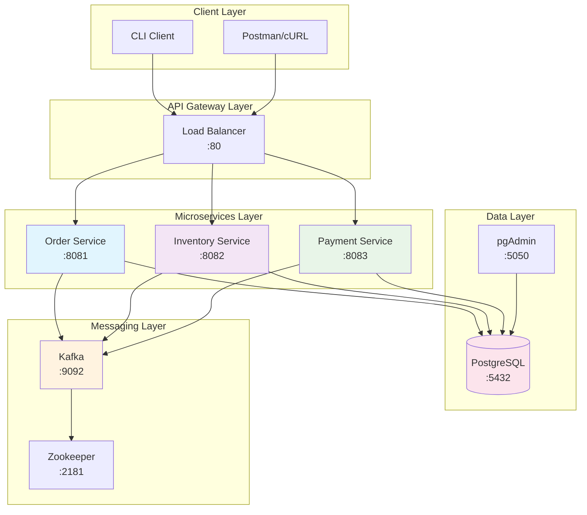
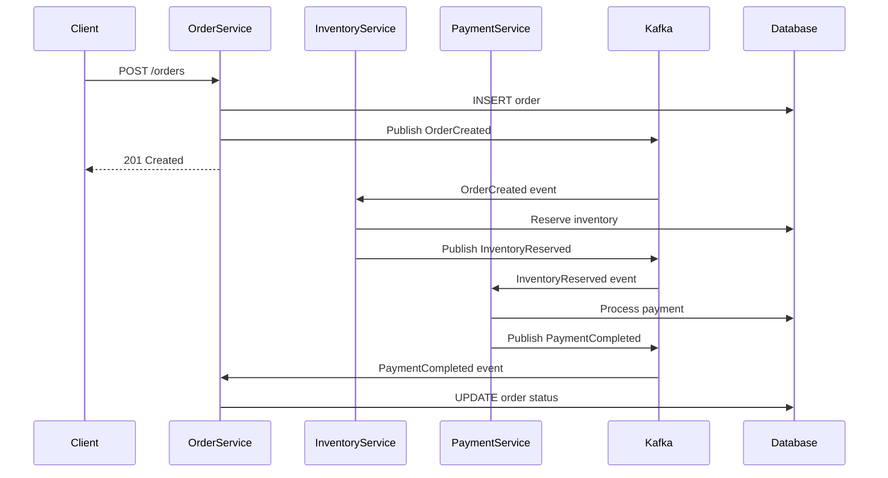

# 🚀 QuickStart Lab - Mikroservisler Hızlı Başlangıç

## 📋 Özet

Bu QuickStart Lab, mikroservis ekosistemine ilk adımınızı atmak için tasarlanmış 2-3 saatlik yoğun bir hands-on deneyimdir. Docker Compose kullanarak Order, Inventory ve Payment servislerinden oluşan minimal ama çalışan bir e-ticaret sistemi kuracak, Kafka ile event-driven communication, PostgreSQL ile data persistence öğreneceksiniz.

## 🎯 Learning Objectives

Bu lab sonunda şunları yapabileceksiniz:

- ✅ Docker Compose ile multi-service mikroservis sistemi çalıştırma
- ✅ Spring Boot mikroservislerinin temel yapısını anlama
- ✅ REST API endpoint'leri ile servisler arası iletişim
- ✅ Kafka ile asynchronous messaging
- ✅ PostgreSQL database per service pattern
- ✅ Basic observability ve debugging

## 📋 Prerequisites

### Sistem Gereksinimleri

- **OS**: Windows 10/11, macOS, Linux
- **RAM**: Minimum 8GB (16GB önerilen)
- **Disk**: 5GB boş alan
- **Network**: Internet bağlantısı (Docker images için)

### Yazılım Gereksinimleri

```bash
# 1. Java Development Kit
java -version
# OpenJDK 17+ olmalı

# 2. Maven Build Tool
mvn -version
# Apache Maven 3.8+ olmalı

# 3. Docker & Docker Compose
docker --version
docker-compose --version
# Docker 20+ ve Docker Compose 2.0+ olmalı

# 4. Git (opsiyonel)
git --version
```

### Windows PowerShell Kurulum Yardımı

```powershell
# Chocolatey ile gerekli araçları kurma
Set-ExecutionPolicy Bypass -Scope Process -Force
iex ((New-Object System.Net.WebClient).DownloadString('https://chocolatey.org/install.ps1'))

# Araçları kurma
choco install openjdk17 maven docker-desktop
```

---

## 🏗️ Proje Yapısı & Mimari

### Sistem Mimarisi



### Directory Structure

```
microservices-quickstart/
├── 📁 documentation/                 # Öğrenme materyalleri
│   └── 01-quickstart/
│       ├── README.md                 # Bu dosya
│       ├── architecture-diagrams/    # Mimari şemalar
│       ├── api-examples/             # Postman collection
│       └── troubleshooting.md        # Sorun giderme
├── 📁 services/                      # Mikroservisler
│   ├── 📁 order-service/
│   │   ├── Dockerfile
│   │   ├── pom.xml
│   │   └── 📁 src/main/java/com/example/order/
│   │       ├── OrderServiceApplication.java
│   │       ├── 📁 controller/        # REST endpoints
│   │       ├── 📁 service/           # Business logic
│   │       ├── 📁 repository/        # Data access
│   │       ├── 📁 model/             # Domain entities
│   │       └── 📁 config/            # Configuration
│   ├── 📁 inventory-service/         # Aynı yapı
│   └── 📁 payment-service/           # Aynı yapı
├── 📁 infrastructure/
│   ├── docker-compose.yml            # Tüm servisler
│   ├── docker-compose.dev.yml       # Development override
│   └── 📁 scripts/
│       ├── start.sh                  # Sistem başlatma
│       ├── stop.sh                   # Sistem durdurma
│       ├── smoke-test.sh             # Temel test
│       └── init-db.sql               # Database setup
└── README.md                         # Ana README
```

---

## 🚀 Adım Adım Kurulum

### Adım 1: Repository Clone & Setup

```powershell
# 1. Repository'yi clone et (varsa)
git clone <repository-url>
cd microservices-quickstart

# 2. Veya mevcut dizinde başla
cd c:\Users\o-oada\Desktop\CLEAN-DDD-SAGA-OUTBOX-CQRS-KAFKA-KUBERNETES-GKE\microservices-quickstart

# 3. Dizin yapısını kontrol et
dir
```

### Adım 2: Eksik Servisleri Oluştur

Mevcut yapıya `inventory-service` ve `payment-service` ekleyelim:

```powershell
# Inventory Service oluştur
mkdir inventory-service
mkdir payment-service

# Scripts dizinini güncelle
mkdir scripts -Force
```

### Adım 3: Maven Dependencies Build

```powershell
# Order service build
cd order-service
mvn clean compile
cd ..

# Not: Inventory ve Payment service'leri de benzer şekilde build edilecek
```

### Adım 4: Docker Environment Başlat

```powershell
# Tüm servisleri başlat
docker-compose up -d

# Logları takip et
docker-compose logs -f

# Servislerin durumunu kontrol et
docker-compose ps
```

**Beklenen Çıktı:**

```
NAME                    IMAGE                           STATUS          PORTS
quickstart-postgres-1   postgres:15                     Up              0.0.0.0:5432->5432/tcp
quickstart-kafka-1      confluentinc/cp-kafka:7.4.0     Up              0.0.0.0:9092->9092/tcp
quickstart-zookeeper-1  confluentinc/cp-zookeeper:7.4.0 Up              2181/tcp
quickstart-pgadmin-1    dpage/pgadmin4:7                Up              0.0.0.0:5050->80/tcp
quickstart-order-service-1    order-service:latest      Up              0.0.0.0:8081->8080/tcp
quickstart-inventory-service-1 inventory-service:latest Up              0.0.0.0:8082->8080/tcp
quickstart-payment-service-1   payment-service:latest   Up              0.0.0.0:8083->8080/tcp
```

### Adım 5: Health Check

```powershell
# Servislerin health endpoint'lerini kontrol et
curl http://localhost:8081/actuator/health
curl http://localhost:8082/actuator/health
curl http://localhost:8083/actuator/health

# Database bağlantısını test et
curl http://localhost:8081/actuator/health/db
```

---

## 🧪 Hands-On Test Scenarios

### Test Scenario 1: Basit CRUD Operations

#### Order Service API Test

```powershell
# 1. Yeni sipariş oluştur
$orderPayload = @{
    customerId = "CUST-001"
    productId = "PROD-123"
    quantity = 2
    price = 299.99
} | ConvertTo-Json

Invoke-RestMethod -Uri "http://localhost:8081/orders" -Method POST -Body $orderPayload -ContentType "application/json"

# 2. Siparişleri listele
Invoke-RestMethod -Uri "http://localhost:8081/orders" -Method GET

# 3. Sipariş detayını getir
Invoke-RestMethod -Uri "http://localhost:8081/orders/1" -Method GET
```

#### Inventory Service API Test

```powershell
# 1. Stok durumunu kontrol et
Invoke-RestMethod -Uri "http://localhost:8082/inventory/PROD-123" -Method GET

# 2. Stok rezervasyonu yap
$reservePayload = @{
    productId = "PROD-123"
    quantity = 2
    orderId = "1"
} | ConvertTo-Json

Invoke-RestMethod -Uri "http://localhost:8082/inventory/reserve" -Method POST -Body $reservePayload -ContentType "application/json"
```

#### Payment Service API Test

```powershell
# 1. Ödeme işlemi başlat
$paymentPayload = @{
    orderId = "1"
    amount = 599.98
    paymentMethod = "CREDIT_CARD"
    cardToken = "tok_123456"
} | ConvertTo-Json

Invoke-RestMethod -Uri "http://localhost:8083/payments" -Method POST -Body $paymentPayload -ContentType "application/json"

# 2. Ödeme durumunu sorgula
Invoke-RestMethod -Uri "http://localhost:8083/payments/order/1" -Method GET
```

### Test Scenario 2: Event-Driven Workflow

Bu senaryo gerçek e-ticaret akışını simüle eder:

```powershell
# 1. Sipariş oluştur (Order Created event publish eder)
$order = @{
    customerId = "CUST-002"
    productId = "PROD-456"
    quantity = 1
    price = 149.99
} | ConvertTo-Json

$createdOrder = Invoke-RestMethod -Uri "http://localhost:8081/orders" -Method POST -Body $order -ContentType "application/json"
Write-Host "✅ Order created: $($createdOrder.id)"

# 2. Kafka consumer loglarını kontrol et (otomatik inventory reserve tetiklenir)
docker-compose logs inventory-service | Select-String "OrderCreated"

# 3. Inventory durumunu kontrol et
$inventory = Invoke-RestMethod -Uri "http://localhost:8082/inventory/PROD-456" -Method GET
Write-Host "📦 Available inventory: $($inventory.availableQuantity)"

# 4. Payment'ı tetikle (manual olarak)
$payment = @{
    orderId = $createdOrder.id
    amount = $createdOrder.totalAmount
    paymentMethod = "CREDIT_CARD"
} | ConvertTo-Json

$processedPayment = Invoke-RestMethod -Uri "http://localhost:8083/payments" -Method POST -Body $payment -ContentType "application/json"
Write-Host "💳 Payment processed: $($processedPayment.status)"

# 5. Final order status kontrol et
$finalOrder = Invoke-RestMethod -Uri "http://localhost:8081/orders/$($createdOrder.id)" -Method GET
Write-Host "📋 Final order status: $($finalOrder.status)"
```

### Test Scenario 3: Database Verification

```powershell
# pgAdmin üzerinden database'leri incele
Start-Process "http://localhost:5050"
# Login: admin@admin.com / admin
# Server: postgres, Port: 5432, Username: admin, Password: admin123

# Veya PowerShell ile direct database query
$env:PGPASSWORD = "admin123"
psql -h localhost -p 5432 -U admin -d order_db -c "SELECT * FROM orders;"
psql -h localhost -p 5432 -U admin -d inventory_db -c "SELECT * FROM inventory;"
psql -h localhost -p 5432 -U admin -d payment_db -c "SELECT * FROM payments;"
```

---

## 🔍 Architecture Deep Dive

### Yapılan İşlemler - Technical Breakdown

#### 1. **Container Orchestration**

```yaml
# docker-compose.yml
services:
  postgres:
    # Tek PostgreSQL instance, 3 ayrı database
    # order_db, inventory_db, payment_db
    environment:
      POSTGRES_DB: microservices
      POSTGRES_USER: admin

  kafka:
    # Event streaming platform
    # Topics: orders, inventory, payments
    environment:
      KAFKA_AUTO_CREATE_TOPICS_ENABLE: "true"

  order-service:
    # Port 8081, Postgres + Kafka integration
    environment:
      SPRING_DATASOURCE_URL: jdbc:postgresql://postgres:5432/order_db
      KAFKA_BOOTSTRAP_SERVERS: kafka:9092
```

**💡 Mimari Açıklama**: Database-per-service pattern ile her mikroservis kendi veri deposuna sahip. Kafka, servisler arası asynchronous communication sağlar.

#### 2. **Service Communication Patterns**



**💡 İşlem Akışı**: Synchronous request/response + Asynchronous event-driven workflow. Order oluşturulduktan sonra downstream servisler otomatik tetiklenir.

#### 3. **Data Consistency Strategy**

```ascii
┌─────────────────┐    ┌─────────────────┐    ┌─────────────────┐
│   Order DB      │    │  Inventory DB   │    │   Payment DB    │
│                 │    │                 │    │                 │
│ ┌─────────────┐ │    │ ┌─────────────┐ │    │ ┌─────────────┐ │
│ │   orders    │ │    │ │ inventory   │ │    │ │  payments   │ │
│ │             │ │    │ │             │ │    │ │             │ │
│ │ id: 1       │ │    │ │ product_id  │ │    │ │ order_id    │ │
│ │ status:     │ │    │ │ available   │ │    │ │ amount      │ │
│ │ PENDING     │ │    │ │ reserved    │ │    │ │ status      │ │
│ └─────────────┘ │    │ └─────────────┘ │    │ └─────────────┘ │
└─────────────────┘    └─────────────────┘    └─────────────────┘
        │                       │                       │
        │                       │                       │
        └───────────────────────┼───────────────────────┘
                                │
                    ┌─────────────────┐
                    │   Kafka Topics  │
                    │                 │
                    │ • orders        │
                    │ • inventory     │
                    │ • payments      │
                    └─────────────────┘
```

**💡 Consistency Model**: Eventual consistency via event sourcing. Her servis kendi local transaction'ını garantiler, system-wide consistency events ile sağlanır.

---

## ✅ Verification Checklist

### Infrastructure Checks

- [ ] PostgreSQL container çalışıyor ve 3 database oluşmuş
- [ ] Kafka + Zookeeper cluster healthy
- [ ] pgAdmin web interface erişilebilir
- [ ] Tüm 3 mikroservis containerleri UP durumda

### API Functionality Checks

- [ ] Order Service - CRUD operations çalışıyor
- [ ] Inventory Service - Stock management çalışıyor
- [ ] Payment Service - Payment processing çalışıyor
- [ ] Health endpoints responding 200 OK

### Event-Driven Checks

- [ ] OrderCreated event publish ediliyor
- [ ] InventoryReserved event consume ediliyor
- [ ] PaymentCompleted event workflow complete oluyor
- [ ] Kafka topics oluşmuş ve message flow var

### Data Persistence Checks

- [ ] Database'lerde data persist oluyor
- [ ] Cross-service transaction consistency
- [ ] Error scenarios gracefully handle ediliyor

---

## 🐛 Troubleshooting Guide

### Yaygın Problemler & Çözümler

#### Problem 1: Port Already in Use

```powershell
# Hata: Port 5432 already in use
# Çözüm: Mevcut PostgreSQL instance'ını durdur
Get-Process -Name postgres | Stop-Process -Force
netstat -an | findstr :5432
```

#### Problem 2: Docker Build Fails

```powershell
# Hata: Maven dependency resolution
# Çözüm: Maven cache temizle
mvn dependency:purge-local-repository
mvn clean compile -U

# Docker build context temizle
docker builder prune -f
```

#### Problem 3: Kafka Connection Issues

```powershell
# Kafka container loglarını incele
docker-compose logs kafka

# Topic'lerin oluşup oluşmadığını kontrol et
docker exec -it quickstart-kafka-1 kafka-topics --list --bootstrap-server localhost:9092
```

#### Problem 4: Service Discovery Problems

```powershell
# Container network'ünü kontrol et
docker network ls
docker network inspect quickstart_default

# DNS resolution test
docker exec -it quickstart-order-service-1 nslookup postgres
docker exec -it quickstart-order-service-1 nslookup kafka
```

### Debug Commands

```powershell
# Tüm container durumları
docker-compose ps -a

# Spesifik service logları
docker-compose logs -f order-service

# Container içine erişim
docker exec -it quickstart-order-service-1 bash

# Database connection test
docker exec -it quickstart-postgres-1 psql -U admin -d order_db -c "\dt"

# Kafka topic'leri listele
docker exec -it quickstart-kafka-1 kafka-topics --list --bootstrap-server localhost:9092
```

---

## 📈 Next Steps

Bu QuickStart Lab'ı başarıyla tamamladıktan sonra:

1. **🏗️ Clean Architecture** bölümüne geçin - servislerin internal structure'ını iyileştirin
2. **🎯 DDD Fundamentals** öğrenin - domain modeling yapmaya başlayın
3. **🔄 SAGA Pattern** implementasyonu - distributed transaction management
4. **📊 Observability** ekleyin - metrics, tracing, logging

### Hands-On Tasks

#### Task 1: API Enhancement

- Order Service'e `GET /orders/customer/{customerId}` endpoint ekleyin
- Response time'ı `@Timed` annotation ile ölçün
- Postman collection oluşturup test edin

#### Task 2: Error Handling

- Invalid order creation scenario'su ekleyin
- Circuit breaker pattern ile downstream service failures handle edin
- Dead letter queue implementation için Kafka configuration

#### Task 3: Data Validation

- Bean Validation annotations ekleyin (`@Valid`, `@NotNull`, `@Min`)
- Custom validation rules oluşturun (örn: `@ValidProductId`)
- Error response standardization

### Solutions / Hints

<details>
<summary>💡 Task 1 Solution Hint</summary>

```java
// OrderController.java
@GetMapping("/customer/{customerId}")
@Timed(name = "orders.by.customer", description = "Time taken to fetch orders by customer")
public ResponseEntity<List<Order>> getOrdersByCustomer(@PathVariable String customerId) {
    List<Order> orders = orderService.findByCustomerId(customerId);
    return ResponseEntity.ok(orders);
}
```

</details>

<details>
<summary>💡 Task 2 Solution Hint</summary>

```yaml
# application.yml
resilience4j:
  circuitbreaker:
    instances:
      inventory-service:
        failure-rate-threshold: 50
        wait-duration-in-open-state: 30s
        sliding-window-size: 10
```

</details>

---

## 📚 Further Reading

### Essential Resources

- **Spring Boot Docs**: [Spring Boot Reference Guide](https://docs.spring.io/spring-boot/docs/current/reference/html/)
- **Apache Kafka**: [Kafka Documentation](https://kafka.apache.org/documentation/)
- **Docker Compose**: [Compose Specification](https://compose-spec.io/)

### Architecture Patterns

- **Microservices Patterns** - Chris Richardson
- **Building Event-Driven Microservices** - Adam Bellemare
- **Kafka: The Definitive Guide** - Neha Narkhede

### Hands-On Learning

- **Spring Boot Microservices Workshop** - [GitHub Repository](https://github.com/spring-projects/spring-petclinic-microservices)
- **Kafka Streams Examples** - [Confluent Examples](https://github.com/confluentinc/kafka-streams-examples)

---

**🎉 Tebrikler!** QuickStart Lab'ı başarıyla tamamladınız. Artık mikroservis ekosisteminin temellerini anlıyorsunuz ve bir sonraki seviyeye hazırsınız.

**⏭️ Bir sonraki adım**: [Clean Architecture Implementation](../02-clean-architecture/README.md)
