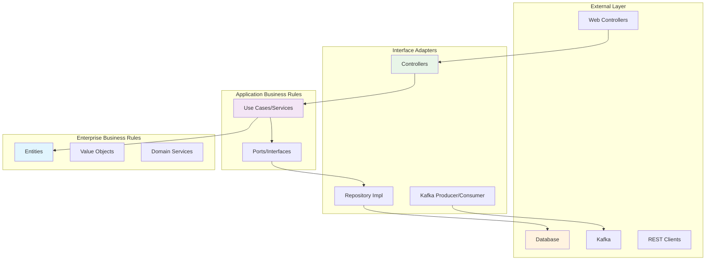

# 🏛️ Clean Architecture Implementation - Bölüm 2

## 📋 Özet

Bu bölümde Clean Architecture principles'ını Spring Boot mikroservislerimize uygulaarak, sürdürülebilir, test edilebilir ve maintainable kod yapısı oluşturacağız. QuickStart Lab'da oluşturduğumuz basit controller'ları katmanlı mimariye çevirerek, dependency inversion, separation of concerns ve business logic isolation öğreneceksiniz.

## 🎯 Learning Objectives

Bu bölüm sonunda şunları yapabileceksiniz:

- ✅ **Clean Architecture** katmanlarını doğru şekilde oluşturma
- ✅ **Dependency Inversion Principle** ile external concerns'den izolasyon
- ✅ **Business Logic** ile infrastructure kodunu ayırma
- ✅ **Port/Adapter pattern** temellerini uygulama
- ✅ **Domain entities** ve **value objects** tasarımı
- ✅ **Repository pattern** ile data access abstraction
- ✅ **Service layer** ile business logic encapsulation

## 📋 Prerequisites

- ✅ QuickStart Lab tamamlanmış olmalı (Bölüm 1)
- ✅ Spring Boot ve Dependency Injection temel bilgisi
- ✅ Java OOP concepts (inheritance, polymorphism, interfaces)
- ✅ Basic unit testing experience (JUnit 5)

---

## 🏗️ Clean Architecture Fundamentals

### Clean Architecture Nedir?

Clean Architecture, Robert C. Martin (Uncle Bob) tarafından önerilmiş, **business logic'i external concerns'den izole eden** katmanlı mimari yaklaşımıdır.



### 🔄 Dependency Direction

```ascii
┌─────────────────────────────────────────────────────────────┐
│                    DEPENDENCY RULE                         │
│                                                             │
│  External ────► Interface ────► Application ────► Domain   │
│   Layer          Adapters        Layer            Layer    │
│                                                             │
│  - REST APIs     - Controllers   - Use Cases    - Entities │
│  - Database      - Repositories  - Services     - V.Objects│
│  - Kafka         - Producers     - Interfaces   - D.Services│
│                                                             │
│          ◄────── Dependencies Always Point Inward ────────►│
└─────────────────────────────────────────────────────────────┘
```

**💡 Temel Prensip**: İç katmanlar dış katmanlardan habersiz olmalıdır. Domain layer hiçbir infrastructure detayını bilmemelidir.

---

## 📂 Package Structure Design

### Current Structure (QuickStart)

```
order-service/
└── src/main/java/com/example/order/
    ├── OrderServiceApplication.java
    └── controller/
        └── OrderController.java    # Everything in one place
```

### Target Clean Architecture Structure

```
order-service/
└── src/main/java/com/example/order/
    ├── OrderServiceApplication.java
    ├── 📁 domain/                    # Enterprise Business Rules
    │   ├── 📁 entity/               # Core entities
    │   │   ├── Order.java
    │   │   └── OrderItem.java
    │   ├── 📁 valueobject/          # Value objects
    │   │   ├── CustomerId.java
    │   │   ├── ProductId.java
    │   │   ├── Money.java
    │   │   └── OrderStatus.java
    │   ├── 📁 event/                # Domain events
    │   │   ├── OrderCreatedEvent.java
    │   │   └── OrderConfirmedEvent.java
    │   └── 📁 service/              # Domain services
    │       └── OrderDomainService.java
    ├── 📁 application/               # Application Business Rules
    │   ├── 📁 port/                 # Interfaces (Ports)
    │   │   ├── 📁 in/               # Driving ports (Use cases)
    │   │   │   ├── CreateOrderUseCase.java
    │   │   │   ├── GetOrderUseCase.java
    │   │   │   └── ConfirmOrderUseCase.java
    │   │   └── 📁 out/              # Driven ports (SPI)
    │   │       ├── OrderRepository.java
    │   │       ├── PaymentService.java
    │   │       └── EventPublisher.java
    │   └── 📁 service/              # Application services
    │       ├── OrderApplicationService.java
    │       └── OrderEventHandler.java
    └── 📁 infrastructure/           # Interface Adapters & External
        ├── 📁 adapter/              # Adapters
        │   ├── 📁 in/               # Driving adapters
        │   │   ├── 📁 web/
        │   │   │   ├── OrderController.java
        │   │   │   └── dto/
        │   │   │       ├── CreateOrderRequest.java
        │   │   │       └── OrderResponse.java
        │   │   └── 📁 kafka/
        │   │       └── OrderKafkaConsumer.java
        │   └── 📁 out/              # Driven adapters
        │       ├── 📁 persistence/
        │       │   ├── OrderJpaRepository.java
        │       │   ├── OrderRepositoryImpl.java
        │       │   └── entity/
        │       │       └── OrderJpaEntity.java
        │       └── 📁 kafka/
        │           └── OrderKafkaProducer.java
        └── 📁 config/               # Configuration
            ├── BeanConfiguration.java
            └── KafkaConfiguration.java
```

**💡 Mimari Açıklama**: Her katmanın sorumluluğu net bir şekilde ayrılmış, dependency direction içten dışa doğru kontrolü sağlanmış.

---

## 🔧 Implementation Step by Step

### Step 1: Domain Layer Implementation

#### Order Entity

```java
// domain/entity/Order.java
package com.example.order.domain.entity;

import com.example.order.domain.valueobject.*;
import com.example.order.domain.event.OrderCreatedEvent;
import java.time.LocalDateTime;
import java.util.ArrayList;
import java.util.List;

/**
 * Order Aggregate Root
 *
 * Business Rules:
 * - Order toplam tutarı 0'dan büyük olmalı
 * - Minimum 1 item içermeli
 * - PENDING status'ta oluşturulur
 * - Status geçişleri belirli kurallara uymalı
 */
public class Order {
    private OrderId id;
    private CustomerId customerId;
    private List<OrderItem> items;
    private OrderStatus status;
    private Money totalAmount;
    private LocalDateTime createdAt;
    private LocalDateTime updatedAt;

    // Domain events (for event sourcing)
    private List<Object> domainEvents = new ArrayList<>();

    // Private constructor for reconstruction
    private Order() {}

    // Factory method - business logic burada
    public static Order create(CustomerId customerId, List<OrderItem> items) {
        if (customerId == null) {
            throw new IllegalArgumentException("Customer ID cannot be null");
        }
        if (items == null || items.isEmpty()) {
            throw new IllegalArgumentException("Order must contain at least one item");
        }

        Order order = new Order();
        order.id = OrderId.generate();
        order.customerId = customerId;
        order.items = new ArrayList<>(items);
        order.status = OrderStatus.PENDING;
        order.totalAmount = calculateTotalAmount(items);
        order.createdAt = LocalDateTime.now();
        order.updatedAt = LocalDateTime.now();

        // Domain event publish
        order.addDomainEvent(new OrderCreatedEvent(
            order.id,
            order.customerId,
            order.totalAmount,
            order.createdAt
        ));

        return order;
    }

    public void confirm() {
        if (status != OrderStatus.PENDING) {
            throw new IllegalStateException("Only PENDING orders can be confirmed");
        }
        this.status = OrderStatus.CONFIRMED;
        this.updatedAt = LocalDateTime.now();

        addDomainEvent(new OrderConfirmedEvent(this.id, LocalDateTime.now()));
    }

    public void cancel(String reason) {
        if (status == OrderStatus.DELIVERED) {
            throw new IllegalStateException("Delivered orders cannot be cancelled");
        }
        this.status = OrderStatus.CANCELLED;
        this.updatedAt = LocalDateTime.now();
    }

    private static Money calculateTotalAmount(List<OrderItem> items) {
        return items.stream()
                .map(OrderItem::getSubtotal)
                .reduce(Money.ZERO, Money::add);
    }

    private void addDomainEvent(Object event) {
        this.domainEvents.add(event);
    }

    public List<Object> getDomainEvents() {
        return List.copyOf(domainEvents);
    }

    public void clearDomainEvents() {
        this.domainEvents.clear();
    }

    // Getters (no setters for immutability)
    public OrderId getId() { return id; }
    public CustomerId getCustomerId() { return customerId; }
    public List<OrderItem> getItems() { return List.copyOf(items); }
    public OrderStatus getStatus() { return status; }
    public Money getTotalAmount() { return totalAmount; }
    public LocalDateTime getCreatedAt() { return createdAt; }
    public LocalDateTime getUpdatedAt() { return updatedAt; }
}
```

#### Value Objects

```java
// domain/valueobject/OrderId.java
package com.example.order.domain.valueobject;

import java.util.Objects;
import java.util.UUID;

/**
 * Order ID Value Object
 * - Immutable
 * - Self-validating
 * - Equality based on value
 */
public class OrderId {
    private final String value;

    private OrderId(String value) {
        if (value == null || value.trim().isEmpty()) {
            throw new IllegalArgumentException("Order ID cannot be null or empty");
        }
        this.value = value;
    }

    public static OrderId of(String value) {
        return new OrderId(value);
    }

    public static OrderId generate() {
        return new OrderId(UUID.randomUUID().toString());
    }

    public String getValue() {
        return value;
    }

    @Override
    public boolean equals(Object o) {
        if (this == o) return true;
        if (o == null || getClass() != o.getClass()) return false;
        OrderId orderId = (OrderId) o;
        return Objects.equals(value, orderId.value);
    }

    @Override
    public int hashCode() {
        return Objects.hash(value);
    }

    @Override
    public String toString() {
        return value;
    }
}
```

```java
// domain/valueobject/Money.java
package com.example.order.domain.valueobject;

import java.math.BigDecimal;
import java.math.RoundingMode;
import java.util.Objects;

/**
 * Money Value Object
 * - Immutable
 * - Thread-safe
 * - Precision handling for currency
 */
public class Money {
    public static final Money ZERO = new Money(BigDecimal.ZERO);

    private final BigDecimal amount;

    private Money(BigDecimal amount) {
        if (amount == null) {
            throw new IllegalArgumentException("Amount cannot be null");
        }
        if (amount.compareTo(BigDecimal.ZERO) < 0) {
            throw new IllegalArgumentException("Amount cannot be negative");
        }
        this.amount = amount.setScale(2, RoundingMode.HALF_UP);
    }

    public static Money of(BigDecimal amount) {
        return new Money(amount);
    }

    public static Money of(double amount) {
        return new Money(BigDecimal.valueOf(amount));
    }

    public Money add(Money other) {
        return new Money(this.amount.add(other.amount));
    }

    public Money subtract(Money other) {
        return new Money(this.amount.subtract(other.amount));
    }

    public Money multiply(int quantity) {
        return new Money(this.amount.multiply(BigDecimal.valueOf(quantity)));
    }

    public boolean isGreaterThan(Money other) {
        return this.amount.compareTo(other.amount) > 0;
    }

    public BigDecimal getAmount() {
        return amount;
    }

    @Override
    public boolean equals(Object o) {
        if (this == o) return true;
        if (o == null || getClass() != o.getClass()) return false;
        Money money = (Money) o;
        return Objects.equals(amount, money.amount);
    }

    @Override
    public int hashCode() {
        return Objects.hash(amount);
    }

    @Override
    public String toString() {
        return "$" + amount.toString();
    }
}
```

### Step 2: Application Layer Implementation

#### Use Case Interfaces (Ports)

```java
// application/port/in/CreateOrderUseCase.java
package com.example.order.application.port.in;

import com.example.order.domain.valueobject.CustomerId;
import com.example.order.domain.entity.Order;

/**
 * Create Order Use Case (Driving Port)
 * - Input boundary for order creation
 * - Technology agnostic interface
 */
public interface CreateOrderUseCase {

    CreateOrderResponse createOrder(CreateOrderCommand command);

    record CreateOrderCommand(
        CustomerId customerId,
        List<OrderItemCommand> items
    ) {
        public CreateOrderCommand {
            if (customerId == null) {
                throw new IllegalArgumentException("Customer ID is required");
            }
            if (items == null || items.isEmpty()) {
                throw new IllegalArgumentException("Order items are required");
            }
        }
    }

    record OrderItemCommand(
        ProductId productId,
        int quantity,
        Money unitPrice
    ) {
        public OrderItemCommand {
            if (productId == null) {
                throw new IllegalArgumentException("Product ID is required");
            }
            if (quantity <= 0) {
                throw new IllegalArgumentException("Quantity must be positive");
            }
            if (unitPrice == null || !unitPrice.isGreaterThan(Money.ZERO)) {
                throw new IllegalArgumentException("Unit price must be positive");
            }
        }
    }

    record CreateOrderResponse(
        OrderId orderId,
        OrderStatus status,
        Money totalAmount,
        LocalDateTime createdAt
    ) {}
}
```

#### Repository Port (Output)

```java
// application/port/out/OrderRepository.java
package com.example.order.application.port.out;

import com.example.order.domain.entity.Order;
import com.example.order.domain.valueobject.OrderId;
import com.example.order.domain.valueobject.CustomerId;
import java.util.List;
import java.util.Optional;

/**
 * Order Repository Port (Driven Port)
 * - Abstraction for data persistence
 * - Domain layer doesn't know about JPA/SQL
 */
public interface OrderRepository {

    Order save(Order order);

    Optional<Order> findById(OrderId orderId);

    List<Order> findByCustomerId(CustomerId customerId);

    List<Order> findAll();

    void deleteById(OrderId orderId);

    boolean existsById(OrderId orderId);
}
```

#### Application Service Implementation

```java
// application/service/OrderApplicationService.java
package com.example.order.application.service;

import com.example.order.application.port.in.*;
import com.example.order.application.port.out.*;
import com.example.order.domain.entity.Order;
import com.example.order.domain.entity.OrderItem;
import org.springframework.stereotype.Service;
import org.springframework.transaction.annotation.Transactional;

/**
 * Order Application Service
 * - Orchestrates use cases
 * - Handles transactions
 * - Coordinates between domain and infrastructure
 */
@Service
@Transactional
public class OrderApplicationService implements
    CreateOrderUseCase,
    GetOrderUseCase,
    ConfirmOrderUseCase {

    private final OrderRepository orderRepository;
    private final EventPublisher eventPublisher;

    public OrderApplicationService(
        OrderRepository orderRepository,
        EventPublisher eventPublisher
    ) {
        this.orderRepository = orderRepository;
        this.eventPublisher = eventPublisher;
    }

    @Override
    public CreateOrderResponse createOrder(CreateOrderCommand command) {
        // 1. Convert command to domain objects
        List<OrderItem> orderItems = command.items().stream()
            .map(item -> OrderItem.create(
                item.productId(),
                item.quantity(),
                item.unitPrice()
            ))
            .toList();

        // 2. Create domain entity
        Order order = Order.create(command.customerId(), orderItems);

        // 3. Persist entity
        Order savedOrder = orderRepository.save(order);

        // 4. Publish domain events
        savedOrder.getDomainEvents().forEach(eventPublisher::publish);
        savedOrder.clearDomainEvents();

        // 5. Return response
        return new CreateOrderResponse(
            savedOrder.getId(),
            savedOrder.getStatus(),
            savedOrder.getTotalAmount(),
            savedOrder.getCreatedAt()
        );
    }

    @Override
    @Transactional(readOnly = true)
    public GetOrderResponse getOrder(GetOrderQuery query) {
        Order order = orderRepository.findById(query.orderId())
            .orElseThrow(() -> new OrderNotFoundException(query.orderId()));

        return new GetOrderResponse(
            order.getId(),
            order.getCustomerId(),
            order.getItems(),
            order.getStatus(),
            order.getTotalAmount(),
            order.getCreatedAt(),
            order.getUpdatedAt()
        );
    }

    @Override
    public ConfirmOrderResponse confirmOrder(ConfirmOrderCommand command) {
        Order order = orderRepository.findById(command.orderId())
            .orElseThrow(() -> new OrderNotFoundException(command.orderId()));

        order.confirm();
        Order savedOrder = orderRepository.save(order);

        // Publish domain events
        savedOrder.getDomainEvents().forEach(eventPublisher::publish);
        savedOrder.clearDomainEvents();

        return new ConfirmOrderResponse(
            savedOrder.getId(),
            savedOrder.getStatus(),
            savedOrder.getUpdatedAt()
        );
    }
}
```

### Step 3: Infrastructure Layer Implementation

#### JPA Repository Adapter

```java
// infrastructure/adapter/out/persistence/OrderRepositoryImpl.java
package com.example.order.infrastructure.adapter.out.persistence;

import com.example.order.application.port.out.OrderRepository;
import com.example.order.domain.entity.Order;
import com.example.order.domain.valueobject.OrderId;
import com.example.order.domain.valueobject.CustomerId;
import org.springframework.stereotype.Repository;
import java.util.List;
import java.util.Optional;

/**
 * JPA Repository Implementation (Driven Adapter)
 * - Implements domain repository interface
 * - Handles OR mapping between domain and JPA entities
 * - Isolates JPA concerns from domain
 */
@Repository
public class OrderRepositoryImpl implements OrderRepository {

    private final OrderJpaRepository jpaRepository;
    private final OrderMapper orderMapper;

    public OrderRepositoryImpl(
        OrderJpaRepository jpaRepository,
        OrderMapper orderMapper
    ) {
        this.jpaRepository = jpaRepository;
        this.orderMapper = orderMapper;
    }

    @Override
    public Order save(Order order) {
        OrderJpaEntity jpaEntity = orderMapper.toJpaEntity(order);
        OrderJpaEntity savedEntity = jpaRepository.save(jpaEntity);
        return orderMapper.toDomainEntity(savedEntity);
    }

    @Override
    public Optional<Order> findById(OrderId orderId) {
        return jpaRepository.findById(orderId.getValue())
            .map(orderMapper::toDomainEntity);
    }

    @Override
    public List<Order> findByCustomerId(CustomerId customerId) {
        return jpaRepository.findByCustomerId(customerId.getValue())
            .stream()
            .map(orderMapper::toDomainEntity)
            .toList();
    }

    @Override
    public List<Order> findAll() {
        return jpaRepository.findAll()
            .stream()
            .map(orderMapper::toDomainEntity)
            .toList();
    }

    @Override
    public void deleteById(OrderId orderId) {
        jpaRepository.deleteById(orderId.getValue());
    }

    @Override
    public boolean existsById(OrderId orderId) {
        return jpaRepository.existsById(orderId.getValue());
    }
}
```

#### Web Controller (Driving Adapter)

```java
// infrastructure/adapter/in/web/OrderController.java
package com.example.order.infrastructure.adapter.in.web;

import com.example.order.application.port.in.*;
import com.example.order.infrastructure.adapter.in.web.dto.*;
import org.springframework.http.ResponseEntity;
import org.springframework.web.bind.annotation.*;
import jakarta.validation.Valid;

/**
 * Order Web Controller (Driving Adapter)
 * - Adapts HTTP requests to use case calls
 * - Handles serialization/deserialization
 * - Maps between DTOs and domain commands/queries
 */
@RestController
@RequestMapping("/orders")
@CrossOrigin(origins = "*")
public class OrderController {

    private final CreateOrderUseCase createOrderUseCase;
    private final GetOrderUseCase getOrderUseCase;
    private final ConfirmOrderUseCase confirmOrderUseCase;

    public OrderController(
        CreateOrderUseCase createOrderUseCase,
        GetOrderUseCase getOrderUseCase,
        ConfirmOrderUseCase confirmOrderUseCase
    ) {
        this.createOrderUseCase = createOrderUseCase;
        this.getOrderUseCase = getOrderUseCase;
        this.confirmOrderUseCase = confirmOrderUseCase;
    }

    @PostMapping
    public ResponseEntity<OrderResponse> createOrder(
        @Valid @RequestBody CreateOrderRequest request
    ) {
        // 1. Convert DTO to command
        CreateOrderCommand command = new CreateOrderCommand(
            CustomerId.of(request.customerId()),
            request.items().stream()
                .map(item -> new OrderItemCommand(
                    ProductId.of(item.productId()),
                    item.quantity(),
                    Money.of(item.unitPrice())
                ))
                .toList()
        );

        // 2. Execute use case
        CreateOrderResponse response = createOrderUseCase.createOrder(command);

        // 3. Convert response to DTO
        OrderResponse orderResponse = OrderResponse.from(response);

        return ResponseEntity.ok(orderResponse);
    }

    @GetMapping("/{orderId}")
    public ResponseEntity<OrderResponse> getOrder(@PathVariable String orderId) {
        GetOrderQuery query = new GetOrderQuery(OrderId.of(orderId));
        GetOrderResponse response = getOrderUseCase.getOrder(query);
        OrderResponse orderResponse = OrderResponse.from(response);
        return ResponseEntity.ok(orderResponse);
    }

    @PostMapping("/{orderId}/confirm")
    public ResponseEntity<OrderResponse> confirmOrder(@PathVariable String orderId) {
        ConfirmOrderCommand command = new ConfirmOrderCommand(OrderId.of(orderId));
        ConfirmOrderResponse response = confirmOrderUseCase.confirmOrder(command);
        OrderResponse orderResponse = OrderResponse.from(response);
        return ResponseEntity.ok(orderResponse);
    }

    @GetMapping("/customer/{customerId}")
    public ResponseEntity<List<OrderResponse>> getOrdersByCustomer(
        @PathVariable String customerId
    ) {
        GetOrdersByCustomerQuery query = new GetOrdersByCustomerQuery(
            CustomerId.of(customerId)
        );
        GetOrdersByCustomerResponse response = getOrderUseCase.getOrdersByCustomer(query);

        List<OrderResponse> orderResponses = response.orders().stream()
            .map(OrderResponse::from)
            .toList();

        return ResponseEntity.ok(orderResponses);
    }
}
```

---

## 🔄 Yapılan İşlemler & Mimari Açıklamalar

### 1. **Katman Separasyonu**

```ascii
┌─────────────────┐    ┌─────────────────┐    ┌─────────────────┐
│   HTTP Request  │    │   Use Case      │    │   Domain        │
│                 │    │   Commands      │    │   Entities      │
│ CreateOrderReq  │───►│ CreateOrderCmd  │───►│     Order       │
│                 │    │                 │    │                 │
│   DTO Layer     │    │ Application     │    │  Domain Layer   │
│                 │    │     Layer       │    │                 │
└─────────────────┘    └─────────────────┘    └─────────────────┘
       │                        │                       │
       ▼                        ▼                       ▼
┌─────────────────┐    ┌─────────────────┐    ┌─────────────────┐
│   JPA Entities  │    │   Repository    │    │   Events        │
│                 │    │   Interface     │    │                 │
│ OrderJpaEntity  │◄───│ OrderRepository │◄───│ OrderCreated    │
│                 │    │                 │    │                 │
│Infrastructure   │    │   Port Layer    │    │   Domain        │
│     Layer       │    │                 │    │    Events       │
└─────────────────┘    └─────────────────┘    └─────────────────┘
```

**💡 İşlem Akışı**: HTTP request → DTO → Command → Domain Entity → Repository → JPA Entity

### 2. **Dependency Inversion**

- **Infrastructure** domain'e depends eder, tersi değil
- **Application** sadece interfaces (ports) kullanır
- **Domain** hiçbir external dependency'si yok

### 3. **Business Logic Isolation**

- Tüm business rules **Domain layer**'da
- **Application layer** sadece orchestration
- **Infrastructure** sadece technical concerns

---

## ✅ Verification Checklist

### Architecture Compliance

- [ ] Domain entities hiçbir infrastructure dependency'si içermiyor
- [ ] Application services sadece ports kullanıyor
- [ ] Controllers sadece use case interfaces çağırıyor
- [ ] Repository implementations domain interfaces implement ediyor

### Code Quality

- [ ] Value objects immutable ve self-validating
- [ ] Domain entities business rules contain ediyor
- [ ] Commands ve queries validation içeriyor
- [ ] Error handling uygun exception types kullanıyor

### Testability

- [ ] Use cases mock'lanabilir interfaces kullanıyor
- [ ] Domain logic unit test edilebilir
- [ ] Repository adapters integration test edilebilir
- [ ] Controllers web layer test edilebilir

---

## 🧪 Hands-On Tasks

### Task 1: Complete Order Service Refactoring

Mevcut Order Service'i Clean Architecture'a çevirin:

1. **Domain Layer** oluşturun

   - Order, OrderItem entities
   - OrderId, CustomerId, Money value objects
   - OrderCreatedEvent domain event

2. **Application Layer** ekleyin

   - CreateOrderUseCase interface ve implementation
   - OrderRepository port
   - OrderApplicationService

3. **Infrastructure Layer** refactor edin
   - OrderController'ı use case'ler kullanacak şekilde değiştirin
   - JPA repository implementation ekleyin
   - DTO mapping layer ekleyin

### Task 2: Add Validation & Error Handling

```java
// Custom exceptions
public class OrderNotFoundException extends RuntimeException {
    public OrderNotFoundException(OrderId orderId) {
        super("Order not found: " + orderId.getValue());
    }
}

public class InvalidOrderStateException extends RuntimeException {
    public InvalidOrderStateException(String message) {
        super(message);
    }
}
```

### Task 3: Unit Testing

```java
// Domain entity test
@Test
void shouldCreateOrderWithValidData() {
    // Given
    CustomerId customerId = CustomerId.of("CUST-001");
    List<OrderItem> items = List.of(
        OrderItem.create(ProductId.of("PROD-123"), 2, Money.of(99.99))
    );

    // When
    Order order = Order.create(customerId, items);

    // Then
    assertThat(order.getId()).isNotNull();
    assertThat(order.getStatus()).isEqualTo(OrderStatus.PENDING);
    assertThat(order.getTotalAmount()).isEqualTo(Money.of(199.98));
}

// Application service test
@Test
void shouldCreateOrderSuccessfully() {
    // Given
    CreateOrderCommand command = new CreateOrderCommand(
        CustomerId.of("CUST-001"),
        List.of(new OrderItemCommand(
            ProductId.of("PROD-123"),
            2,
            Money.of(99.99)
        ))
    );

    // When
    CreateOrderResponse response = orderApplicationService.createOrder(command);

    // Then
    verify(orderRepository).save(any(Order.class));
    verify(eventPublisher).publish(any(OrderCreatedEvent.class));
    assertThat(response.orderId()).isNotNull();
}
```

---

## 💡 Solutions / Hints

<details>
<summary>💡 Task 1 Solution Structure</summary>

1. **Domain Layer Setup**:

```java
// 1. Create base value object
public abstract class ValueObject {
    protected abstract List<Object> getEqualityComponents();

    @Override
    public boolean equals(Object obj) {
        // Implementation
    }
}

// 2. Create base entity
public abstract class Entity<ID> {
    protected ID id;
    // Implementation
}
```

2. **Application Layer Setup**:

```java
// 1. Create use case query/command pattern
public interface Query {}
public interface Command {}
public interface UseCase<REQUEST, RESPONSE> {
    RESPONSE execute(REQUEST request);
}
```

</details>

<details>
<summary>💡 Task 2 Error Handling Strategy</summary>

```java
@ControllerAdvice
public class GlobalExceptionHandler {

    @ExceptionHandler(OrderNotFoundException.class)
    public ResponseEntity<ErrorResponse> handleOrderNotFound(
        OrderNotFoundException ex
    ) {
        return ResponseEntity.notFound()
            .body(new ErrorResponse("ORDER_NOT_FOUND", ex.getMessage()));
    }

    @ExceptionHandler(IllegalArgumentException.class)
    public ResponseEntity<ErrorResponse> handleValidation(
        IllegalArgumentException ex
    ) {
        return ResponseEntity.badRequest()
            .body(new ErrorResponse("VALIDATION_ERROR", ex.getMessage()));
    }
}
```

</details>

---

## 📈 Next Steps

Bu Clean Architecture implementation'ını tamamladıktan sonra:

1. **🏛️ Hexagonal Architecture** - Port/Adapter pattern derinlemesine
2. **🎯 Domain Driven Design** - Strategic patterns, bounded contexts
3. **📊 Event Sourcing** - Domain events ile state management
4. **🔄 SAGA Pattern** - Distributed transaction coordination

### Learning Path Validation

- [ ] Order Service Clean Architecture refactoring complete
- [ ] Unit tests passing (%80+ coverage)
- [ ] Integration tests working
- [ ] API endpoints functioning correctly
- [ ] Domain events publishing

## 📚 Further Reading

### Essential Resources

- **Clean Architecture** - Robert C. Martin
- **Implementing Domain-Driven Design** - Vaughn Vernon
- **Patterns of Enterprise Application Architecture** - Martin Fowler

### Code Examples

- **Spring Boot Clean Architecture Examples** - [GitHub](https://github.com/mattia-battiston/clean-architecture-example)
- **DDD Sample Application** - [GitHub](https://github.com/citerus/dddsample-core)

---

**🎯 Hedef**: Clean Architecture principles'ını uygulayarak maintainable, testable ve scalable kod yapısı oluşturmak.

**⏱️ Süre**: 1 hafta

**🚀 Başarı Kriterleri**: Dependency inversion uygulanmış, katmanlar net ayrılmış, business logic izole edilmiş.
