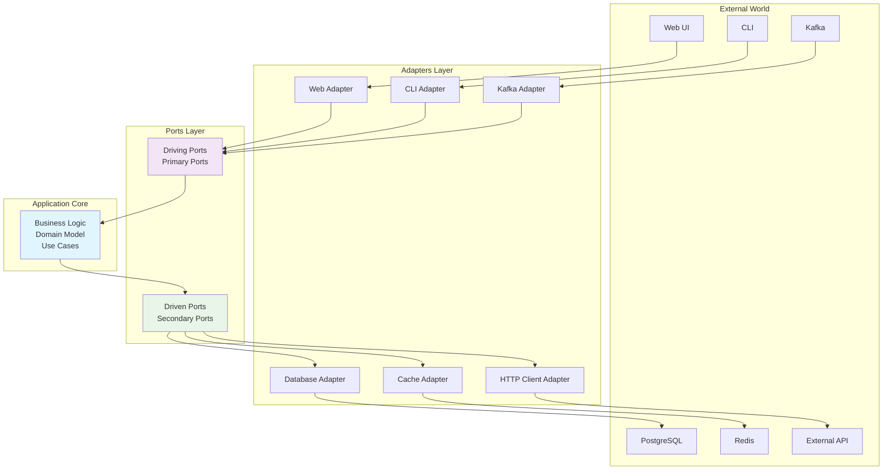

# 🔷 Hexagonal Architecture (Ports & Adapters) - Bölüm 3

## 📋 Özet

Bu bölümde Hexagonal Architecture (Ports & Adapters) pattern'ini derinlemesine uygulayarak, Clean Architecture temellerini genişletecek ve business logic'i tamamen external concerns'den izole edeceğiz. Inventory Service'i example olarak kullanarak, pluggable adapters, ports interfaces ve symmetric architecture öğreneceksiniz.

## 🎯 Learning Objectives

Bu bölüm sonunda şunları yapabileceksiniz:

- ✅ **Hexagonal Architecture** principles'ını uygulama
- ✅ **Ports & Adapters** pattern ile symmetric design
- ✅ **Primary/Secondary Adapters** ayrımını anlama
- ✅ **Pluggable Architecture** ile technology independence
- ✅ **Testing Strategy** - test doubles ve mock adapters
- ✅ **Configuration Management** ile adapter wiring
- ✅ **Multiple Adapters** aynı port için implementation

## 📋 Prerequisites

- ✅ Clean Architecture bölümü tamamlanmış olmalı (Bölüm 2)
- ✅ Dependency Injection ve IoC container bilgisi
- ✅ Interface design ve polymorphism
- ✅ Testing doubles (mocks, stubs, fakes) experience

---

## 🔷 Hexagonal Architecture Fundamentals

### Hexagonal Architecture Nedir?

Hexagonal Architecture (Ports & Adapters), Alistair Cockburn tarafından önerilmiş, **application'ı tamamen external world'den izole eden** symmetric architectural pattern'dir.



### 🔄 Symmetric Design

```ascii
                        ┌─────────────────────┐
                        │    Primary Actor    │
                        │  (Web, CLI, Test)   │
                        └─────────┬───────────┘
                                  │
                    ┌─────────────▼──────────────┐
                    │      Primary Adapter      │
                    │   (Controllers, CLI)      │
                    └─────────────┬──────────────┘
                                  │
    ┌─────────────────────────────▼──────────────────────────────┐
    │                      Primary Port                          │
    │                 (Driving Interface)                        │
    └─────────────────────────────┬──────────────────────────────┘
                                  │
    ┌─────────────────────────────▼──────────────────────────────┐
    │                   APPLICATION CORE                         │
    │              (Business Logic, Domain)                      │
    │                                                            │
    └─────────────────────────────┬──────────────────────────────┘
                                  │
    ┌─────────────────────────────▼──────────────────────────────┐
    │                    Secondary Port                          │
    │                 (Driven Interface)                         │
    └─────────────────────────────┬──────────────────────────────┘
                                  │
                    ┌─────────────▼──────────────┐
                    │    Secondary Adapter       │
                    │ (Repository, HTTP Client)  │
                    └─────────────┬──────────────┘
                                  │
                        ┌─────────▼───────────┐
                        │   Secondary Actor   │
                        │ (Database, External │
                        │     Services)       │
                        └─────────────────────┘
```

**💡 Core Principle**: Application core hiçbir external technology'yi bilmez. Tüm communication ports üzerinden gerçekleşir.

---

## 📂 Hexagonal Package Structure

### Target Structure for Inventory Service

```
inventory-service/
└── src/main/java/com/example/inventory/
    ├── InventoryServiceApplication.java
    ├── 📁 domain/                           # Application Core
    │   ├── 📁 model/                        # Domain entities
    │   │   ├── Inventory.java
    │   │   ├── InventoryItem.java
    │   │   └── ReservationRecord.java
    │   ├── 📁 valueobject/                  # Value objects
    │   │   ├── ProductId.java
    │   │   ├── Quantity.java
    │   │   ├── StockLevel.java
    │   │   └── ReservationId.java
    │   ├── 📁 event/                        # Domain events
    │   │   ├── InventoryReservedEvent.java
    │   │   ├── InventoryReleasedEvent.java
    │   │   └── LowStockAlertEvent.java
    │   └── 📁 service/                      # Domain services
    │       ├── InventoryDomainService.java
    │       └── StockAllocationService.java
    ├── 📁 application/                      # Application Core
    │   ├── 📁 port/                         # Ports (Interfaces)
    │   │   ├── 📁 in/                       # Primary Ports (Driving)
    │   │   │   ├── ReserveInventoryUseCase.java
    │   │   │   ├── ReleaseInventoryUseCase.java
    │   │   │   ├── CheckStockUseCase.java
    │   │   │   └── GetInventoryUseCase.java
    │   │   └── 📁 out/                      # Secondary Ports (Driven)
    │   │       ├── InventoryRepository.java
    │   │       ├── StockEventPublisher.java
    │   │       ├── ProductCatalogService.java
    │   │       └── NotificationService.java
    │   └── 📁 service/                      # Application services
    │       ├── InventoryApplicationService.java
    │       └── StockManagementService.java
    └── 📁 adapter/                          # Adapters (Infrastructure)
        ├── 📁 in/                           # Primary Adapters (Driving)
        │   ├── 📁 web/                      # REST API adapter
        │   │   ├── InventoryController.java
        │   │   ├── StockController.java
        │   │   └── 📁 dto/
        │   │       ├── ReserveStockRequest.java
        │   │       ├── StockResponse.java
        │   │       └── InventoryResponse.java
        │   ├── 📁 kafka/                    # Kafka consumer adapter
        │   │   ├── OrderEventConsumer.java
        │   │   └── PaymentEventConsumer.java
        │   └── 📁 cli/                      # CLI adapter (optional)
        │       └── InventoryCliAdapter.java
        ├── 📁 out/                          # Secondary Adapters (Driven)
        │   ├── 📁 persistence/              # Database adapter
        │   │   ├── InventoryJpaAdapter.java
        │   │   ├── InventoryJpaRepository.java
        │   │   └── 📁 entity/
        │   │       ├── InventoryJpaEntity.java
        │   │       └── ReservationJpaEntity.java
        │   ├── 📁 kafka/                    # Kafka producer adapter
        │   │   └── StockEventKafkaAdapter.java
        │   ├── 📁 httpclient/               # HTTP client adapter
        │   │   └── ProductCatalogHttpAdapter.java
        │   └── 📁 notification/             # Notification adapter
        │       ├── EmailNotificationAdapter.java
        │       └── SlackNotificationAdapter.java
        └── 📁 config/                       # Configuration & Wiring
            ├── AdapterConfiguration.java
            ├── PortConfiguration.java
            └── TestConfiguration.java
```

**💡 Symmetric Design**: Primary adapters application'ı drive eder, secondary adapters application tarafından driven edilir.

---

## 🔧 Implementation Deep Dive

### Step 1: Domain Model (Application Core)

#### Inventory Aggregate

```java
// domain/model/Inventory.java
package com.example.inventory.domain.model;

import com.example.inventory.domain.valueobject.*;
import com.example.inventory.domain.event.*;
import java.time.LocalDateTime;
import java.util.*;

/**
 * Inventory Aggregate Root
 *
 * Business Rules:
 * - Stok negatif olamaz
 * - Rezervasyon miktarı available stock'u geçemez
 * - Low stock threshold kontrolleri
 * - Concurrent reservation handling
 */
public class Inventory {
    private ProductId productId;
    private Quantity availableQuantity;
    private Quantity reservedQuantity;
    private StockLevel lowStockThreshold;
    private LocalDateTime lastUpdated;
    private List<ReservationRecord> reservations;

    // Domain events
    private List<Object> domainEvents = new ArrayList<>();

    private Inventory() {
        this.reservations = new ArrayList<>();
    }

    public static Inventory create(ProductId productId, Quantity initialStock,
                                  StockLevel lowStockThreshold) {
        if (productId == null) {
            throw new IllegalArgumentException("Product ID cannot be null");
        }
        if (initialStock == null || initialStock.isNegative()) {
            throw new IllegalArgumentException("Initial stock must be non-negative");
        }

        Inventory inventory = new Inventory();
        inventory.productId = productId;
        inventory.availableQuantity = initialStock;
        inventory.reservedQuantity = Quantity.ZERO;
        inventory.lowStockThreshold = lowStockThreshold;
        inventory.lastUpdated = LocalDateTime.now();

        return inventory;
    }

    /**
     * Reserve stock for an order
     *
     * @param reservationId Unique reservation identifier
     * @param quantity Quantity to reserve
     * @return ReservationResult indicating success/failure
     */
    public ReservationResult reserveStock(ReservationId reservationId, Quantity quantity) {
        if (reservationId == null || quantity == null) {
            throw new IllegalArgumentException("ReservationId and quantity cannot be null");
        }

        if (quantity.isNegative() || quantity.isZero()) {
            return ReservationResult.failed("Quantity must be positive");
        }

        // Check if already reserved
        if (isAlreadyReserved(reservationId)) {
            return ReservationResult.failed("Reservation already exists");
        }

        // Check availability
        if (!hasAvailableStock(quantity)) {
            return ReservationResult.failed("Insufficient stock available");
        }

        // Perform reservation
        this.availableQuantity = availableQuantity.subtract(quantity);
        this.reservedQuantity = reservedQuantity.add(quantity);
        this.lastUpdated = LocalDateTime.now();

        ReservationRecord reservation = ReservationRecord.create(
            reservationId, quantity, LocalDateTime.now()
        );
        this.reservations.add(reservation);

        // Publish domain event
        addDomainEvent(new InventoryReservedEvent(
            productId, reservationId, quantity, availableQuantity, LocalDateTime.now()
        ));

        // Check for low stock
        if (isLowStock()) {
            addDomainEvent(new LowStockAlertEvent(
                productId, availableQuantity, lowStockThreshold, LocalDateTime.now()
            ));
        }

        return ReservationResult.success(reservation);
    }

    /**
     * Release reserved stock
     */
    public ReleaseResult releaseStock(ReservationId reservationId) {
        Optional<ReservationRecord> reservationOpt = findReservation(reservationId);

        if (reservationOpt.isEmpty()) {
            return ReleaseResult.failed("Reservation not found");
        }

        ReservationRecord reservation = reservationOpt.get();
        this.reservations.remove(reservation);
        this.availableQuantity = availableQuantity.add(reservation.getQuantity());
        this.reservedQuantity = reservedQuantity.subtract(reservation.getQuantity());
        this.lastUpdated = LocalDateTime.now();

        // Publish domain event
        addDomainEvent(new InventoryReleasedEvent(
            productId, reservationId, reservation.getQuantity(),
            availableQuantity, LocalDateTime.now()
        ));

        return ReleaseResult.success();
    }

    /**
     * Add stock to inventory
     */
    public void addStock(Quantity quantity, String reason) {
        if (quantity == null || quantity.isNegative()) {
            throw new IllegalArgumentException("Quantity must be non-negative");
        }

        this.availableQuantity = availableQuantity.add(quantity);
        this.lastUpdated = LocalDateTime.now();

        addDomainEvent(new StockAddedEvent(
            productId, quantity, availableQuantity, reason, LocalDateTime.now()
        ));
    }

    private boolean hasAvailableStock(Quantity requestedQuantity) {
        return availableQuantity.isGreaterThanOrEqual(requestedQuantity);
    }

    private boolean isAlreadyReserved(ReservationId reservationId) {
        return reservations.stream()
            .anyMatch(r -> r.getReservationId().equals(reservationId));
    }

    private Optional<ReservationRecord> findReservation(ReservationId reservationId) {
        return reservations.stream()
            .filter(r -> r.getReservationId().equals(reservationId))
            .findFirst();
    }

    private boolean isLowStock() {
        return lowStockThreshold != null &&
               availableQuantity.isLessThan(lowStockThreshold.getThreshold());
    }

    private void addDomainEvent(Object event) {
        this.domainEvents.add(event);
    }

    // Result value objects
    public static class ReservationResult {
        private final boolean success;
        private final String errorMessage;
        private final ReservationRecord reservation;

        private ReservationResult(boolean success, String errorMessage,
                                 ReservationRecord reservation) {
            this.success = success;
            this.errorMessage = errorMessage;
            this.reservation = reservation;
        }

        public static ReservationResult success(ReservationRecord reservation) {
            return new ReservationResult(true, null, reservation);
        }

        public static ReservationResult failed(String errorMessage) {
            return new ReservationResult(false, errorMessage, null);
        }

        // Getters
        public boolean isSuccess() { return success; }
        public String getErrorMessage() { return errorMessage; }
        public ReservationRecord getReservation() { return reservation; }
    }

    public static class ReleaseResult {
        private final boolean success;
        private final String errorMessage;

        private ReleaseResult(boolean success, String errorMessage) {
            this.success = success;
            this.errorMessage = errorMessage;
        }

        public static ReleaseResult success() {
            return new ReleaseResult(true, null);
        }

        public static ReleaseResult failed(String errorMessage) {
            return new ReleaseResult(false, errorMessage);
        }

        public boolean isSuccess() { return success; }
        public String getErrorMessage() { return errorMessage; }
    }

    // Getters
    public ProductId getProductId() { return productId; }
    public Quantity getAvailableQuantity() { return availableQuantity; }
    public Quantity getReservedQuantity() { return reservedQuantity; }
    public Quantity getTotalQuantity() { return availableQuantity.add(reservedQuantity); }
    public StockLevel getLowStockThreshold() { return lowStockThreshold; }
    public LocalDateTime getLastUpdated() { return lastUpdated; }
    public List<ReservationRecord> getReservations() { return List.copyOf(reservations); }
    public List<Object> getDomainEvents() { return List.copyOf(domainEvents); }

    public void clearDomainEvents() {
        this.domainEvents.clear();
    }
}
```

### Step 2: Primary Ports (Driving Interfaces)

#### Reserve Inventory Use Case

```java
// application/port/in/ReserveInventoryUseCase.java
package com.example.inventory.application.port.in;

import com.example.inventory.domain.valueobject.*;
import java.time.LocalDateTime;

/**
 * Reserve Inventory Use Case (Primary Port)
 * - Driving interface for stock reservation
 * - Technology agnostic contract
 */
public interface ReserveInventoryUseCase {

    ReserveInventoryResponse reserveInventory(ReserveInventoryCommand command);

    /**
     * Command for inventory reservation
     */
    record ReserveInventoryCommand(
        ProductId productId,
        Quantity quantity,
        ReservationId reservationId,
        String orderId,
        String reason
    ) {
        public ReserveInventoryCommand {
            if (productId == null) {
                throw new IllegalArgumentException("Product ID is required");
            }
            if (quantity == null || quantity.isNegative() || quantity.isZero()) {
                throw new IllegalArgumentException("Quantity must be positive");
            }
            if (reservationId == null) {
                throw new IllegalArgumentException("Reservation ID is required");
            }
        }
    }

    /**
     * Response for inventory reservation
     */
    record ReserveInventoryResponse(
        boolean success,
        ReservationId reservationId,
        ProductId productId,
        Quantity reservedQuantity,
        Quantity remainingStock,
        String errorMessage,
        LocalDateTime timestamp
    ) {
        public static ReserveInventoryResponse success(
            ReservationId reservationId,
            ProductId productId,
            Quantity reservedQuantity,
            Quantity remainingStock
        ) {
            return new ReserveInventoryResponse(
                true, reservationId, productId, reservedQuantity,
                remainingStock, null, LocalDateTime.now()
            );
        }

        public static ReserveInventoryResponse failure(
            ProductId productId,
            String errorMessage
        ) {
            return new ReserveInventoryResponse(
                false, null, productId, null,
                null, errorMessage, LocalDateTime.now()
            );
        }
    }
}
```

#### Check Stock Use Case

```java
// application/port/in/CheckStockUseCase.java
package com.example.inventory.application.port.in;

import com.example.inventory.domain.valueobject.*;
import java.time.LocalDateTime;
import java.util.List;

/**
 * Check Stock Use Case (Primary Port)
 * - Query interface for stock information
 */
public interface CheckStockUseCase {

    CheckStockResponse checkStock(CheckStockQuery query);

    List<StockSummaryResponse> checkMultipleStocks(CheckMultipleStocksQuery query);

    /**
     * Query for single product stock check
     */
    record CheckStockQuery(ProductId productId) {
        public CheckStockQuery {
            if (productId == null) {
                throw new IllegalArgumentException("Product ID is required");
            }
        }
    }

    /**
     * Query for multiple products stock check
     */
    record CheckMultipleStocksQuery(List<ProductId> productIds) {
        public CheckMultipleStocksQuery {
            if (productIds == null || productIds.isEmpty()) {
                throw new IllegalArgumentException("Product IDs are required");
            }
        }
    }

    /**
     * Response for stock check
     */
    record CheckStockResponse(
        ProductId productId,
        Quantity availableQuantity,
        Quantity reservedQuantity,
        Quantity totalQuantity,
        StockLevel lowStockThreshold,
        boolean isLowStock,
        LocalDateTime lastUpdated
    ) {}

    /**
     * Summary response for multiple stock check
     */
    record StockSummaryResponse(
        ProductId productId,
        Quantity availableQuantity,
        boolean isAvailable,
        boolean isLowStock
    ) {}
}
```

### Step 3: Secondary Ports (Driven Interfaces)

#### Inventory Repository Port

```java
// application/port/out/InventoryRepository.java
package com.example.inventory.application.port.out;

import com.example.inventory.domain.model.Inventory;
import com.example.inventory.domain.valueobject.ProductId;
import java.util.List;
import java.util.Optional;

/**
 * Inventory Repository Port (Secondary Port)
 * - Driven interface for data persistence
 * - Technology agnostic storage contract
 */
public interface InventoryRepository {

    /**
     * Save inventory aggregate
     */
    Inventory save(Inventory inventory);

    /**
     * Find inventory by product ID
     */
    Optional<Inventory> findByProductId(ProductId productId);

    /**
     * Find multiple inventories by product IDs
     */
    List<Inventory> findByProductIds(List<ProductId> productIds);

    /**
     * Find all inventories
     */
    List<Inventory> findAll();

    /**
     * Find inventories with low stock
     */
    List<Inventory> findLowStockInventories();

    /**
     * Check if inventory exists for product
     */
    boolean existsByProductId(ProductId productId);

    /**
     * Delete inventory by product ID
     */
    void deleteByProductId(ProductId productId);

    /**
     * Get total available stock across all products
     */
    long getTotalAvailableStock();
}
```

#### Event Publisher Port

```java
// application/port/out/StockEventPublisher.java
package com.example.inventory.application.port.out;

import com.example.inventory.domain.event.*;

/**
 * Stock Event Publisher Port (Secondary Port)
 * - Driven interface for event publishing
 * - Technology agnostic messaging contract
 */
public interface StockEventPublisher {

    /**
     * Publish inventory reserved event
     */
    void publish(InventoryReservedEvent event);

    /**
     * Publish inventory released event
     */
    void publish(InventoryReleasedEvent event);

    /**
     * Publish low stock alert event
     */
    void publish(LowStockAlertEvent event);

    /**
     * Publish stock added event
     */
    void publish(StockAddedEvent event);

    /**
     * Publish generic domain event
     */
    void publishDomainEvent(Object event);

    /**
     * Publish multiple events in batch
     */
    void publishAll(List<Object> events);
}
```

### Step 4: Application Service (Hexagon Core)

```java
// application/service/InventoryApplicationService.java
package com.example.inventory.application.service;

import com.example.inventory.application.port.in.*;
import com.example.inventory.application.port.out.*;
import com.example.inventory.domain.model.Inventory;
import org.springframework.stereotype.Service;
import org.springframework.transaction.annotation.Transactional;

/**
 * Inventory Application Service
 * - Orchestrates use cases
 * - Coordinates between ports
 * - Handles transactions and domain events
 */
@Service
@Transactional
public class InventoryApplicationService implements
    ReserveInventoryUseCase,
    ReleaseInventoryUseCase,
    CheckStockUseCase,
    GetInventoryUseCase {

    private final InventoryRepository inventoryRepository;
    private final StockEventPublisher eventPublisher;
    private final ProductCatalogService productCatalogService;
    private final NotificationService notificationService;

    public InventoryApplicationService(
        InventoryRepository inventoryRepository,
        StockEventPublisher eventPublisher,
        ProductCatalogService productCatalogService,
        NotificationService notificationService
    ) {
        this.inventoryRepository = inventoryRepository;
        this.eventPublisher = eventPublisher;
        this.productCatalogService = productCatalogService;
        this.notificationService = notificationService;
    }

    @Override
    public ReserveInventoryResponse reserveInventory(ReserveInventoryCommand command) {
        // 1. Find or create inventory
        Inventory inventory = inventoryRepository.findByProductId(command.productId())
            .orElseGet(() -> createInventoryForProduct(command.productId()));

        // 2. Attempt reservation
        var reservationResult = inventory.reserveStock(
            command.reservationId(),
            command.quantity()
        );

        if (!reservationResult.isSuccess()) {
            return ReserveInventoryResponse.failure(
                command.productId(),
                reservationResult.getErrorMessage()
            );
        }

        // 3. Save updated inventory
        Inventory savedInventory = inventoryRepository.save(inventory);

        // 4. Publish domain events
        savedInventory.getDomainEvents().forEach(eventPublisher::publishDomainEvent);
        savedInventory.clearDomainEvents();

        // 5. Handle side effects (notifications, etc.)
        handlePostReservationActions(savedInventory, command);

        return ReserveInventoryResponse.success(
            command.reservationId(),
            command.productId(),
            command.quantity(),
            savedInventory.getAvailableQuantity()
        );
    }

    @Override
    @Transactional(readOnly = true)
    public CheckStockResponse checkStock(CheckStockQuery query) {
        Inventory inventory = inventoryRepository.findByProductId(query.productId())
            .orElseThrow(() -> new InventoryNotFoundException(query.productId()));

        return new CheckStockResponse(
            inventory.getProductId(),
            inventory.getAvailableQuantity(),
            inventory.getReservedQuantity(),
            inventory.getTotalQuantity(),
            inventory.getLowStockThreshold(),
            isLowStock(inventory),
            inventory.getLastUpdated()
        );
    }

    @Override
    @Transactional(readOnly = true)
    public List<StockSummaryResponse> checkMultipleStocks(CheckMultipleStocksQuery query) {
        List<Inventory> inventories = inventoryRepository.findByProductIds(query.productIds());

        return inventories.stream()
            .map(inventory -> new StockSummaryResponse(
                inventory.getProductId(),
                inventory.getAvailableQuantity(),
                inventory.getAvailableQuantity().isGreaterThan(Quantity.ZERO),
                isLowStock(inventory)
            ))
            .toList();
    }

    private Inventory createInventoryForProduct(ProductId productId) {
        // Validate product exists via external service
        if (!productCatalogService.productExists(productId)) {
            throw new ProductNotFoundException(productId);
        }

        // Create with default settings
        return Inventory.create(
            productId,
            Quantity.ZERO, // Start with zero stock
            StockLevel.of(10) // Default low stock threshold
        );
    }

    private void handlePostReservationActions(Inventory inventory, ReserveInventoryCommand command) {
        // Send low stock notifications if needed
        if (isLowStock(inventory)) {
            notificationService.sendLowStockAlert(
                inventory.getProductId(),
                inventory.getAvailableQuantity()
            );
        }

        // Log reservation for audit
        // auditService.logReservation(command);
    }

    private boolean isLowStock(Inventory inventory) {
        StockLevel threshold = inventory.getLowStockThreshold();
        return threshold != null &&
               inventory.getAvailableQuantity().isLessThan(threshold.getThreshold());
    }
}
```

### Step 5: Primary Adapters (Driving)

#### Web Controller Adapter

```java
// adapter/in/web/InventoryController.java
package com.example.inventory.adapter.in.web;

import com.example.inventory.application.port.in.*;
import com.example.inventory.adapter.in.web.dto.*;
import org.springframework.http.ResponseEntity;
import org.springframework.web.bind.annotation.*;
import jakarta.validation.Valid;

/**
 * Inventory Web Controller (Primary Adapter)
 * - Adapts HTTP requests to use case calls
 * - Maps between web DTOs and domain commands
 * - Handles HTTP-specific concerns
 */
@RestController
@RequestMapping("/inventory")
@CrossOrigin(origins = "*")
public class InventoryController {

    private final ReserveInventoryUseCase reserveInventoryUseCase;
    private final ReleaseInventoryUseCase releaseInventoryUseCase;
    private final CheckStockUseCase checkStockUseCase;
    private final GetInventoryUseCase getInventoryUseCase;

    public InventoryController(
        ReserveInventoryUseCase reserveInventoryUseCase,
        ReleaseInventoryUseCase releaseInventoryUseCase,
        CheckStockUseCase checkStockUseCase,
        GetInventoryUseCase getInventoryUseCase
    ) {
        this.reserveInventoryUseCase = reserveInventoryUseCase;
        this.releaseInventoryUseCase = releaseInventoryUseCase;
        this.checkStockUseCase = checkStockUseCase;
        this.getInventoryUseCase = getInventoryUseCase;
    }

    /**
     * Check stock for a single product
     */
    @GetMapping("/{productId}")
    public ResponseEntity<StockResponse> checkStock(@PathVariable String productId) {
        CheckStockQuery query = new CheckStockQuery(ProductId.of(productId));
        CheckStockResponse response = checkStockUseCase.checkStock(query);

        StockResponse stockResponse = StockResponse.from(response);
        return ResponseEntity.ok(stockResponse);
    }

    /**
     * Reserve inventory
     */
    @PostMapping("/reserve")
    public ResponseEntity<ReservationResponse> reserveInventory(
        @Valid @RequestBody ReserveStockRequest request
    ) {
        ReserveInventoryCommand command = new ReserveInventoryCommand(
            ProductId.of(request.productId()),
            Quantity.of(request.quantity()),
            ReservationId.of(request.reservationId()),
            request.orderId(),
            request.reason()
        );

        ReserveInventoryResponse response = reserveInventoryUseCase.reserveInventory(command);

        if (response.success()) {
            ReservationResponse reservationResponse = ReservationResponse.success(response);
            return ResponseEntity.ok(reservationResponse);
        } else {
            ReservationResponse reservationResponse = ReservationResponse.failure(response);
            return ResponseEntity.badRequest().body(reservationResponse);
        }
    }

    /**
     * Release inventory reservation
     */
    @PostMapping("/release")
    public ResponseEntity<ReleaseResponse> releaseInventory(
        @Valid @RequestBody ReleaseStockRequest request
    ) {
        ReleaseInventoryCommand command = new ReleaseInventoryCommand(
            ReservationId.of(request.reservationId()),
            request.reason()
        );

        ReleaseInventoryResponse response = releaseInventoryUseCase.releaseInventory(command);

        ReleaseResponse releaseResponse = ReleaseResponse.from(response);
        return ResponseEntity.ok(releaseResponse);
    }

    /**
     * Check stock for multiple products
     */
    @PostMapping("/check-multiple")
    public ResponseEntity<List<StockSummaryResponse>> checkMultipleStocks(
        @Valid @RequestBody CheckMultipleStocksRequest request
    ) {
        List<ProductId> productIds = request.productIds().stream()
            .map(ProductId::of)
            .toList();

        CheckMultipleStocksQuery query = new CheckMultipleStocksQuery(productIds);
        List<CheckStockUseCase.StockSummaryResponse> responses =
            checkStockUseCase.checkMultipleStocks(query);

        List<StockSummaryResponse> stockResponses = responses.stream()
            .map(StockSummaryResponse::from)
            .toList();

        return ResponseEntity.ok(stockResponses);
    }

    /**
     * Get all inventory items
     */
    @GetMapping
    public ResponseEntity<List<InventoryResponse>> getAllInventory() {
        GetAllInventoryQuery query = new GetAllInventoryQuery();
        GetAllInventoryResponse response = getInventoryUseCase.getAllInventory(query);

        List<InventoryResponse> inventoryResponses = response.inventories().stream()
            .map(InventoryResponse::from)
            .toList();

        return ResponseEntity.ok(inventoryResponses);
    }
}
```

#### Kafka Consumer Adapter

```java
// adapter/in/kafka/OrderEventConsumer.java
package com.example.inventory.adapter.in.kafka;

import com.example.inventory.application.port.in.ReserveInventoryUseCase;
import com.example.inventory.domain.valueobject.*;
import org.springframework.kafka.annotation.KafkaListener;
import org.springframework.stereotype.Component;
import com.fasterxml.jackson.databind.ObjectMapper;

/**
 * Order Event Kafka Consumer (Primary Adapter)
 * - Adapts Kafka messages to use case calls
 * - Handles event-driven inventory operations
 */
@Component
public class OrderEventConsumer {

    private final ReserveInventoryUseCase reserveInventoryUseCase;
    private final ObjectMapper objectMapper;

    public OrderEventConsumer(
        ReserveInventoryUseCase reserveInventoryUseCase,
        ObjectMapper objectMapper
    ) {
        this.reserveInventoryUseCase = reserveInventoryUseCase;
        this.objectMapper = objectMapper;
    }

    /**
     * Handle order created events
     */
    @KafkaListener(topics = "orders.created", groupId = "inventory-service-group")
    public void handleOrderCreated(String message) {
        try {
            OrderCreatedEvent event = objectMapper.readValue(message, OrderCreatedEvent.class);

            // Convert to use case command
            ReserveInventoryCommand command = new ReserveInventoryCommand(
                ProductId.of(event.getProductId()),
                Quantity.of(event.getQuantity()),
                ReservationId.generate(), // Generate new reservation ID
                event.getOrderId(),
                "Order created reservation"
            );

            // Execute use case
            var response = reserveInventoryUseCase.reserveInventory(command);

            if (response.success()) {
                System.out.println("✅ Inventory reserved for order: " + event.getOrderId());
            } else {
                System.err.println("❌ Failed to reserve inventory for order: " +
                                 event.getOrderId() + " - " + response.errorMessage());
            }

        } catch (Exception e) {
            System.err.println("Error processing order created event: " + e.getMessage());
        }
    }

    /**
     * Handle order cancelled events
     */
    @KafkaListener(topics = "orders.cancelled", groupId = "inventory-service-group")
    public void handleOrderCancelled(String message) {
        try {
            OrderCancelledEvent event = objectMapper.readValue(message, OrderCancelledEvent.class);

            // Find and release reservation
            // Implementation depends on how reservations are tracked

            System.out.println("📦 Order cancelled, releasing inventory for: " + event.getOrderId());

        } catch (Exception e) {
            System.err.println("Error processing order cancelled event: " + e.getMessage());
        }
    }

    // Event DTOs
    public static class OrderCreatedEvent {
        private String orderId;
        private String customerId;
        private String productId;
        private int quantity;
        private double totalAmount;

        // Getters and setters
        public String getOrderId() { return orderId; }
        public void setOrderId(String orderId) { this.orderId = orderId; }

        public String getCustomerId() { return customerId; }
        public void setCustomerId(String customerId) { this.customerId = customerId; }

        public String getProductId() { return productId; }
        public void setProductId(String productId) { this.productId = productId; }

        public int getQuantity() { return quantity; }
        public void setQuantity(int quantity) { this.quantity = quantity; }

        public double getTotalAmount() { return totalAmount; }
        public void setTotalAmount(double totalAmount) { this.totalAmount = totalAmount; }
    }

    public static class OrderCancelledEvent {
        private String orderId;
        private String reason;

        // Getters and setters
        public String getOrderId() { return orderId; }
        public void setOrderId(String orderId) { this.orderId = orderId; }

        public String getReason() { return reason; }
        public void setReason(String reason) { this.reason = reason; }
    }
}
```

### Step 6: Secondary Adapters (Driven)

#### JPA Database Adapter

```java
// adapter/out/persistence/InventoryJpaAdapter.java
package com.example.inventory.adapter.out.persistence;

import com.example.inventory.application.port.out.InventoryRepository;
import com.example.inventory.domain.model.Inventory;
import com.example.inventory.domain.valueobject.ProductId;
import org.springframework.stereotype.Repository;
import java.util.List;
import java.util.Optional;

/**
 * JPA Inventory Repository Adapter (Secondary Adapter)
 * - Implements inventory repository port
 * - Handles OR mapping between domain and JPA entities
 * - Isolates JPA concerns from domain
 */
@Repository
public class InventoryJpaAdapter implements InventoryRepository {

    private final InventoryJpaRepository jpaRepository;
    private final InventoryMapper inventoryMapper;

    public InventoryJpaAdapter(
        InventoryJpaRepository jpaRepository,
        InventoryMapper inventoryMapper
    ) {
        this.jpaRepository = jpaRepository;
        this.inventoryMapper = inventoryMapper;
    }

    @Override
    public Inventory save(Inventory inventory) {
        InventoryJpaEntity jpaEntity = inventoryMapper.toJpaEntity(inventory);
        InventoryJpaEntity savedEntity = jpaRepository.save(jpaEntity);
        return inventoryMapper.toDomainEntity(savedEntity);
    }

    @Override
    public Optional<Inventory> findByProductId(ProductId productId) {
        return jpaRepository.findByProductId(productId.getValue())
            .map(inventoryMapper::toDomainEntity);
    }

    @Override
    public List<Inventory> findByProductIds(List<ProductId> productIds) {
        List<String> productIdValues = productIds.stream()
            .map(ProductId::getValue)
            .toList();

        return jpaRepository.findByProductIdIn(productIdValues)
            .stream()
            .map(inventoryMapper::toDomainEntity)
            .toList();
    }

    @Override
    public List<Inventory> findAll() {
        return jpaRepository.findAll()
            .stream()
            .map(inventoryMapper::toDomainEntity)
            .toList();
    }

    @Override
    public List<Inventory> findLowStockInventories() {
        // Custom query to find inventories where available_quantity < low_stock_threshold
        return jpaRepository.findLowStockInventories()
            .stream()
            .map(inventoryMapper::toDomainEntity)
            .toList();
    }

    @Override
    public boolean existsByProductId(ProductId productId) {
        return jpaRepository.existsByProductId(productId.getValue());
    }

    @Override
    public void deleteByProductId(ProductId productId) {
        jpaRepository.deleteByProductId(productId.getValue());
    }

    @Override
    public long getTotalAvailableStock() {
        return jpaRepository.sumAvailableQuantity();
    }
}
```

#### Kafka Event Publisher Adapter

```java
// adapter/out/kafka/StockEventKafkaAdapter.java
package com.example.inventory.adapter.out.kafka;

import com.example.inventory.application.port.out.StockEventPublisher;
import com.example.inventory.domain.event.*;
import org.springframework.kafka.core.KafkaTemplate;
import org.springframework.stereotype.Component;
import com.fasterxml.jackson.databind.ObjectMapper;

/**
 * Kafka Stock Event Publisher (Secondary Adapter)
 * - Implements event publisher port
 * - Handles Kafka-specific serialization and routing
 * - Maps domain events to Kafka topics
 */
@Component
public class StockEventKafkaAdapter implements StockEventPublisher {

    private final KafkaTemplate<String, String> kafkaTemplate;
    private final ObjectMapper objectMapper;

    // Topic names
    private static final String INVENTORY_RESERVED_TOPIC = "inventory.reserved";
    private static final String INVENTORY_RELEASED_TOPIC = "inventory.released";
    private static final String LOW_STOCK_ALERT_TOPIC = "inventory.low-stock";
    private static final String STOCK_ADDED_TOPIC = "inventory.stock-added";

    public StockEventKafkaAdapter(
        KafkaTemplate<String, String> kafkaTemplate,
        ObjectMapper objectMapper
    ) {
        this.kafkaTemplate = kafkaTemplate;
        this.objectMapper = objectMapper;
    }

    @Override
    public void publish(InventoryReservedEvent event) {
        try {
            String message = objectMapper.writeValueAsString(event);
            String key = event.getProductId().getValue();

            kafkaTemplate.send(INVENTORY_RESERVED_TOPIC, key, message);

            System.out.println("📤 Published InventoryReservedEvent for product: " +
                             event.getProductId().getValue());
        } catch (Exception e) {
            System.err.println("Failed to publish InventoryReservedEvent: " + e.getMessage());
            throw new EventPublishingException("Failed to publish inventory reserved event", e);
        }
    }

    @Override
    public void publish(InventoryReleasedEvent event) {
        try {
            String message = objectMapper.writeValueAsString(event);
            String key = event.getProductId().getValue();

            kafkaTemplate.send(INVENTORY_RELEASED_TOPIC, key, message);

            System.out.println("📤 Published InventoryReleasedEvent for product: " +
                             event.getProductId().getValue());
        } catch (Exception e) {
            System.err.println("Failed to publish InventoryReleasedEvent: " + e.getMessage());
            throw new EventPublishingException("Failed to publish inventory released event", e);
        }
    }

    @Override
    public void publish(LowStockAlertEvent event) {
        try {
            String message = objectMapper.writeValueAsString(event);
            String key = event.getProductId().getValue();

            kafkaTemplate.send(LOW_STOCK_ALERT_TOPIC, key, message);

            System.out.println("⚠️ Published LowStockAlertEvent for product: " +
                             event.getProductId().getValue());
        } catch (Exception e) {
            System.err.println("Failed to publish LowStockAlertEvent: " + e.getMessage());
            throw new EventPublishingException("Failed to publish low stock alert", e);
        }
    }

    @Override
    public void publish(StockAddedEvent event) {
        try {
            String message = objectMapper.writeValueAsString(event);
            String key = event.getProductId().getValue();

            kafkaTemplate.send(STOCK_ADDED_TOPIC, key, message);

            System.out.println("📤 Published StockAddedEvent for product: " +
                             event.getProductId().getValue());
        } catch (Exception e) {
            System.err.println("Failed to publish StockAddedEvent: " + e.getMessage());
            throw new EventPublishingException("Failed to publish stock added event", e);
        }
    }

    @Override
    public void publishDomainEvent(Object event) {
        switch (event) {
            case InventoryReservedEvent e -> publish(e);
            case InventoryReleasedEvent e -> publish(e);
            case LowStockAlertEvent e -> publish(e);
            case StockAddedEvent e -> publish(e);
            default -> System.err.println("Unknown domain event type: " + event.getClass());
        }
    }

    @Override
    public void publishAll(List<Object> events) {
        events.forEach(this::publishDomainEvent);
    }
}
```

### Step 7: Configuration & Wiring

```java
// adapter/config/AdapterConfiguration.java
package com.example.inventory.adapter.config;

import com.example.inventory.application.port.in.*;
import com.example.inventory.application.port.out.*;
import com.example.inventory.application.service.InventoryApplicationService;
import org.springframework.context.annotation.Bean;
import org.springframework.context.annotation.Configuration;

/**
 * Adapter Configuration
 * - Wires ports with adapters
 * - Dependency injection configuration for hexagonal architecture
 * - Enables multiple adapters for same port
 */
@Configuration
public class AdapterConfiguration {

    /**
     * Configure application service with all required ports
     */
    @Bean
    public InventoryApplicationService inventoryApplicationService(
        InventoryRepository inventoryRepository,
        StockEventPublisher eventPublisher,
        ProductCatalogService productCatalogService,
        NotificationService notificationService
    ) {
        return new InventoryApplicationService(
            inventoryRepository,
            eventPublisher,
            productCatalogService,
            notificationService
        );
    }

    /**
     * Multiple notification adapters can be configured
     */
    @Bean
    @Primary
    public NotificationService primaryNotificationService(
        EmailNotificationAdapter emailAdapter,
        SlackNotificationAdapter slackAdapter
    ) {
        return new CompositeNotificationService(
            List.of(emailAdapter, slackAdapter)
        );
    }

    /**
     * Different event publishers for different environments
     */
    @Bean
    @Profile("!test")
    public StockEventPublisher kafkaEventPublisher(
        KafkaTemplate<String, String> kafkaTemplate,
        ObjectMapper objectMapper
    ) {
        return new StockEventKafkaAdapter(kafkaTemplate, objectMapper);
    }

    @Bean
    @Profile("test")
    public StockEventPublisher testEventPublisher() {
        return new InMemoryEventPublisher();
    }
}
```

---

## 🔄 Yapılan İşlemler & Mimari Açıklamalar

### 1. **Symmetric Architecture**

```ascii
                Primary Adapters                    Secondary Adapters

    ┌─────────────────┐                            ┌─────────────────┐
    │   Web API       │──┐                    ┌────│   Database      │
    │   Controller    │  │                    │    │   (JPA)         │
    └─────────────────┘  │                    │    └─────────────────┘
                         │                    │
    ┌─────────────────┐  │                    │    ┌─────────────────┐
    │   Kafka         │──┤                    ├────│   Kafka         │
    │   Consumer      │  │                    │    │   Producer      │
    └─────────────────┘  │                    │    └─────────────────┘
                         │                    │
    ┌─────────────────┐  │  ┌─────────────┐   │    ┌─────────────────┐
    │   CLI           │──┼──│Application  │───┼────│   HTTP Client   │
    │   Interface     │  │  │    Core     │   │    │   (External)    │
    └─────────────────┘  │  └─────────────┘   │    └─────────────────┘
                         │                    │
    ┌─────────────────┐  │                    │    ┌─────────────────┐
    │   Test          │──┘                    └────│   Email/Slack   │
    │   Harness       │                            │   Notification  │
    └─────────────────┘                            └─────────────────┘

    Drive Application                               Driven by Application
```

**💡 Symmetric Principle**: Application core'u drive eden ve core tarafından driven edilen adapter'lar symmetric olarak organize edilmiş.

### 2. **Port Implementation Strategy**

- **Primary Ports**: Use case interfaces - application'ı kullanan actor'lar için
- **Secondary Ports**: SPI interfaces - application'ın ihtiyaç duyduğu external services için
- **Adapter Pluggability**: Aynı port için multiple implementation'lar mümkün

### 3. **Configuration Flexibility**

```java
// Test Configuration
@Profile("test")
@Bean
public InventoryRepository testRepository() {
    return new InMemoryInventoryRepository();
}

// Production Configuration
@Profile("prod")
@Bean
public InventoryRepository prodRepository() {
    return new InventoryJpaAdapter(...);
}
```

---

## ✅ Verification Checklist

### Hexagonal Architecture Compliance

- [ ] Application core hiçbir adapter'ı directly bilmiyor
- [ ] Tüm external communication ports üzerinden gerçekleşiyor
- [ ] Primary ve secondary adapters net ayrılmış
- [ ] Multiple adapter implementations mümkün

### Pluggability Tests

- [ ] Test adapters kolayca swap edilebiliyor
- [ ] Different database adapters switch edilebiliyor
- [ ] Multiple event publishers configure edilebiliyor
- [ ] External service adapters mock'lanabiliyor

### Symmetry Validation

- [ ] Primary adapters application'ı drive ediyor
- [ ] Secondary adapters application tarafından driven ediliyor
- [ ] Adapter'lar birbirinden bağımsız
- [ ] Configuration management centralized

---

## 🧪 Hands-On Tasks

### Task 1: Complete Inventory Service Hexagonal Refactoring

Inventory Service'i tam hexagonal architecture'a çevirin:

1. **Domain Model** oluşturun

   - Inventory aggregate root
   - Value objects (ProductId, Quantity, etc.)
   - Domain events

2. **Ports** tasarlayın

   - Primary ports (use cases)
   - Secondary ports (repository, event publisher)

3. **Adapters** implement edin
   - Web controller (primary)
   - Kafka consumer (primary)
   - JPA repository (secondary)
   - Kafka producer (secondary)

### Task 2: Add Multiple Adapters for Same Port

```java
// Multiple notification adapters
public interface NotificationService {
    void sendLowStockAlert(ProductId productId, Quantity currentStock);
}

@Component
public class EmailNotificationAdapter implements NotificationService {
    public void sendLowStockAlert(ProductId productId, Quantity currentStock) {
        // Email implementation
    }
}

@Component
public class SlackNotificationAdapter implements NotificationService {
    public void sendLowStockAlert(ProductId productId, Quantity currentStock) {
        // Slack implementation
    }
}

@Component
public class SMSNotificationAdapter implements NotificationService {
    public void sendLowStockAlert(ProductId productId, Quantity currentStock) {
        // SMS implementation
    }
}
```

### Task 3: Test Adapters Implementation

```java
// Test doubles for ports
public class InMemoryInventoryRepository implements InventoryRepository {
    private final Map<ProductId, Inventory> inventories = new HashMap<>();

    @Override
    public Inventory save(Inventory inventory) {
        inventories.put(inventory.getProductId(), inventory);
        return inventory;
    }

    // Other methods...
}

public class TestEventPublisher implements StockEventPublisher {
    private final List<Object> publishedEvents = new ArrayList<>();

    @Override
    public void publishDomainEvent(Object event) {
        publishedEvents.add(event);
    }

    public List<Object> getPublishedEvents() {
        return List.copyOf(publishedEvents);
    }
}
```

### Task 4: Configuration Profiles

```java
@Configuration
@Profile("integration-test")
public class IntegrationTestConfiguration {

    @Bean
    @Primary
    public InventoryRepository testContainerRepository() {
        // Testcontainers-based repository
        return new TestContainerInventoryRepository();
    }

    @Bean
    @Primary
    public StockEventPublisher testEventPublisher() {
        // Kafka testcontainer publisher
        return new TestContainerEventPublisher();
    }
}
```

---

## 💡 Solutions / Hints

<details>
<summary>💡 Task 1 Architecture Guidelines</summary>

1. **Port First Design**:

```java
// 1. Define use case interface first
public interface ReserveInventoryUseCase {
    ReserveInventoryResponse reserve(ReserveInventoryCommand command);
}

// 2. Then implement in application service
@Service
public class InventoryApplicationService implements ReserveInventoryUseCase {
    // Implementation using secondary ports only
}

// 3. Finally create adapters
@RestController
public class InventoryController {
    private final ReserveInventoryUseCase useCase; // Depends on port
}
```

</details>

<details>
<summary>💡 Task 2 Composite Pattern</summary>

```java
@Component
public class CompositeNotificationService implements NotificationService {
    private final List<NotificationService> notifiers;

    public CompositeNotificationService(List<NotificationService> notifiers) {
        this.notifiers = notifiers;
    }

    @Override
    public void sendLowStockAlert(ProductId productId, Quantity currentStock) {
        notifiers.forEach(notifier -> {
            try {
                notifier.sendLowStockAlert(productId, currentStock);
            } catch (Exception e) {
                // Log but don't fail
            }
        });
    }
}
```

</details>

---

## 📈 Next Steps

Bu Hexagonal Architecture implementation'ını tamamladıktan sonra:

1. **🎯 Domain Driven Design** - Strategic ve tactical patterns
2. **🔄 SAGA Pattern** - Distributed transaction orchestration
3. **📊 CQRS Pattern** - Command/Query segregation
4. **📤 Outbox Pattern** - Reliable event publishing

### Learning Path Validation

- [ ] Inventory Service hexagonal architecture refactoring complete
- [ ] Multiple adapters for same port working
- [ ] Test doubles ve mock adapters functional
- [ ] Configuration profiles switching correctly
- [ ] Symmetry principle applied

## 📚 Further Reading

### Essential Resources

- **Hexagonal Architecture** - Alistair Cockburn
- **Ports and Adapters in Practice** - Steve Freeman
- **Clean Architecture** - Robert C. Martin (Hexagonal chapter)

### Implementation Examples

- **Hexagonal Architecture Spring Boot** - [GitHub](https://github.com/buckpal/buckpal)
- **Ports and Adapters Example** - [GitHub](https://github.com/sandromancuso/bank-kata-outsidein-screencast)

---

**🎯 Hedef**: Hexagonal Architecture ile tamamen pluggable, testable ve technology-independent system oluşturmak.

**⏱️ Süre**: 1 hafta

**🚀 Başarı Kriterleri**: Symmetric design uygulanmış, multiple adapters çalışıyor, test pluggability sağlanmış.
