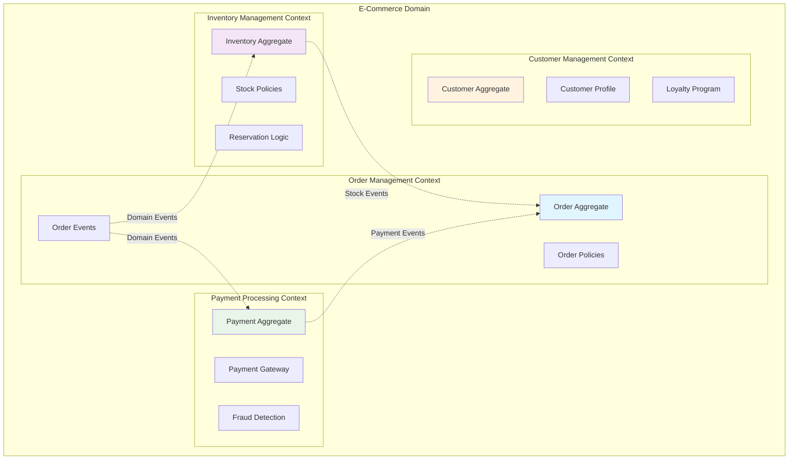

# 🎯 Domain Driven Design (DDD) - Bölüm 4

## 📋 Özet

Bu bölümde Domain Driven Design strategic ve tactical patterns'ını e-ticaret domain'imizde derinlemesine uygulayarak, complex business logic'i organize etmeyi, bounded contexts tasarlamayı, aggregates oluşturmayı ve domain events ile coordination yapmayı öğreneceksiniz. Order, Inventory ve Payment context'lerini DDD principles ile modelleyeceğiz.

## 🎯 Learning Objectives

Bu bölüm sonunda şunları yapabileceksiniz:

- ✅ **Strategic DDD** - Bounded contexts ve context mapping
- ✅ **Tactical DDD** - Aggregates, entities, value objects
- ✅ **Domain Events** - Event-driven coordination
- ✅ **Ubiquitous Language** - Domain experts ile common terminology
- ✅ **Anti-Corruption Layer** - Context boundaries protection
- ✅ **Domain Services** - Complex business logic organization
- ✅ **Repository Pattern** - Aggregate persistence abstraction

## 📋 Prerequisites

- ✅ Clean Architecture ve Hexagonal Architecture tamamlanmış (Bölüm 2-3)
- ✅ Domain modeling temel bilgisi
- ✅ Event-driven architecture concepts
- ✅ Complex business rules handling experience

---

## 🎯 Strategic DDD - Context Design

### Bounded Context Mapping

E-ticaret domain'imizde 3 ana bounded context belirledik:



### Context Relationships

```ascii
┌─────────────────────────────────────────────────────────────────────┐
│                      CONTEXT MAP                                    │
├─────────────────────────────────────────────────────────────────────┤
│                                                                     │
│  ┌─────────────────┐    ┌─────────────────┐    ┌─────────────────┐ │
│  │  Order Context  │    │Inventory Context│    │Payment Context  │ │
│  │                 │    │                 │    │                 │ │
│  │ • Order         │    │ • Inventory     │    │ • Payment       │ │
│  │ • OrderItem     │    │ • Reservation   │    │ • Transaction   │ │
│  │ • Customer      │    │ • Stock Level   │    │ • Gateway       │ │
│  │                 │    │                 │    │                 │ │
│  └─────────┬───────┘    └─────────┬───────┘    └─────────┬───────┘ │
│            │                      │                      │         │
│            │    ┌─────────────────┼──────────────────────┤         │
│            │    │                 │                      │         │
│            │    │    Domain Events Bus                   │         │
│            │    │                 │                      │         │
│            └────┼─────────────────┼──────────────────────┘         │
│                 │                 │                                │
│                 └─────────────────┘                                │
│                                                                     │
│  Relationship Types:                                                │
│  • Shared Kernel: Common domain events                             │
│  • Customer/Supplier: Order → Inventory, Order → Payment           │
│  • Anti-Corruption Layer: External payment gateways                │
│                                                                     │
└─────────────────────────────────────────────────────────────────────┘
```

### Ubiquitous Language

| Term             | Order Context                      | Inventory Context                          | Payment Context                        |
| ---------------- | ---------------------------------- | ------------------------------------------ | -------------------------------------- |
| **Reservation**  | "Order reserves items"             | "Stock allocation for specific order"      | "Authorization hold on payment method" |
| **Confirmation** | "Order is confirmed after payment" | "Reservation becomes permanent allocation" | "Payment is captured/settled"          |
| **Cancellation** | "Order is cancelled by customer"   | "Reserved stock is released"               | "Payment authorization is voided"      |
| **Fulfillment**  | "Order is shipped/delivered"       | "Stock is physically removed"              | "Payment is finalized"                 |

---

## 🏗️ Tactical DDD Implementation

### Order Bounded Context

#### Order Aggregate Root

```java
// domain/model/Order.java
package com.example.order.domain.model;

import com.example.order.domain.valueobject.*;
import com.example.order.domain.event.*;
import com.example.order.domain.policy.*;
import java.time.LocalDateTime;
import java.util.*;

/**
 * Order Aggregate Root
 *
 * Business Rules:
 * - Order must have at least one item
 * - Total amount must match sum of item prices
 * - Status transitions follow business rules
 * - Order can only be modified in PENDING status
 * - Cancellation policies apply based on status
 */
public class Order {
    private OrderId id;
    private CustomerId customerId;
    private List<OrderItem> items;
    private OrderStatus status;
    private Money totalAmount;
    private ShippingAddress shippingAddress;
    private OrderPolicy orderPolicy;
    private LocalDateTime placedAt;
    private LocalDateTime confirmedAt;
    private LocalDateTime cancelledAt;

    // Domain events
    private List<DomainEvent> domainEvents = new ArrayList<>();

    private Order() {
        this.items = new ArrayList<>();
    }

    /**
     * Factory method for creating new orders
     */
    public static Order placeOrder(
        CustomerId customerId,
        List<OrderItem> items,
        ShippingAddress shippingAddress,
        OrderPolicy orderPolicy
    ) {
        validateOrderCreation(customerId, items, shippingAddress);

        Order order = new Order();
        order.id = OrderId.generate();
        order.customerId = customerId;
        order.items = new ArrayList<>(items);
        order.shippingAddress = shippingAddress;
        order.orderPolicy = orderPolicy;
        order.status = OrderStatus.PENDING;
        order.totalAmount = calculateTotalAmount(items);
        order.placedAt = LocalDateTime.now();

        // Apply business policies
        order.applyOrderPolicies();

        // Publish domain event
        order.addDomainEvent(new OrderPlacedEvent(
            order.id,
            order.customerId,
            order.totalAmount,
            order.items.stream().map(OrderItem::getProductId).toList(),
            order.placedAt
        ));

        return order;
    }

    /**
     * Confirm order after payment and inventory verification
     */
    public void confirm(PaymentConfirmation paymentConfirmation,
                       InventoryConfirmation inventoryConfirmation) {
        if (status != OrderStatus.PENDING) {
            throw new IllegalOrderStateException(
                "Only PENDING orders can be confirmed. Current status: " + status);
        }

        validateConfirmationRequirements(paymentConfirmation, inventoryConfirmation);

        this.status = OrderStatus.CONFIRMED;
        this.confirmedAt = LocalDateTime.now();

        addDomainEvent(new OrderConfirmedEvent(
            this.id,
            this.customerId,
            this.totalAmount,
            paymentConfirmation.getPaymentId(),
            this.confirmedAt
        ));
    }

    /**
     * Cancel order with business rule validation
     */
    public OrderCancellationResult cancel(CancellationReason reason, String requestedBy) {
        OrderCancellationPolicy cancellationPolicy = orderPolicy.getCancellationPolicy();

        if (!cancellationPolicy.canCancelOrder(this, reason)) {
            return OrderCancellationResult.denied(
                cancellationPolicy.getCancellationDenialReason(this, reason)
            );
        }

        OrderStatus previousStatus = this.status;
        this.status = OrderStatus.CANCELLED;
        this.cancelledAt = LocalDateTime.now();

        // Calculate cancellation fees if any
        Money cancellationFee = cancellationPolicy.calculateCancellationFee(this, reason);

        addDomainEvent(new OrderCancelledEvent(
            this.id,
            this.customerId,
            previousStatus,
            reason,
            cancellationFee,
            requestedBy,
            this.cancelledAt
        ));

        return OrderCancellationResult.approved(cancellationFee);
    }

    /**
     * Add item to order (only in PENDING status)
     */
    public void addItem(OrderItem newItem) {
        if (status != OrderStatus.PENDING) {
            throw new IllegalOrderStateException("Cannot modify order in status: " + status);
        }

        // Check if item already exists
        Optional<OrderItem> existingItem = findItemByProductId(newItem.getProductId());

        if (existingItem.isPresent()) {
            // Update quantity of existing item
            OrderItem updated = existingItem.get().increaseQuantity(newItem.getQuantity());
            items.remove(existingItem.get());
            items.add(updated);
        } else {
            // Add new item
            items.add(newItem);
        }

        // Recalculate total
        this.totalAmount = calculateTotalAmount(items);

        addDomainEvent(new OrderItemAddedEvent(
            this.id,
            newItem.getProductId(),
            newItem.getQuantity(),
            newItem.getUnitPrice(),
            this.totalAmount
        ));
    }

    /**
     * Remove item from order
     */
    public void removeItem(ProductId productId) {
        if (status != OrderStatus.PENDING) {
            throw new IllegalOrderStateException("Cannot modify order in status: " + status);
        }

        OrderItem itemToRemove = findItemByProductId(productId)
            .orElseThrow(() -> new OrderItemNotFoundException(productId));

        items.remove(itemToRemove);

        if (items.isEmpty()) {
            throw new IllegalOrderStateException("Order must contain at least one item");
        }

        this.totalAmount = calculateTotalAmount(items);

        addDomainEvent(new OrderItemRemovedEvent(
            this.id,
            productId,
            itemToRemove.getQuantity(),
            this.totalAmount
        ));
    }

    private static void validateOrderCreation(
        CustomerId customerId,
        List<OrderItem> items,
        ShippingAddress shippingAddress
    ) {
        if (customerId == null) {
            throw new IllegalArgumentException("Customer ID is required");
        }
        if (items == null || items.isEmpty()) {
            throw new IllegalArgumentException("Order must contain at least one item");
        }
        if (shippingAddress == null) {
            throw new IllegalArgumentException("Shipping address is required");
        }

        // Validate items
        for (OrderItem item : items) {
            if (item.getQuantity().isNegativeOrZero()) {
                throw new IllegalArgumentException("Item quantity must be positive");
            }
            if (item.getUnitPrice().isNegativeOrZero()) {
                throw new IllegalArgumentException("Item price must be positive");
            }
        }
    }

    private void validateConfirmationRequirements(
        PaymentConfirmation paymentConfirmation,
        InventoryConfirmation inventoryConfirmation
    ) {
        if (paymentConfirmation == null || !paymentConfirmation.isSuccessful()) {
            throw new IllegalArgumentException("Valid payment confirmation required");
        }
        if (inventoryConfirmation == null || !inventoryConfirmation.isSuccessful()) {
            throw new IllegalArgumentException("Valid inventory confirmation required");
        }
        if (!paymentConfirmation.getAmount().equals(this.totalAmount)) {
            throw new IllegalArgumentException("Payment amount does not match order total");
        }
    }

    private void applyOrderPolicies() {
        // Apply discount policies
        DiscountPolicy discountPolicy = orderPolicy.getDiscountPolicy();
        Money discount = discountPolicy.calculateDiscount(this);
        if (discount.isPositive()) {
            this.totalAmount = this.totalAmount.subtract(discount);
            addDomainEvent(new DiscountAppliedEvent(this.id, discount, discountPolicy.getType()));
        }

        // Apply shipping policies
        ShippingPolicy shippingPolicy = orderPolicy.getShippingPolicy();
        Money shippingCost = shippingPolicy.calculateShippingCost(this);
        this.totalAmount = this.totalAmount.add(shippingCost);

        addDomainEvent(new ShippingCalculatedEvent(this.id, shippingCost, shippingPolicy.getType()));
    }

    private static Money calculateTotalAmount(List<OrderItem> items) {
        return items.stream()
            .map(OrderItem::getSubtotal)
            .reduce(Money.ZERO, Money::add);
    }

    private Optional<OrderItem> findItemByProductId(ProductId productId) {
        return items.stream()
            .filter(item -> item.getProductId().equals(productId))
            .findFirst();
    }

    private void addDomainEvent(DomainEvent event) {
        this.domainEvents.add(event);
    }

    // Getters
    public OrderId getId() { return id; }
    public CustomerId getCustomerId() { return customerId; }
    public List<OrderItem> getItems() { return List.copyOf(items); }
    public OrderStatus getStatus() { return status; }
    public Money getTotalAmount() { return totalAmount; }
    public ShippingAddress getShippingAddress() { return shippingAddress; }
    public LocalDateTime getPlacedAt() { return placedAt; }
    public LocalDateTime getConfirmedAt() { return confirmedAt; }
    public LocalDateTime getCancelledAt() { return cancelledAt; }
    public List<DomainEvent> getDomainEvents() { return List.copyOf(domainEvents); }

    public void clearDomainEvents() {
        this.domainEvents.clear();
    }

    // Complex business logic results
    public static class OrderCancellationResult {
        private final boolean approved;
        private final Money cancellationFee;
        private final String denialReason;

        private OrderCancellationResult(boolean approved, Money cancellationFee, String denialReason) {
            this.approved = approved;
            this.cancellationFee = cancellationFee;
            this.denialReason = denialReason;
        }

        public static OrderCancellationResult approved(Money cancellationFee) {
            return new OrderCancellationResult(true, cancellationFee, null);
        }

        public static OrderCancellationResult denied(String reason) {
            return new OrderCancellationResult(false, Money.ZERO, reason);
        }

        public boolean isApproved() { return approved; }
        public Money getCancellationFee() { return cancellationFee; }
        public String getDenialReason() { return denialReason; }
    }
}
```

#### Order Item Entity

```java
// domain/model/OrderItem.java
package com.example.order.domain.model;

import com.example.order.domain.valueobject.*;

/**
 * Order Item Entity
 *
 * Business Rules:
 * - Quantity must be positive
 * - Unit price must be positive
 * - Subtotal is calculated as quantity * unit price
 * - Immutable after order confirmation
 */
public class OrderItem {
    private OrderItemId id;
    private ProductId productId;
    private Quantity quantity;
    private Money unitPrice;
    private Money subtotal;

    private OrderItem() {}

    public static OrderItem create(ProductId productId, Quantity quantity, Money unitPrice) {
        if (productId == null) {
            throw new IllegalArgumentException("Product ID is required");
        }
        if (quantity == null || quantity.isNegativeOrZero()) {
            throw new IllegalArgumentException("Quantity must be positive");
        }
        if (unitPrice == null || unitPrice.isNegativeOrZero()) {
            throw new IllegalArgumentException("Unit price must be positive");
        }

        OrderItem item = new OrderItem();
        item.id = OrderItemId.generate();
        item.productId = productId;
        item.quantity = quantity;
        item.unitPrice = unitPrice;
        item.subtotal = unitPrice.multiply(quantity.getValue());

        return item;
    }

    /**
     * Increase quantity (creates new immutable instance)
     */
    public OrderItem increaseQuantity(Quantity additionalQuantity) {
        if (additionalQuantity == null || additionalQuantity.isNegativeOrZero()) {
            throw new IllegalArgumentException("Additional quantity must be positive");
        }

        Quantity newQuantity = this.quantity.add(additionalQuantity);
        return create(this.productId, newQuantity, this.unitPrice);
    }

    /**
     * Update unit price (creates new immutable instance)
     */
    public OrderItem updateUnitPrice(Money newUnitPrice) {
        if (newUnitPrice == null || newUnitPrice.isNegativeOrZero()) {
            throw new IllegalArgumentException("Unit price must be positive");
        }

        return create(this.productId, this.quantity, newUnitPrice);
    }

    // Getters
    public OrderItemId getId() { return id; }
    public ProductId getProductId() { return productId; }
    public Quantity getQuantity() { return quantity; }
    public Money getUnitPrice() { return unitPrice; }
    public Money getSubtotal() { return subtotal; }

    @Override
    public boolean equals(Object o) {
        if (this == o) return true;
        if (o == null || getClass() != o.getClass()) return false;
        OrderItem orderItem = (OrderItem) o;
        return Objects.equals(id, orderItem.id);
    }

    @Override
    public int hashCode() {
        return Objects.hash(id);
    }
}
```

#### Domain Services

```java
// domain/service/OrderDomainService.java
package com.example.order.domain.service;

import com.example.order.domain.model.Order;
import com.example.order.domain.valueobject.*;
import com.example.order.domain.policy.*;

/**
 * Order Domain Service
 *
 * Contains complex business logic that doesn't naturally fit in any aggregate.
 * Coordinates between multiple aggregates or implements complex domain rules.
 */
public class OrderDomainService {

    /**
     * Validate order against inventory availability
     * Complex business rule involving multiple systems
     */
    public OrderValidationResult validateOrderFeasibility(
        Order order,
        InventoryCheckResult inventoryResult,
        CustomerCreditResult creditResult
    ) {
        List<String> violations = new ArrayList<>();

        // Check inventory availability
        for (OrderItem item : order.getItems()) {
            InventoryLevel inventory = inventoryResult.getInventoryLevel(item.getProductId());
            if (inventory.getAvailableQuantity().isLessThan(item.getQuantity())) {
                violations.add(String.format(
                    "Insufficient inventory for product %s. Available: %d, Requested: %d",
                    item.getProductId().getValue(),
                    inventory.getAvailableQuantity().getValue(),
                    item.getQuantity().getValue()
                ));
            }
        }

        // Check customer credit limit
        if (order.getTotalAmount().isGreaterThan(creditResult.getAvailableCredit())) {
            violations.add(String.format(
                "Order amount %s exceeds available credit %s",
                order.getTotalAmount(),
                creditResult.getAvailableCredit()
            ));
        }

        // Check business rules
        if (isHighRiskOrder(order)) {
            violations.add("Order requires manual approval due to high risk factors");
        }

        return violations.isEmpty()
            ? OrderValidationResult.valid()
            : OrderValidationResult.invalid(violations);
    }

    /**
     * Calculate order priority based on complex business rules
     */
    public OrderPriority calculateOrderPriority(
        Order order,
        CustomerProfile customerProfile,
        InventoryStatus inventoryStatus
    ) {
        int priorityScore = 0;

        // Customer tier influence
        switch (customerProfile.getTier()) {
            case PLATINUM -> priorityScore += 50;
            case GOLD -> priorityScore += 30;
            case SILVER -> priorityScore += 10;
            case BRONZE -> priorityScore += 0;
        }

        // Order value influence
        Money orderValue = order.getTotalAmount();
        if (orderValue.isGreaterThan(Money.of(1000))) {
            priorityScore += 20;
        } else if (orderValue.isGreaterThan(Money.of(500))) {
            priorityScore += 10;
        }

        // Inventory scarcity influence
        for (OrderItem item : order.getItems()) {
            if (inventoryStatus.isLowStock(item.getProductId())) {
                priorityScore += 15;
            }
        }

        // Shipping address influence (expedited delivery)
        if (order.getShippingAddress().requiresExpressDelivery()) {
            priorityScore += 25;
        }

        return OrderPriority.fromScore(priorityScore);
    }

    /**
     * Complex fraud detection rules
     */
    public FraudAssessmentResult assessOrderForFraud(
        Order order,
        CustomerProfile customerProfile,
        PaymentMethod paymentMethod
    ) {
        List<FraudIndicator> indicators = new ArrayList<>();
        int riskScore = 0;

        // New customer with high value order
        if (customerProfile.isNewCustomer() && order.getTotalAmount().isGreaterThan(Money.of(500))) {
            indicators.add(FraudIndicator.NEW_CUSTOMER_HIGH_VALUE);
            riskScore += 30;
        }

        // Multiple orders in short time
        if (customerProfile.getRecentOrderCount() > 5) {
            indicators.add(FraudIndicator.FREQUENT_ORDERS);
            riskScore += 20;
        }

        // Different shipping and billing address
        if (!paymentMethod.getBillingAddress().equals(order.getShippingAddress())) {
            indicators.add(FraudIndicator.ADDRESS_MISMATCH);
            riskScore += 15;
        }

        // Velocity checks
        if (customerProfile.getTotalSpentToday().isGreaterThan(Money.of(2000))) {
            indicators.add(FraudIndicator.HIGH_DAILY_VELOCITY);
            riskScore += 25;
        }

        FraudRiskLevel riskLevel;
        if (riskScore >= 50) {
            riskLevel = FraudRiskLevel.HIGH;
        } else if (riskScore >= 25) {
            riskLevel = FraudRiskLevel.MEDIUM;
        } else {
            riskLevel = FraudRiskLevel.LOW;
        }

        return new FraudAssessmentResult(riskLevel, riskScore, indicators);
    }

    private boolean isHighRiskOrder(Order order) {
        // Complex business logic to determine high risk
        return order.getTotalAmount().isGreaterThan(Money.of(5000)) ||
               order.getItems().size() > 20 ||
               hasRestrictedProducts(order);
    }

    private boolean hasRestrictedProducts(Order order) {
        // Check for restricted or controlled products
        return order.getItems().stream()
            .anyMatch(item -> item.getProductId().getValue().startsWith("RESTRICTED_"));
    }
}
```

### Domain Events

```java
// domain/event/OrderPlacedEvent.java
package com.example.order.domain.event;

import com.example.order.domain.valueobject.*;
import java.time.LocalDateTime;
import java.util.List;

/**
 * Order Placed Domain Event
 *
 * Published when a new order is placed by customer.
 * Triggers inventory reservation and payment authorization.
 */
public class OrderPlacedEvent implements DomainEvent {
    private final OrderId orderId;
    private final CustomerId customerId;
    private final Money totalAmount;
    private final List<ProductId> productIds;
    private final LocalDateTime occurredAt;
    private final String eventId;

    public OrderPlacedEvent(
        OrderId orderId,
        CustomerId customerId,
        Money totalAmount,
        List<ProductId> productIds,
        LocalDateTime occurredAt
    ) {
        this.orderId = orderId;
        this.customerId = customerId;
        this.totalAmount = totalAmount;
        this.productIds = List.copyOf(productIds);
        this.occurredAt = occurredAt;
        this.eventId = UUID.randomUUID().toString();
    }

    @Override
    public String getEventId() { return eventId; }

    @Override
    public LocalDateTime getOccurredAt() { return occurredAt; }

    @Override
    public String getAggregateId() { return orderId.getValue(); }

    @Override
    public String getEventType() { return "OrderPlaced"; }

    public OrderId getOrderId() { return orderId; }
    public CustomerId getCustomerId() { return customerId; }
    public Money getTotalAmount() { return totalAmount; }
    public List<ProductId> getProductIds() { return List.copyOf(productIds); }
}
```

```java
// domain/event/OrderConfirmedEvent.java
package com.example.order.domain.event;

import com.example.order.domain.valueobject.*;
import java.time.LocalDateTime;

/**
 * Order Confirmed Domain Event
 *
 * Published when an order is confirmed after successful payment and inventory allocation.
 * Triggers fulfillment process and customer notifications.
 */
public class OrderConfirmedEvent implements DomainEvent {
    private final OrderId orderId;
    private final CustomerId customerId;
    private final Money totalAmount;
    private final PaymentId paymentId;
    private final LocalDateTime occurredAt;
    private final String eventId;

    public OrderConfirmedEvent(
        OrderId orderId,
        CustomerId customerId,
        Money totalAmount,
        PaymentId paymentId,
        LocalDateTime occurredAt
    ) {
        this.orderId = orderId;
        this.customerId = customerId;
        this.totalAmount = totalAmount;
        this.paymentId = paymentId;
        this.occurredAt = occurredAt;
        this.eventId = UUID.randomUUID().toString();
    }

    @Override
    public String getEventId() { return eventId; }

    @Override
    public LocalDateTime getOccurredAt() { return occurredAt; }

    @Override
    public String getAggregateId() { return orderId.getValue(); }

    @Override
    public String getEventType() { return "OrderConfirmed"; }

    public OrderId getOrderId() { return orderId; }
    public CustomerId getCustomerId() { return customerId; }
    public Money getTotalAmount() { return totalAmount; }
    public PaymentId getPaymentId() { return paymentId; }
}
```

### Domain Policies

```java
// domain/policy/OrderCancellationPolicy.java
package com.example.order.domain.policy;

import com.example.order.domain.model.Order;
import com.example.order.domain.valueobject.*;
import java.time.Duration;
import java.time.LocalDateTime;

/**
 * Order Cancellation Policy
 *
 * Encapsulates complex business rules around order cancellation.
 * Rules may vary based on customer tier, order status, and timing.
 */
public class OrderCancellationPolicy {
    private final CustomerTier customerTier;
    private final Duration gracePeriod;
    private final Money cancellationFeeRate;

    public OrderCancellationPolicy(
        CustomerTier customerTier,
        Duration gracePeriod,
        Money cancellationFeeRate
    ) {
        this.customerTier = customerTier;
        this.gracePeriod = gracePeriod;
        this.cancellationFeeRate = cancellationFeeRate;
    }

    /**
     * Determine if order can be cancelled
     */
    public boolean canCancelOrder(Order order, CancellationReason reason) {
        // Cannot cancel delivered orders
        if (order.getStatus() == OrderStatus.DELIVERED) {
            return false;
        }

        // Different rules for different statuses
        switch (order.getStatus()) {
            case PENDING:
                return true; // Always can cancel pending orders

            case CONFIRMED:
                // Check if within grace period
                Duration timeSinceConfirmation = Duration.between(
                    order.getConfirmedAt(),
                    LocalDateTime.now()
                );
                return timeSinceConfirmation.compareTo(gracePeriod) <= 0;

            case SHIPPED:
                // Only premium customers can cancel shipped orders
                return customerTier.isPremium() && reason == CancellationReason.CUSTOMER_REQUEST;

            case CANCELLED:
                return false; // Already cancelled

            default:
                return false;
        }
    }

    /**
     * Calculate cancellation fee based on business rules
     */
    public Money calculateCancellationFee(Order order, CancellationReason reason) {
        if (!canCancelOrder(order, reason)) {
            return Money.ZERO;
        }

        // No fee for cancellations within grace period
        if (order.getStatus() == OrderStatus.PENDING) {
            return Money.ZERO;
        }

        // No fee for premium customers
        if (customerTier.isPremium()) {
            return Money.ZERO;
        }

        // Calculate percentage-based fee
        switch (order.getStatus()) {
            case CONFIRMED:
                return order.getTotalAmount().multiply(cancellationFeeRate.getAmount().doubleValue());

            case SHIPPED:
                // Higher fee for shipped orders
                return order.getTotalAmount().multiply(cancellationFeeRate.getAmount().doubleValue() * 2);

            default:
                return Money.ZERO;
        }
    }

    /**
     * Get reason why cancellation was denied
     */
    public String getCancellationDenialReason(Order order, CancellationReason reason) {
        if (order.getStatus() == OrderStatus.DELIVERED) {
            return "Cannot cancel delivered orders";
        }

        if (order.getStatus() == OrderStatus.CONFIRMED) {
            Duration timeSinceConfirmation = Duration.between(
                order.getConfirmedAt(),
                LocalDateTime.now()
            );
            if (timeSinceConfirmation.compareTo(gracePeriod) > 0) {
                return String.format(
                    "Order can only be cancelled within %d hours of confirmation",
                    gracePeriod.toHours()
                );
            }
        }

        if (order.getStatus() == OrderStatus.SHIPPED && !customerTier.isPremium()) {
            return "Only premium customers can cancel shipped orders";
        }

        return "Order cannot be cancelled in current status: " + order.getStatus();
    }
}
```

```java
// domain/policy/DiscountPolicy.java
package com.example.order.domain.policy;

import com.example.order.domain.model.Order;
import com.example.order.domain.valueobject.*;
import java.math.BigDecimal;

/**
 * Discount Policy
 *
 * Encapsulates business rules for calculating discounts.
 * Supports multiple discount types and customer tiers.
 */
public abstract class DiscountPolicy {

    public abstract Money calculateDiscount(Order order);
    public abstract String getType();

    /**
     * Volume discount based on order amount
     */
    public static class VolumeDiscountPolicy extends DiscountPolicy {
        private final Money minimumOrderAmount;
        private final BigDecimal discountPercentage;

        public VolumeDiscountPolicy(Money minimumOrderAmount, BigDecimal discountPercentage) {
            this.minimumOrderAmount = minimumOrderAmount;
            this.discountPercentage = discountPercentage;
        }

        @Override
        public Money calculateDiscount(Order order) {
            if (order.getTotalAmount().isGreaterThanOrEqual(minimumOrderAmount)) {
                return order.getTotalAmount().multiply(discountPercentage.doubleValue());
            }
            return Money.ZERO;
        }

        @Override
        public String getType() {
            return "VOLUME_DISCOUNT";
        }
    }

    /**
     * Customer tier discount
     */
    public static class CustomerTierDiscountPolicy extends DiscountPolicy {
        private final CustomerTier customerTier;
        private final BigDecimal discountPercentage;

        public CustomerTierDiscountPolicy(CustomerTier customerTier, BigDecimal discountPercentage) {
            this.customerTier = customerTier;
            this.discountPercentage = discountPercentage;
        }

        @Override
        public Money calculateDiscount(Order order) {
            // Discount applies to all orders for eligible customers
            return order.getTotalAmount().multiply(discountPercentage.doubleValue());
        }

        @Override
        public String getType() {
            return "CUSTOMER_TIER_DISCOUNT";
        }
    }

    /**
     * Composite discount policy
     */
    public static class CompositeDiscountPolicy extends DiscountPolicy {
        private final List<DiscountPolicy> policies;

        public CompositeDiscountPolicy(List<DiscountPolicy> policies) {
            this.policies = List.copyOf(policies);
        }

        @Override
        public Money calculateDiscount(Order order) {
            return policies.stream()
                .map(policy -> policy.calculateDiscount(order))
                .reduce(Money.ZERO, Money::add);
        }

        @Override
        public String getType() {
            return "COMPOSITE_DISCOUNT";
        }
    }
}
```

---

## 🔄 Yapılan İşlemler & Mimari Açıklamalar

### 1. **Strategic DDD Implementation**

```ascii
┌─────────────────────────────────────────────────────────────────────┐
│                         BOUNDED CONTEXTS                            │
├─────────────────────────────────────────────────────────────────────┤
│                                                                     │
│  ┌─────────────────────┐      ┌─────────────────────────────────┐   │
│  │   Order Context     │      │     Inventory Context          │   │
│  │                     │      │                                 │   │
│  │ • Order (AR)        │◄────►│ • Inventory (AR)               │   │
│  │ • OrderItem (E)     │      │ • Reservation (E)              │   │
│  │ • Money (VO)        │      │ • StockLevel (VO)              │   │
│  │ • OrderStatus (VO)  │      │ • ProductId (VO)               │   │
│  │                     │      │                                 │   │
│  │ Domain Events:      │      │ Domain Events:                 │   │
│  │ • OrderPlaced       │─────►│ • InventoryReserved            │   │
│  │ • OrderConfirmed    │      │ • StockLevelChanged            │   │
│  │ • OrderCancelled    │◄─────│ • LowStockAlert                │   │
│  └─────────────────────┘      └─────────────────────────────────┘   │
│            │                                   │                    │
│            │                                   │                    │
│            ▼                                   ▼                    │
│  ┌─────────────────────┐      ┌─────────────────────────────────┐   │
│  │   Payment Context   │      │       Shared Kernel             │   │
│  │                     │      │                                 │   │
│  │ • Payment (AR)      │      │ • DomainEvent interface         │   │
│  │ • Transaction (E)   │      │ • Money value object            │   │
│  │ • Gateway (VO)      │      │ • ProductId value object        │   │
│  │ • PaymentStatus(VO) │      │ • CustomerId value object       │   │
│  └─────────────────────┘      └─────────────────────────────────┘   │
│                                                                     │
└─────────────────────────────────────────────────────────────────────┘
```

**💡 Strategic Design**: Her bounded context kendi domain model'ine sahip, domain events ile coordinate oluyor.

### 2. **Tactical Patterns Implementation**

- **Aggregates**: Order, Inventory, Payment - transaction boundaries
- **Entities**: OrderItem, ReservationRecord, Transaction
- **Value Objects**: Money, ProductId, OrderStatus - immutable, self-validating
- **Domain Services**: Complex business logic coordination
- **Domain Events**: Cross-aggregate communication
- **Policies**: Encapsulated business rules

### 3. **Business Logic Organization**

```java
// Domain Layer Organization
Order (Aggregate Root)
├── Business Rules (invariants)
├── State Transitions (status changes)
├── Domain Events (coordination)
└── Policy Application (business policies)

OrderDomainService
├── Multi-aggregate coordination
├── Complex calculations
├── External system coordination
└── Cross-cutting business rules
```

---

## ✅ Verification Checklist

### Strategic DDD Compliance

- [ ] Bounded contexts net olarak tanımlanmış
- [ ] Context relationships doğru modellenmiş
- [ ] Ubiquitous language consistent kullanılıyor
- [ ] Anti-corruption layers external integrations'da var

### Tactical DDD Implementation

- [ ] Aggregates doğru transaction boundaries define ediyor
- [ ] Entities identity-based equality kullanıyor
- [ ] Value objects immutable ve self-validating
- [ ] Domain events proper olarak publish ediliyor

### Business Logic Quality

- [ ] Complex business rules domain layer'da encapsulated
- [ ] Policies business rules'ı cleanly organize ediyor
- [ ] Domain services multi-aggregate coordination yapıyor
- [ ] Invariants aggregate'lerde korunuyor

---

## 🧪 Hands-On Tasks

### Task 1: Complete Order Bounded Context Implementation

Order context'ini DDD patterns ile tamamlayın:

1. **Aggregate Design**

   - Order aggregate root
   - OrderItem entity
   - Value objects (OrderId, Money, OrderStatus)
   - Business rule enforcement

2. **Domain Events**

   - OrderPlaced, OrderConfirmed, OrderCancelled
   - Event publishing mechanism
   - Cross-context coordination

3. **Domain Services**

   - OrderDomainService for complex logic
   - FraudDetectionService
   - OrderValidationService

4. **Policies**
   - CancellationPolicy
   - DiscountPolicy
   - ShippingPolicy

### Task 2: Implement Inventory Bounded Context

```java
// Inventory aggregate with DDD patterns
public class Inventory {
    // Aggregate root for stock management
    // Business rules:
    // - Stock cannot go negative
    // - Reservations must be tracked
    // - Low stock alerts
    // - Expiring reservations cleanup
}

public class StockReservation {
    // Entity for tracking reservations
    // Business rules:
    // - Expiration handling
    // - Partial fulfillment
    // - Reservation conflicts
}

public class InventoryDomainService {
    // Multi-product allocation
    // Stock optimization
    // Supplier coordination
}
```

### Task 3: Payment Bounded Context

```java
// Payment aggregate with complex business rules
public class Payment {
    // Aggregate root for payment processing
    // Business rules:
    // - Payment state machine
    // - Fraud detection integration
    // - Refund policies
    // - Multi-currency support
}

public class PaymentPolicy {
    // Encapsulated payment business rules
    // - Risk assessment
    // - Payment method restrictions
    // - Currency conversion rules
}
```

### Task 4: Cross-Context Integration

```java
// Event handlers for cross-context coordination
@Component
public class OrderEventHandler {

    @EventHandler
    public void handle(OrderPlacedEvent event) {
        // Reserve inventory
        // Authorize payment
        // Send notifications
    }

    @EventHandler
    public void handle(InventoryReservedEvent event) {
        // Update order status
        // Trigger payment processing
    }

    @EventHandler
    public void handle(PaymentCompletedEvent event) {
        // Confirm order
        // Start fulfillment
    }
}
```

---

## 💡 Solutions / Hints

<details>
<summary>💡 Task 1 Aggregate Design Guidelines</summary>

```java
// Aggregate design principles
public class Order {
    // 1. Encapsulate business rules
    public void confirm() {
        if (this.status != OrderStatus.PENDING) {
            throw new IllegalStateException("Only pending orders can be confirmed");
        }
        // Business logic
    }

    // 2. Maintain invariants
    private void validateOrderTotal() {
        Money calculatedTotal = items.stream()
            .map(OrderItem::getSubtotal)
            .reduce(Money.ZERO, Money::add);
        if (!calculatedTotal.equals(this.totalAmount)) {
            throw new IllegalStateException("Order total must match sum of items");
        }
    }

    // 3. Publish domain events
    private void addDomainEvent(DomainEvent event) {
        this.domainEvents.add(event);
    }
}
```

</details>

<details>
<summary>💡 Task 2 Value Object Implementation</summary>

```java
// Value object best practices
public class Money {
    private final BigDecimal amount;
    private final Currency currency;

    // Immutable
    public Money add(Money other) {
        if (!this.currency.equals(other.currency)) {
            throw new IllegalArgumentException("Currency mismatch");
        }
        return new Money(this.amount.add(other.amount), this.currency);
    }

    // Self-validating
    public Money(BigDecimal amount, Currency currency) {
        if (amount == null || amount.compareTo(BigDecimal.ZERO) < 0) {
            throw new IllegalArgumentException("Amount cannot be negative");
        }
        this.amount = amount;
        this.currency = currency;
    }

    // Value-based equality
    @Override
    public boolean equals(Object o) {
        if (this == o) return true;
        if (!(o instanceof Money)) return false;
        Money money = (Money) o;
        return Objects.equals(amount, money.amount) &&
               Objects.equals(currency, money.currency);
    }
}
```

</details>

---

## 📈 Next Steps

Bu DDD implementation'ını tamamladıktan sonra:

1. **🔄 SAGA Pattern** - Long-running business processes
2. **📤 Outbox Pattern** - Reliable event publishing
3. **📊 CQRS Pattern** - Query optimization ve read models
4. **🎪 Event Sourcing** - Event-based state management

### Learning Path Validation

- [ ] Order, Inventory, Payment bounded contexts implemented
- [ ] Domain events cross-context coordination working
- [ ] Business policies properly encapsulated
- [ ] Complex business rules in domain services
- [ ] Tactical patterns correctly applied

## 📚 Further Reading

### Essential Resources

- **Domain-Driven Design** - Eric Evans (Blue Book)
- **Implementing Domain-Driven Design** - Vaughn Vernon (Red Book)
- **Domain Modeling Made Functional** - Scott Wlaschin

### Advanced Topics

- **Event Storming** - Alberto Brandolini
- **Microservices Patterns** - Chris Richardson
- **Patterns, Principles, and Practices of DDD** - Scott Millett

---

**🎯 Hedef**: Domain-driven design ile complex business logic'i organize etmek ve maintainable domain model oluşturmak.

**⏱️ Süre**: 2 hafta

**🚀 Başarı Kriterleri**: Bounded contexts tanımlanmış, tactical patterns uygulanmış, business rules properly encapsulated.
