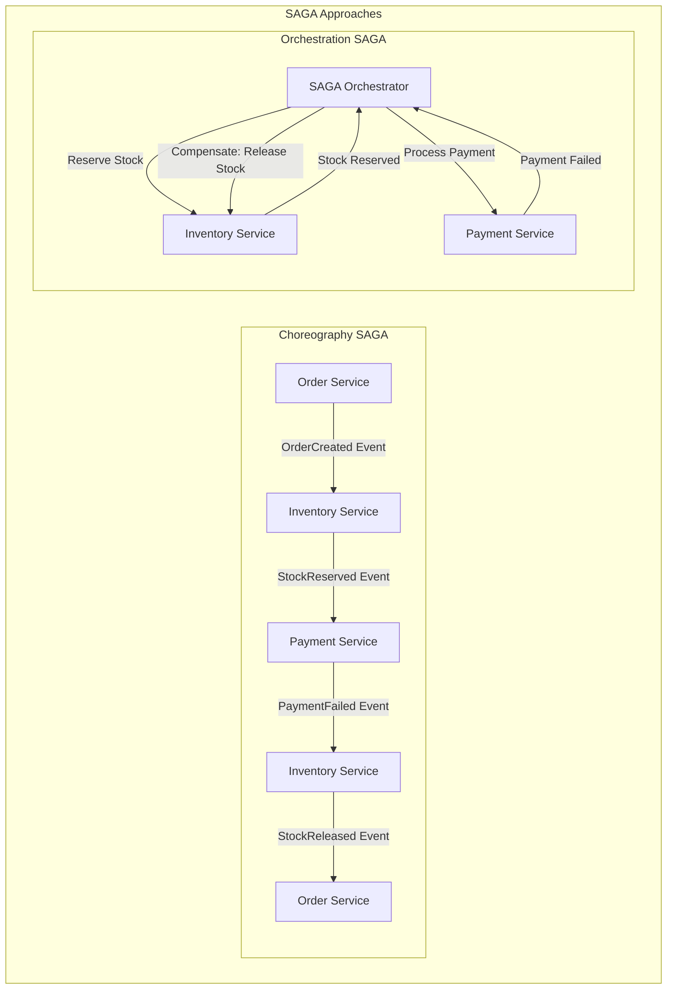

# 🎯 SAGA Architecture Pattern - Bölüm 5

## 📋 Özet

Bu bölümde SAGA Pattern ile distributed transaction'ları yönetmeyi, long-running business process'leri implemente etmeyi ve microservice'ler arası data consistency sağlamayı öğreneceksiniz. Choreography ve Orchestration yaklaşımlarını e-ticaret domain'imizde pratik olarak uygulayacağız.

## 🎯 Öğrenme Hedefleri

Bu bölüm sonunda şunları yapabileceksiniz:

- ✅ **SAGA Pattern Fundamentals** - Distributed transaction yönetimi
- ✅ **Choreography SAGA** - Event-driven decentralized approach
- ✅ **Orchestration SAGA** - Centralized coordination approach
- ✅ **Compensation Logic** - Rollback ve error handling
- ✅ **SAGA State Management** - Process state tracking
- ✅ **Timeout Handling** - Dead process detection ve recovery
- ✅ **Monitoring & Observability** - SAGA execution tracking

## 📋 Ön Koşullar

- ✅ Domain Driven Design tamamlanmış (Bölüm 4)
- ✅ Event-driven architecture kavramları
- ✅ Distributed systems temel bilgisi
- ✅ Transaction management concepts

---

## 🎯 SAGA Pattern Nedir?

SAGA Pattern, distributed transaction'ları manage etmek için kullanılan bir pattern'dir. Microservice architecture'da traditional ACID transaction'lar mümkün olmadığında, eventual consistency sağlamak için kullanılır.

### Problem: Distributed Transaction Challenges

```ascii
┌─────────────────────────────────────────────────────────────────────┐
│                    DISTRIBUTED TRANSACTION PROBLEM                  │
├─────────────────────────────────────────────────────────────────────┤
│                                                                     │
│  ┌─────────────────┐    ┌─────────────────┐    ┌─────────────────┐ │
│  │  Order Service  │    │Inventory Service│    │Payment Service  │ │
│  │                 │    │                 │    │                 │ │
│  │ • Create Order  │───►│ • Reserve Stock │───►│ • Charge Payment│ │
│  │ • Set PENDING   │    │ • Update Levels │    │ • Authorization │ │
│  │                 │    │                 │    │                 │ │
│  └─────────────────┘    └─────────────────┘    └─────────────────┘ │
│           │                        │                        │       │
│           │                        │                        │       │
│           ▼                        ▼                        ▼       │
│    ❌ Ne olur eğer?          ❌ Ne olur eğer?         ❌ Ne olur eğer? │
│    • Network failure        • Stock insufficient      • Payment fails│
│    • Service down           • Timeout occurs          • Card declined│
│    • Database error         • Concurrent access       • Fraud detected│
│                                                                     │
│  💥 SORUN: Partial success → Inconsistent state                   │
│  💡 ÇÖZÜM: SAGA Pattern → Compensating actions                    │
│                                                                     │
└─────────────────────────────────────────────────────────────────────┘
```

### SAGA Pattern Solution

SAGA Pattern iki ana yaklaşım sunar:

1. **Choreography SAGA**: Event-driven, decentralized
2. **Orchestration SAGA**: Command-driven, centralized



---

## 🎪 Choreography SAGA Implementation

### Event-Driven Saga Architecture

Choreography SAGA'da her service kendi responsibility'si ile ilgili event'leri dinler ve publish eder.

```java
// domain/saga/OrderProcessingSaga.java
package com.example.saga.choreography;

/**
 * Order Processing Choreography SAGA
 *
 * Event Flow:
 * 1. OrderPlaced → Inventory reserves stock
 * 2. StockReserved → Payment processes authorization
 * 3. PaymentAuthorized → Order confirms
 * 4. Any failure → Compensation events triggered
 */
public class OrderProcessingSaga {

    // SAGA participant services collaborate through events
    // No central coordinator - each service knows its role

    /*
     * Event Flow Sequence:
     *
     * Happy Path:
     * OrderPlaced ──► StockReserved ──► PaymentAuthorized ──► OrderConfirmed
     *
     * Compensation Path:
     * PaymentFailed ──► StockReleased ──► OrderCancelled
     * StockUnavailable ──► OrderCancelled
     */
}
```

### Order Service - SAGA Participant

```java
// application/saga/OrderSagaEventHandler.java
package com.example.order.application.saga;

import com.example.order.domain.model.Order;
import com.example.order.domain.repository.OrderRepository;
import com.example.common.events.*;
import org.springframework.stereotype.Component;
import org.springframework.transaction.annotation.Transactional;
import lombok.extern.slf4j.Slf4j;

@Component
@Slf4j
public class OrderSagaEventHandler {

    private final OrderRepository orderRepository;
    private final DomainEventPublisher eventPublisher;

    public OrderSagaEventHandler(
        OrderRepository orderRepository,
        DomainEventPublisher eventPublisher
    ) {
        this.orderRepository = orderRepository;
        this.eventPublisher = eventPublisher;
    }

    /**
     * Order placement triggers SAGA start
     */
    @EventHandler
    @Transactional
    public void handle(OrderPlacedEvent event) {
        log.info("SAGA: Order placed, triggering inventory reservation for order: {}",
                 event.getOrderId());

        // Order service has already created the order
        // Event is automatically published to trigger next step

        // Inventory service will listen to this event and reserve stock
        log.debug("SAGA Step 1: OrderPlaced event published, waiting for inventory response");
    }

    /**
     * Inventory reservation success
     */
    @EventHandler
    @Transactional
    public void handle(InventoryReservedEvent event) {
        log.info("SAGA: Inventory reserved for order: {}, proceeding to payment",
                 event.getOrderId());

        Order order = orderRepository.findById(OrderId.of(event.getOrderId()))
            .orElseThrow(() -> new OrderNotFoundException(event.getOrderId()));

        // Update order with inventory confirmation
        order.markInventoryReserved(
            ReservationId.of(event.getReservationId()),
            event.getReservedQuantities()
        );

        orderRepository.save(order);

        // Payment service will listen to InventoryReserved event
        log.debug("SAGA Step 2: Inventory reserved, payment processing will start");
    }

    /**
     * Payment authorization success - SAGA completion
     */
    @EventHandler
    @Transactional
    public void handle(PaymentAuthorizedEvent event) {
        log.info("SAGA: Payment authorized for order: {}, confirming order",
                 event.getOrderId());

        Order order = orderRepository.findById(OrderId.of(event.getOrderId()))
            .orElseThrow(() -> new OrderNotFoundException(event.getOrderId()));

        // Confirm order - SAGA successful completion
        PaymentConfirmation paymentConfirmation = PaymentConfirmation.create(
            PaymentId.of(event.getPaymentId()),
            Money.of(event.getAmount(), event.getCurrency()),
            event.getAuthorizationCode()
        );

        InventoryConfirmation inventoryConfirmation = order.getInventoryConfirmation();

        order.confirm(paymentConfirmation, inventoryConfirmation);
        orderRepository.save(order);

        log.info("SAGA: Order {} successfully completed", event.getOrderId());
    }

    /**
     * Inventory reservation failure - SAGA compensation
     */
    @EventHandler
    @Transactional
    public void handle(InventoryReservationFailedEvent event) {
        log.warn("SAGA: Inventory reservation failed for order: {}, cancelling order",
                 event.getOrderId());

        Order order = orderRepository.findById(OrderId.of(event.getOrderId()))
            .orElseThrow(() -> new OrderNotFoundException(event.getOrderId()));

        // Cancel order due to inventory failure
        OrderCancellationResult result = order.cancel(
            CancellationReason.INVENTORY_UNAVAILABLE,
            "SAGA-COMPENSATION"
        );

        if (result.isApproved()) {
            orderRepository.save(order);
            log.info("SAGA: Order {} cancelled due to inventory failure", event.getOrderId());
        } else {
            log.error("SAGA: Failed to cancel order {} - {}",
                     event.getOrderId(), result.getDenialReason());
        }
    }

    /**
     * Payment authorization failure - SAGA compensation
     */
    @EventHandler
    @Transactional
    public void handle(PaymentAuthorizationFailedEvent event) {
        log.warn("SAGA: Payment authorization failed for order: {}, starting compensation",
                 event.getOrderId());

        Order order = orderRepository.findById(OrderId.of(event.getOrderId()))
            .orElseThrow(() -> new OrderNotFoundException(event.getOrderId()));

        // Trigger inventory compensation
        if (order.hasInventoryReservation()) {
            InventoryCompensationRequest compensationRequest =
                InventoryCompensationRequest.create(
                    order.getId(),
                    order.getInventoryReservation().getReservationId(),
                    "Payment authorization failed"
                );

            eventPublisher.publish(new CompensateInventoryEvent(compensationRequest));
        }

        // Cancel order
        OrderCancellationResult result = order.cancel(
            CancellationReason.PAYMENT_FAILED,
            "SAGA-COMPENSATION"
        );

        if (result.isApproved()) {
            orderRepository.save(order);
        }

        log.info("SAGA: Compensation triggered for order {}", event.getOrderId());
    }

    /**
     * Inventory compensation completed
     */
    @EventHandler
    @Transactional
    public void handle(InventoryCompensatedEvent event) {
        log.info("SAGA: Inventory compensation completed for order: {}",
                 event.getOrderId());

        Order order = orderRepository.findById(OrderId.of(event.getOrderId()))
            .orElseThrow(() -> new OrderNotFoundException(event.getOrderId()));

        // Mark inventory compensation as completed
        order.markInventoryCompensated();
        orderRepository.save(order);

        log.info("SAGA: Order {} fully compensated", event.getOrderId());
    }
}
```

### Inventory Service - SAGA Participant

```java
// application/saga/InventorySagaEventHandler.java
package com.example.inventory.application.saga;

import com.example.inventory.domain.model.Inventory;
import com.example.inventory.domain.repository.InventoryRepository;
import com.example.common.events.*;
import org.springframework.stereotype.Component;
import org.springframework.transaction.annotation.Transactional;
import lombok.extern.slf4j.Slf4j;

@Component
@Slf4j
public class InventorySagaEventHandler {

    private final InventoryRepository inventoryRepository;
    private final DomainEventPublisher eventPublisher;
    private final InventoryService inventoryService;

    /**
     * Order placed - Reserve inventory
     */
    @EventHandler
    @Transactional
    public void handle(OrderPlacedEvent event) {
        log.info("SAGA: Processing inventory reservation for order: {}",
                 event.getOrderId());

        try {
            // Create reservation requests from order items
            List<InventoryReservationRequest> requests = event.getItems().stream()
                .map(item -> InventoryReservationRequest.create(
                    ProductId.of(item.getProductId()),
                    Quantity.of(item.getQuantity()),
                    OrderId.of(event.getOrderId()),
                    Duration.ofMinutes(30) // Reservation timeout
                ))
                .collect(Collectors.toList());

            // Reserve inventory for all items
            MultiProductReservationResult result =
                inventoryService.reserveMultipleProducts(requests);

            if (result.isSuccessful()) {
                // Publish success event
                InventoryReservedEvent reservedEvent = new InventoryReservedEvent(
                    event.getOrderId(),
                    result.getReservations().stream()
                        .collect(Collectors.toMap(
                            res -> res.getProductId().getValue(),
                            res -> res.getQuantity().getValue()
                        )),
                    result.getReservationIds().stream()
                        .map(ReservationId::getValue)
                        .collect(Collectors.toList()),
                    LocalDateTime.now()
                );

                eventPublisher.publish(reservedEvent);

                log.info("SAGA: Inventory reserved successfully for order: {}",
                         event.getOrderId());
            } else {
                // Publish failure event
                InventoryReservationFailedEvent failedEvent =
                    new InventoryReservationFailedEvent(
                        event.getOrderId(),
                        result.getFailureReasons(),
                        LocalDateTime.now()
                    );

                eventPublisher.publish(failedEvent);

                log.warn("SAGA: Inventory reservation failed for order: {} - {}",
                         event.getOrderId(), result.getFailureReasons());
            }

        } catch (Exception e) {
            log.error("SAGA: Error processing inventory reservation for order: {}",
                     event.getOrderId(), e);

            // Publish error event
            InventoryReservationFailedEvent errorEvent =
                new InventoryReservationFailedEvent(
                    event.getOrderId(),
                    List.of("Internal error: " + e.getMessage()),
                    LocalDateTime.now()
                );

            eventPublisher.publish(errorEvent);
        }
    }

    /**
     * Compensation: Release reserved inventory
     */
    @EventHandler
    @Transactional
    public void handle(CompensateInventoryEvent event) {
        log.info("SAGA: Processing inventory compensation for order: {}",
                 event.getOrderId());

        try {
            InventoryCompensationRequest request = event.getCompensationRequest();

            // Release all reservations for the order
            for (ReservationId reservationId : request.getReservationIds()) {
                Optional<Inventory> inventoryOpt =
                    inventoryRepository.findByReservationId(reservationId);

                if (inventoryOpt.isPresent()) {
                    Inventory inventory = inventoryOpt.get();
                    inventory.cancelReservation(reservationId, request.getReason());
                    inventoryRepository.save(inventory);

                    log.debug("SAGA: Released reservation {} for order {}",
                             reservationId.getValue(), event.getOrderId());
                }
            }

            // Publish compensation completed event
            InventoryCompensatedEvent compensatedEvent =
                new InventoryCompensatedEvent(
                    event.getOrderId(),
                    request.getReservationIds().stream()
                        .map(ReservationId::getValue)
                        .collect(Collectors.toList()),
                    LocalDateTime.now()
                );

            eventPublisher.publish(compensatedEvent);

            log.info("SAGA: Inventory compensation completed for order: {}",
                     event.getOrderId());

        } catch (Exception e) {
            log.error("SAGA: Error processing inventory compensation for order: {}",
                     event.getOrderId(), e);

            // Could publish compensation failed event here
            // For now, we'll rely on timeout mechanisms
        }
    }

    /**
     * Order confirmed - Convert reservations to allocations
     */
    @EventHandler
    @Transactional
    public void handle(OrderConfirmedEvent event) {
        log.info("SAGA: Converting inventory reservations to allocations for order: {}",
                 event.getOrderId());

        try {
            // Find all reservations for this order and confirm them
            List<Inventory> inventories =
                inventoryRepository.findByOrderId(OrderId.of(event.getOrderId()));

            for (Inventory inventory : inventories) {
                List<StockReservation> orderReservations = inventory.getActiveReservations()
                    .stream()
                    .filter(res -> res.getOrderId().getValue().equals(event.getOrderId()))
                    .collect(Collectors.toList());

                for (StockReservation reservation : orderReservations) {
                    inventory.confirmReservation(reservation.getId());
                }

                inventoryRepository.save(inventory);
            }

            log.info("SAGA: Inventory allocations completed for order: {}",
                     event.getOrderId());

        } catch (Exception e) {
            log.error("SAGA: Error converting reservations to allocations for order: {}",
                     event.getOrderId(), e);
        }
    }
}
```

### Payment Service - SAGA Participant

```java
// application/saga/PaymentSagaEventHandler.java
package com.example.payment.application.saga;

import com.example.payment.domain.model.Payment;
import com.example.payment.domain.repository.PaymentRepository;
import com.example.common.events.*;
import org.springframework.stereotype.Component;
import org.springframework.transaction.annotation.Transactional;
import lombok.extern.slf4j.Slf4j;

@Component
@Slf4j
public class PaymentSagaEventHandler {

    private final PaymentRepository paymentRepository;
    private final PaymentService paymentService;
    private final DomainEventPublisher eventPublisher;

    /**
     * Inventory reserved - Process payment authorization
     */
    @EventHandler
    @Transactional
    public void handle(InventoryReservedEvent event) {
        log.info("SAGA: Processing payment authorization for order: {}",
                 event.getOrderId());

        try {
            // Find existing payment for this order
            Optional<Payment> paymentOpt =
                paymentRepository.findByOrderId(OrderId.of(event.getOrderId()));

            if (paymentOpt.isEmpty()) {
                log.error("SAGA: No payment found for order: {}", event.getOrderId());

                PaymentAuthorizationFailedEvent failedEvent =
                    new PaymentAuthorizationFailedEvent(
                        event.getOrderId(),
                        null,
                        "PAYMENT_NOT_FOUND",
                        "Payment not found for order",
                        LocalDateTime.now()
                    );

                eventPublisher.publish(failedEvent);
                return;
            }

            Payment payment = paymentOpt.get();

            // Simulate payment gateway call
            PaymentGatewayResult gatewayResult = simulatePaymentGateway(payment);
            RiskAssessment riskAssessment = performRiskAssessment(payment);

            // Authorize payment
            PaymentAuthorizationResult authResult =
                payment.authorize(gatewayResult, riskAssessment);

            paymentRepository.save(payment);

            if (authResult.isSuccessful()) {
                // Publish success event
                PaymentAuthorizedEvent authorizedEvent = new PaymentAuthorizedEvent(
                    payment.getId().getValue(),
                    event.getOrderId(),
                    payment.getCustomerId().getValue(),
                    payment.getAmount().getAmount(),
                    payment.getAmount().getCurrency().getCurrencyCode(),
                    authResult.getAuthorizationCode(),
                    authResult.getAuthorizedAt()
                );

                eventPublisher.publish(authorizedEvent);

                log.info("SAGA: Payment authorized successfully for order: {}",
                         event.getOrderId());
            } else {
                // Publish failure event
                PaymentAuthorizationFailedEvent failedEvent =
                    new PaymentAuthorizationFailedEvent(
                        event.getOrderId(),
                        payment.getId().getValue(),
                        "AUTHORIZATION_FAILED",
                        authResult.getFailureReason(),
                        LocalDateTime.now()
                    );

                eventPublisher.publish(failedEvent);

                log.warn("SAGA: Payment authorization failed for order: {} - {}",
                         event.getOrderId(), authResult.getFailureReason());
            }

        } catch (Exception e) {
            log.error("SAGA: Error processing payment authorization for order: {}",
                     event.getOrderId(), e);

            PaymentAuthorizationFailedEvent errorEvent =
                new PaymentAuthorizationFailedEvent(
                    event.getOrderId(),
                    null,
                    "INTERNAL_ERROR",
                    "Payment processing error: " + e.getMessage(),
                    LocalDateTime.now()
                );

            eventPublisher.publish(errorEvent);
        }
    }

    private PaymentGatewayResult simulatePaymentGateway(Payment payment) {
        // Simulate payment gateway interaction
        // In real implementation, this would call actual payment gateway

        if (payment.getPaymentMethod().isExpired()) {
            return PaymentGatewayResult.failed("CARD_EXPIRED", "Payment method expired");
        }

        if (payment.getAmount().getAmount().compareTo(BigDecimal.valueOf(10000)) > 0) {
            return PaymentGatewayResult.failed("AMOUNT_LIMIT_EXCEEDED", "Amount exceeds limit");
        }

        // Simulate random failure for testing
        if (Math.random() < 0.1) { // 10% failure rate
            return PaymentGatewayResult.failed("INSUFFICIENT_FUNDS", "Insufficient funds");
        }

        return PaymentGatewayResult.successful(
            "AUTH-" + UUID.randomUUID().toString().substring(0, 8),
            "GW-TXN-" + System.currentTimeMillis()
        );
    }

    private RiskAssessment performRiskAssessment(Payment payment) {
        // Simplified risk assessment
        List<String> riskFactors = new ArrayList<>();
        int riskScore = 0;

        if (payment.getPaymentMethod().isFirstTimeUse()) {
            riskFactors.add("First time payment method");
            riskScore += 20;
        }

        if (payment.getAmount().getAmount().compareTo(BigDecimal.valueOf(1000)) > 0) {
            riskFactors.add("High amount transaction");
            riskScore += 15;
        }

        RiskLevel riskLevel = riskScore >= 30 ? RiskLevel.HIGH :
                             riskScore >= 15 ? RiskLevel.MEDIUM : RiskLevel.LOW;

        return new RiskAssessment(riskLevel, riskScore, riskFactors);
    }
}
```

---

## 🔄 Yapılan İşlemler & Mimari Açıklamalar

### 1. **Choreography SAGA Architecture**

```ascii
┌─────────────────────────────────────────────────────────────────────┐
│                      CHOREOGRAPHY SAGA FLOW                        │
├─────────────────────────────────────────────────────────────────────┤
│                                                                     │
│  1. OrderPlaced Event        2. InventoryReserved Event             │
│  ┌─────────┐ publishes    ┌──────────────┐ publishes               │
│  │  Order  │─────────────►│  Inventory   │─────────────┐            │
│  │ Service │              │   Service    │             │            │
│  └─────────┘              └──────────────┘             │            │
│       ▲                                                │            │
│       │                                                ▼            │
│       │                   3. PaymentAuthorized Event ┌──────────┐   │
│       │              ◄─────────────────────────────────│ Payment  │   │
│       │                                               │ Service  │   │
│       │                                               └──────────┘   │
│       │                                                              │
│  4. OrderConfirmed                                                   │
│                                                                     │
│  COMPENSATION FLOW (if failures occur):                            │
│  ┌─────────┐ PaymentFailed  ┌──────────────┐ CompensateInventory   │
│  │  Order  │◄───────────────│   Payment    │─────────────────────►│ │
│  │ Service │                │   Service    │                      │ │
│  └─────────┘                └──────────────┘                      │ │
│       │                                                           │ │
│       │ OrderCancelled                    InventoryCompensated   │ │
│       ▼                                  ◄─────────────────────────┘ │
│  ┌──────────────┐                      ┌──────────────┐              │
│  │   Customer   │                      │  Inventory   │              │
│  │Notification  │                      │   Service    │              │
│  └──────────────┘                      └──────────────┘              │
│                                                                     │
└─────────────────────────────────────────────────────────────────────┘
```

**💡 Choreography Avantajları:**

- **Loose Coupling**: Service'ler birbirini doğrudan tanımaz
- **High Autonomy**: Her service kendi logic'ini manage eder
- **Event-Driven**: Natural microservice communication pattern
- **Scalability**: Service'ler independent olarak scale olabilir

**⚠️ Choreography Dezavantajları:**

- **Complex Debugging**: Flow'u trace etmek zor
- **No Central Control**: Business process overview yok
- **Event Ordering**: Event sequence'i garanti etmek zor
- **Monitoring Complexity**: End-to-end visibility challenging

### 2. **SAGA Event Patterns**

```java
// SAGA Event Categories
public interface SagaEvent extends DomainEvent {
    String getSagaId();
    SagaEventType getEventType();
}

public enum SagaEventType {
    SAGA_STARTED,        // SAGA başladı
    STEP_COMPLETED,      // Bir adım tamamlandı
    STEP_FAILED,         // Bir adım başarısız
    COMPENSATION_STARTED, // Compensation başladı
    COMPENSATION_COMPLETED, // Compensation tamamlandı
    SAGA_COMPLETED,      // SAGA başarıyla tamamlandı
    SAGA_ABORTED         // SAGA iptal edildi
}
```

### 3. **Error Handling & Compensation**

Her SAGA participant:

- **Forward Recovery**: Retry mechanisms ile step'i complete etmeye çalışır
- **Backward Recovery**: Compensation action'ları ile rollback yapar
- **Timeout Handling**: Belirli süre sonra timeout ve compensation
- **Idempotency**: Aynı event multiple times safely process edilebilir

---

## ✅ Verification Checklist

### Choreography SAGA Implementation

- [ ] Event-driven service communication kurulmuş
- [ ] Her service kendi responsibility'sini handle ediyor
- [ ] Compensation logic tüm participant'lerde implement edilmiş
- [ ] Event idempotency sağlanmış

### Error Handling & Recovery

- [ ] Timeout mechanisms implement edilmiş
- [ ] Retry logic ile transient error'lar handle ediliyor
- [ ] Compensation actions tüm business rules'ı follow ediyor
- [ ] Dead letter queue mechanisms var

### Monitoring & Observability

- [ ] SAGA execution'ı trace edilebiliyor
- [ ] Event flow visualization mevcut
- [ ] Performance metrics collect ediliyor
- [ ] Error alerting configure edilmiş

---

## 🧪 Next Steps

Sıradaki adımda **Orchestration SAGA** implementation'ını ve **SAGA State Management** advanced patterns'ını göreceğiz.

**🎯 Hedef**: Distributed transaction'ları reliable şekilde manage etmek
**⏱️ Süre**: 2 hafta  
**🚀 Başarı Kriterleri**: Event-driven coordination, compensation logic, error handling
