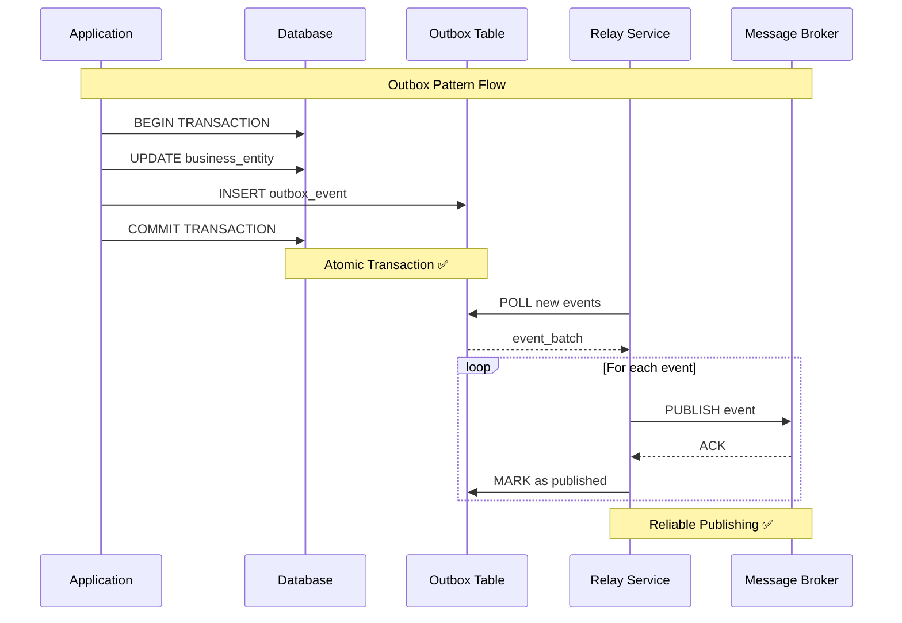

# 📤 Outbox Pattern - Reliable Event Publishing - Bölüm 6

## 📋 Özet

Bu bölümde Outbox Pattern ile reliable event publishing implement edeceğiz. Microservices architecture'da database transaction'ları ile event publishing'i atomic olarak gerçekleştirme, dual write problem'ini çözme ve eventual consistency sağlama konularını derinlemesine öğreneceksiniz.

## 🎯 Öğrenme Hedefleri

Bu bölüm sonunda şunları yapabileceksiniz:

- ✅ **Outbox Pattern Fundamentals** - Reliable event publishing principles
- ✅ **Transactional Outbox** - Database transaction ile event atomicity
- ✅ **Outbox Relay Service** - Event publishing automation
- ✅ **CDC (Change Data Capture)** - Database change tracking
- ✅ **Event Deduplication** - Duplicate event handling
- ✅ **Error Handling & Retry** - Resilient event publishing
- ✅ **Performance Optimization** - Bulk processing ve batching
- ✅ **Monitoring & Observability** - Event publishing metrics

## 📋 Ön Koşullar

- ✅ SAGA Pattern tamamlanmış (Bölüm 5)
- ✅ Event-driven architecture concepts
- ✅ Database transaction management
- ✅ Apache Kafka basics
- ✅ Eventual consistency concepts

---

## 📤 Outbox Pattern Nedir?

Outbox Pattern, **database transaction'ları ile event publishing'i atomically** gerçekleştirmek için kullanılan pattern'dir. Dual write problem'ini çözer ve reliable event publishing sağlar.

### Problem: Dual Write Problem

```ascii
┌─────────────────────────────────────────────────────────────────────┐
│                        DUAL WRITE PROBLEM                          │
├─────────────────────────────────────────────────────────────────────┤
│                                                                     │
│  💥 PROBLEM SCENARIO                                               │
│  ┌─────────────────────────────────────────────────────────────┐   │
│  │                                                             │   │
│  │  1. Application Logic                                       │   │
│  │     ┌───────────────────┐                                  │   │
│  │     │ Business Logic    │                                  │   │
│  │     │ - Process Order   │                                  │   │
│  │     │ - Update State    │                                  │   │
│  │     └───────────────────┘                                  │   │
│  │             │                                               │   │
│  │             ▼                                               │   │
│  │  2. Database Write          3. Event Publish               │   │
│  │     ┌──────────────┐          ┌──────────────┐            │   │
│  │     │ UPDATE order │ SUCCESS  │ PUBLISH      │ FAILURE    │   │
│  │     │ SET status = │ ✅       │ OrderCreated │ ❌         │   │
│  │     │ 'CONFIRMED'  │          │ Event        │            │   │
│  │     └──────────────┘          └──────────────┘            │   │
│  │                                                             │   │
│  │  💥 RESULT: Inconsistent State                             │   │
│  │     - Database updated                                      │   │
│  │     - Event NOT published                                  │   │
│  │     - Other services don't know about order               │   │
│  │                                                             │   │
│  └─────────────────────────────────────────────────────────────┘   │
│                                                                     │
│  🚫 FAILURE SCENARIOS                                              │
│  • Network failure during event publishing                         │
│  • Message broker unavailable                                      │
│  • Application crash between DB write and event publish            │
│  • Transaction committed but event publishing fails                │
│                                                                     │
│  💡 SOLUTION: Outbox Pattern                                       │
│  • Store events in same database transaction                       │
│  • Separate process publishes events reliably                      │
│  • Atomic consistency within database                              │
│  • Eventually consistent across services                           │
│                                                                     │
└─────────────────────────────────────────────────────────────────────┘
```

### Outbox Pattern Solution



---

## 🏗️ Outbox Pattern Implementation

### Outbox Entity Design

```java
// domain/outbox/OutboxEvent.java
package com.example.order.domain.outbox;

import com.example.order.domain.valueobject.*;
import jakarta.persistence.*;
import java.time.LocalDateTime;
import java.util.UUID;

/**
 * Outbox Event Entity
 *
 * Business transaction ile atomically store edilen event'ler.
 * Eventual consistency sağlamak için separate process tarafından publish edilir.
 */
@Entity
@Table(name = "outbox_events", indexes = {
    @Index(name = "idx_outbox_status_created", columnList = "status, createdAt"),
    @Index(name = "idx_outbox_aggregate_id", columnList = "aggregateId"),
    @Index(name = "idx_outbox_event_type", columnList = "eventType")
})
public class OutboxEvent {

    @Id
    @Column(name = "id")
    private String id;

    @Column(name = "aggregate_type", nullable = false)
    private String aggregateType;

    @Column(name = "aggregate_id", nullable = false)
    private String aggregateId;

    @Column(name = "event_type", nullable = false)
    private String eventType;

    @Column(name = "event_data", columnDefinition = "TEXT", nullable = false)
    private String eventData;

    @Column(name = "event_metadata", columnDefinition = "TEXT")
    private String eventMetadata;

    @Enumerated(EnumType.STRING)
    @Column(name = "status", nullable = false)
    private OutboxEventStatus status;

    @Column(name = "created_at", nullable = false)
    private LocalDateTime createdAt;

    @Column(name = "published_at")
    private LocalDateTime publishedAt;

    @Column(name = "retry_count")
    private int retryCount = 0;

    @Column(name = "last_retry_at")
    private LocalDateTime lastRetryAt;

    @Column(name = "error_message")
    private String errorMessage;

    @Version
    @Column(name = "version")
    private Long version;

    protected OutboxEvent() {} // JPA constructor

    private OutboxEvent(
        String id,
        String aggregateType,
        String aggregateId,
        String eventType,
        String eventData,
        String eventMetadata,
        OutboxEventStatus status,
        LocalDateTime createdAt
    ) {
        this.id = id;
        this.aggregateType = aggregateType;
        this.aggregateId = aggregateId;
        this.eventType = eventType;
        this.eventData = eventData;
        this.eventMetadata = eventMetadata;
        this.status = status;
        this.createdAt = createdAt;
    }

    /**
     * Create new outbox event
     */
    public static OutboxEvent create(
        String aggregateType,
        String aggregateId,
        String eventType,
        Object eventPayload,
        EventMetadata metadata
    ) {
        try {
            ObjectMapper mapper = new ObjectMapper();
            mapper.registerModule(new JavaTimeModule());

            String eventData = mapper.writeValueAsString(eventPayload);
            String eventMetadata = metadata != null ?
                mapper.writeValueAsString(metadata) : null;

            return new OutboxEvent(
                UUID.randomUUID().toString(),
                aggregateType,
                aggregateId,
                eventType,
                eventData,
                eventMetadata,
                OutboxEventStatus.PENDING,
                LocalDateTime.now()
            );

        } catch (Exception e) {
            throw new OutboxEventCreationException("Failed to create outbox event", e);
        }
    }

    /**
     * Mark event as published
     */
    public void markAsPublished() {
        if (this.status != OutboxEventStatus.PENDING) {
            throw new IllegalOutboxEventStateException(
                "Cannot mark event as published. Current status: " + this.status
            );
        }

        this.status = OutboxEventStatus.PUBLISHED;
        this.publishedAt = LocalDateTime.now();
    }

    /**
     * Mark event as failed
     */
    public void markAsFailed(String errorMessage) {
        this.status = OutboxEventStatus.FAILED;
        this.errorMessage = errorMessage;
        this.lastRetryAt = LocalDateTime.now();
        this.retryCount++;
    }

    /**
     * Reset for retry
     */
    public void resetForRetry() {
        if (this.status != OutboxEventStatus.FAILED) {
            throw new IllegalOutboxEventStateException(
                "Cannot retry event. Current status: " + this.status
            );
        }

        this.status = OutboxEventStatus.PENDING;
        this.errorMessage = null;
    }

    /**
     * Check if event can be retried
     */
    public boolean canRetry(int maxRetries) {
        return this.status == OutboxEventStatus.FAILED &&
               this.retryCount < maxRetries;
    }

    /**
     * Check if event is old enough for cleanup
     */
    public boolean canBeCleanedUp(LocalDateTime cleanupThreshold) {
        return this.status == OutboxEventStatus.PUBLISHED &&
               this.publishedAt != null &&
               this.publishedAt.isBefore(cleanupThreshold);
    }

    /**
     * Deserialize event data
     */
    public <T> T getEventPayload(Class<T> eventClass) {
        try {
            ObjectMapper mapper = new ObjectMapper();
            mapper.registerModule(new JavaTimeModule());
            return mapper.readValue(this.eventData, eventClass);
        } catch (Exception e) {
            throw new OutboxEventDeserializationException(
                "Failed to deserialize event data", e
            );
        }
    }

    /**
     * Deserialize event metadata
     */
    public EventMetadata getEventMetadata() {
        if (this.eventMetadata == null) {
            return null;
        }

        try {
            ObjectMapper mapper = new ObjectMapper();
            mapper.registerModule(new JavaTimeModule());
            return mapper.readValue(this.eventMetadata, EventMetadata.class);
        } catch (Exception e) {
            throw new OutboxEventDeserializationException(
                "Failed to deserialize event metadata", e
            );
        }
    }

    // Getters
    public String getId() { return id; }
    public String getAggregateType() { return aggregateType; }
    public String getAggregateId() { return aggregateId; }
    public String getEventType() { return eventType; }
    public String getEventData() { return eventData; }
    public String getEventMetadata() { return eventMetadata; }
    public OutboxEventStatus getStatus() { return status; }
    public LocalDateTime getCreatedAt() { return createdAt; }
    public LocalDateTime getPublishedAt() { return publishedAt; }
    public int getRetryCount() { return retryCount; }
    public LocalDateTime getLastRetryAt() { return lastRetryAt; }
    public String getErrorMessage() { return errorMessage; }
    public Long getVersion() { return version; }
}

/**
 * Outbox Event Status
 */
public enum OutboxEventStatus {
    PENDING,      // Event created, waiting to be published
    PUBLISHED,    // Event successfully published
    FAILED        // Event publishing failed
}

/**
 * Event Metadata for tracing and correlation
 */
public record EventMetadata(
    String correlationId,
    String causationId,
    String userId,
    String traceId,
    LocalDateTime timestamp,
    String source,
    int version
) {
    public static EventMetadata create(String correlationId, String source) {
        return new EventMetadata(
            correlationId,
            null,
            null,
            UUID.randomUUID().toString(),
            LocalDateTime.now(),
            source,
            1
        );
    }
}
```

### Outbox Repository

```java
// infrastructure/persistence/OutboxEventRepository.java
package com.example.order.infrastructure.persistence;

import com.example.order.domain.outbox.OutboxEvent;
import com.example.order.domain.outbox.OutboxEventStatus;
import org.springframework.data.jpa.repository.JpaRepository;
import org.springframework.data.jpa.repository.Query;
import org.springframework.data.jpa.repository.Modifying;
import org.springframework.data.repository.query.Param;
import org.springframework.stereotype.Repository;

import java.time.LocalDateTime;
import java.util.List;

/**
 * Outbox Event Repository
 */
@Repository
public interface OutboxEventRepository extends JpaRepository<OutboxEvent, String> {

    /**
     * Find pending events for publishing
     */
    @Query("""
        SELECT e FROM OutboxEvent e
        WHERE e.status = :status
        ORDER BY e.createdAt ASC
        """)
    List<OutboxEvent> findPendingEvents(
        @Param("status") OutboxEventStatus status,
        Pageable pageable
    );

    /**
     * Find failed events that can be retried
     */
    @Query("""
        SELECT e FROM OutboxEvent e
        WHERE e.status = :status
        AND e.retryCount < :maxRetries
        AND (e.lastRetryAt IS NULL OR e.lastRetryAt < :retryThreshold)
        ORDER BY e.createdAt ASC
        """)
    List<OutboxEvent> findRetryableEvents(
        @Param("status") OutboxEventStatus status,
        @Param("maxRetries") int maxRetries,
        @Param("retryThreshold") LocalDateTime retryThreshold,
        Pageable pageable
    );

    /**
     * Find events by aggregate
     */
    List<OutboxEvent> findByAggregateTypeAndAggregateIdOrderByCreatedAtAsc(
        String aggregateType,
        String aggregateId
    );

    /**
     * Find events for cleanup
     */
    @Query("""
        SELECT e FROM OutboxEvent e
        WHERE e.status = :status
        AND e.publishedAt < :cleanupThreshold
        """)
    List<OutboxEvent> findEventsForCleanup(
        @Param("status") OutboxEventStatus status,
        @Param("cleanupThreshold") LocalDateTime cleanupThreshold
    );

    /**
     * Count events by status
     */
    long countByStatus(OutboxEventStatus status);

    /**
     * Count events by status and time range
     */
    @Query("""
        SELECT COUNT(e) FROM OutboxEvent e
        WHERE e.status = :status
        AND e.createdAt BETWEEN :startTime AND :endTime
        """)
    long countByStatusAndTimeRange(
        @Param("status") OutboxEventStatus status,
        @Param("startTime") LocalDateTime startTime,
        @Param("endTime") LocalDateTime endTime
    );

    /**
     * Bulk delete old published events
     */
    @Modifying
    @Query("""
        DELETE FROM OutboxEvent e
        WHERE e.status = :status
        AND e.publishedAt < :cleanupThreshold
        """)
    int deleteOldPublishedEvents(
        @Param("status") OutboxEventStatus status,
        @Param("cleanupThreshold") LocalDateTime cleanupThreshold
    );

    /**
     * Find events by correlation ID for tracing
     */
    @Query("""
        SELECT e FROM OutboxEvent e
        WHERE JSON_EXTRACT(e.eventMetadata, '$.correlationId') = :correlationId
        ORDER BY e.createdAt ASC
        """)
    List<OutboxEvent> findByCorrelationId(@Param("correlationId") String correlationId);

    /**
     * Find events that might be stuck
     */
    @Query("""
        SELECT e FROM OutboxEvent e
        WHERE e.status = :status
        AND e.createdAt < :stuckThreshold
        """)
    List<OutboxEvent> findStuckEvents(
        @Param("status") OutboxEventStatus status,
        @Param("stuckThreshold") LocalDateTime stuckThreshold
    );
}
```

### Domain Service Integration

```java
// application/service/OrderDomainService.java
package com.example.order.application.service;

import com.example.order.domain.model.Order;
import com.example.order.domain.outbox.OutboxEvent;
import com.example.order.domain.event.*;
import com.example.order.infrastructure.persistence.OutboxEventRepository;
import org.springframework.stereotype.Service;
import org.springframework.transaction.annotation.Transactional;

/**
 * Order Domain Service with Outbox Pattern
 *
 * Business operations ile event publishing'i atomically yapar.
 */
@Service
@Transactional
public class OrderDomainService {

    private final OrderRepository orderRepository;
    private final OutboxEventRepository outboxEventRepository;

    public OrderDomainService(
        OrderRepository orderRepository,
        OutboxEventRepository outboxEventRepository
    ) {
        this.orderRepository = orderRepository;
        this.outboxEventRepository = outboxEventRepository;
    }

    /**
     * Create order with outbox events
     */
    public OrderCreationResult createOrder(CreateOrderCommand command) {
        try {
            // 1. Business logic - Create order
            Order order = Order.create(
                command.getCustomerId(),
                command.getItems(),
                command.getShippingAddress(),
                command.getPaymentMethod()
            );

            // 2. Persist order
            Order savedOrder = orderRepository.save(order);

            // 3. Create outbox events - SAME TRANSACTION
            EventMetadata metadata = EventMetadata.create(
                command.getCorrelationId(),
                "order-service"
            );

            // Order placed event
            OrderPlacedEvent orderPlacedEvent = OrderPlacedEvent.builder()
                .orderId(savedOrder.getId().getValue())
                .customerId(savedOrder.getCustomerId().getValue())
                .items(mapOrderItems(savedOrder.getItems()))
                .totalAmount(savedOrder.getTotalAmount().getAmount())
                .currency(savedOrder.getTotalAmount().getCurrency().getCurrencyCode())
                .paymentMethod(savedOrder.getPaymentMethod().getType())
                .shippingAddress(mapShippingAddress(savedOrder.getShippingAddress()))
                .occurredAt(LocalDateTime.now())
                .build();

            OutboxEvent outboxEvent = OutboxEvent.create(
                "Order",
                savedOrder.getId().getValue(),
                "OrderPlaced",
                orderPlacedEvent,
                metadata
            );

            outboxEventRepository.save(outboxEvent);

            // Customer notification event
            CustomerNotificationEvent notificationEvent = CustomerNotificationEvent.builder()
                .customerId(savedOrder.getCustomerId().getValue())
                .orderId(savedOrder.getId().getValue())
                .notificationType("ORDER_CREATED")
                .message("Your order has been created successfully")
                .email(savedOrder.getCustomer().getEmail())
                .occurredAt(LocalDateTime.now())
                .build();

            OutboxEvent notificationOutboxEvent = OutboxEvent.create(
                "Order",
                savedOrder.getId().getValue(),
                "CustomerNotification",
                notificationEvent,
                metadata
            );

            outboxEventRepository.save(notificationOutboxEvent);

            log.info("Order created successfully with outbox events: {}",
                    savedOrder.getId().getValue());

            return OrderCreationResult.success(savedOrder.getId());

        } catch (Exception e) {
            log.error("Failed to create order: {}", command.getCustomerId(), e);
            throw new OrderCreationException("Order creation failed", e);
        }
    }

    /**
     * Confirm order with outbox events
     */
    public OrderConfirmationResult confirmOrder(ConfirmOrderCommand command) {
        try {
            // 1. Load order
            Order order = orderRepository.findById(command.getOrderId())
                .orElseThrow(() -> new OrderNotFoundException(command.getOrderId()));

            // 2. Business logic - Confirm order
            OrderConfirmationResult result = order.confirm(
                command.getPaymentConfirmation(),
                command.getInventoryConfirmation()
            );

            if (!result.isSuccessful()) {
                return result;
            }

            // 3. Persist order changes
            orderRepository.save(order);

            // 4. Create outbox events - SAME TRANSACTION
            EventMetadata metadata = EventMetadata.create(
                command.getCorrelationId(),
                "order-service"
            );

            // Order confirmed event
            OrderConfirmedEvent orderConfirmedEvent = OrderConfirmedEvent.builder()
                .orderId(order.getId().getValue())
                .customerId(order.getCustomerId().getValue())
                .totalAmount(order.getTotalAmount().getAmount())
                .currency(order.getTotalAmount().getCurrency().getCurrencyCode())
                .paymentId(command.getPaymentConfirmation().getPaymentId().getValue())
                .inventoryReservationIds(command.getInventoryConfirmation()
                    .getReservationIds().stream()
                    .map(ReservationId::getValue)
                    .collect(Collectors.toList()))
                .confirmedAt(LocalDateTime.now())
                .build();

            OutboxEvent confirmationEvent = OutboxEvent.create(
                "Order",
                order.getId().getValue(),
                "OrderConfirmed",
                orderConfirmedEvent,
                metadata
            );

            outboxEventRepository.save(confirmationEvent);

            // Fulfillment trigger event
            FulfillmentTriggerEvent fulfillmentEvent = FulfillmentTriggerEvent.builder()
                .orderId(order.getId().getValue())
                .items(mapOrderItems(order.getItems()))
                .shippingAddress(mapShippingAddress(order.getShippingAddress()))
                .priority(order.getPriority().name())
                .triggeredAt(LocalDateTime.now())
                .build();

            OutboxEvent fulfillmentOutboxEvent = OutboxEvent.create(
                "Order",
                order.getId().getValue(),
                "FulfillmentTriggered",
                fulfillmentEvent,
                metadata
            );

            outboxEventRepository.save(fulfillmentOutboxEvent);

            log.info("Order confirmed successfully with outbox events: {}",
                    order.getId().getValue());

            return result;

        } catch (Exception e) {
            log.error("Failed to confirm order: {}", command.getOrderId(), e);
            throw new OrderConfirmationException("Order confirmation failed", e);
        }
    }

    /**
     * Cancel order with outbox events
     */
    public OrderCancellationResult cancelOrder(CancelOrderCommand command) {
        try {
            // 1. Load order
            Order order = orderRepository.findById(command.getOrderId())
                .orElseThrow(() -> new OrderNotFoundException(command.getOrderId()));

            // 2. Business logic - Cancel order
            OrderCancellationResult result = order.cancel(
                command.getCancellationReason(),
                command.getRequestedBy()
            );

            if (!result.isApproved()) {
                return result;
            }

            // 3. Persist order changes
            orderRepository.save(order);

            // 4. Create outbox events - SAME TRANSACTION
            EventMetadata metadata = EventMetadata.create(
                command.getCorrelationId(),
                "order-service"
            );

            // Order cancelled event
            OrderCancelledEvent orderCancelledEvent = OrderCancelledEvent.builder()
                .orderId(order.getId().getValue())
                .customerId(order.getCustomerId().getValue())
                .cancellationReason(command.getCancellationReason().name())
                .requestedBy(command.getRequestedBy())
                .previousStatus(order.getPreviousStatus().name())
                .cancelledAt(LocalDateTime.now())
                .build();

            OutboxEvent cancellationEvent = OutboxEvent.create(
                "Order",
                order.getId().getValue(),
                "OrderCancelled",
                orderCancelledEvent,
                metadata
            );

            outboxEventRepository.save(cancellationEvent);

            // Refund trigger event (if payment was processed)
            if (order.hasPayment()) {
                RefundTriggerEvent refundEvent = RefundTriggerEvent.builder()
                    .orderId(order.getId().getValue())
                    .paymentId(order.getPayment().getPaymentId().getValue())
                    .refundAmount(order.getTotalAmount().getAmount())
                    .currency(order.getTotalAmount().getCurrency().getCurrencyCode())
                    .reason("Order cancellation")
                    .triggeredAt(LocalDateTime.now())
                    .build();

                OutboxEvent refundOutboxEvent = OutboxEvent.create(
                    "Order",
                    order.getId().getValue(),
                    "RefundTriggered",
                    refundEvent,
                    metadata
                );

                outboxEventRepository.save(refundOutboxEvent);
            }

            log.info("Order cancelled successfully with outbox events: {}",
                    order.getId().getValue());

            return result;

        } catch (Exception e) {
            log.error("Failed to cancel order: {}", command.getOrderId(), e);
            throw new OrderCancellationException("Order cancellation failed", e);
        }
    }

    // Helper methods for mapping
    private List<OrderItemData> mapOrderItems(List<OrderItem> items) {
        return items.stream()
            .map(item -> OrderItemData.builder()
                .productId(item.getProductId().getValue())
                .quantity(item.getQuantity().getValue())
                .unitPrice(item.getUnitPrice().getAmount())
                .build())
            .collect(Collectors.toList());
    }

    private AddressData mapShippingAddress(Address address) {
        return AddressData.builder()
            .street(address.getStreet())
            .city(address.getCity())
            .zipCode(address.getZipCode())
            .country(address.getCountry())
            .build();
    }
}
```

---

## 🔄 Outbox Relay Service

### Event Publishing Service

```java
// infrastructure/outbox/OutboxEventPublisher.java
package com.example.order.infrastructure.outbox;

import com.example.order.domain.outbox.OutboxEvent;
import com.example.order.infrastructure.persistence.OutboxEventRepository;
import org.apache.kafka.clients.producer.ProducerRecord;
import org.springframework.kafka.core.KafkaTemplate;
import org.springframework.stereotype.Service;
import org.springframework.transaction.annotation.Transactional;
import lombok.extern.slf4j.Slf4j;

/**
 * Outbox Event Publisher
 *
 * Outbox table'dan event'leri okur ve message broker'a publish eder.
 * Reliability, retry logic ve error handling sağlar.
 */
@Service
@Slf4j
public class OutboxEventPublisher {

    private final OutboxEventRepository outboxEventRepository;
    private final KafkaTemplate<String, String> kafkaTemplate;
    private final OutboxConfiguration outboxConfig;
    private final EventMapper eventMapper;
    private final OutboxMetrics outboxMetrics;

    public OutboxEventPublisher(
        OutboxEventRepository outboxEventRepository,
        KafkaTemplate<String, String> kafkaTemplate,
        OutboxConfiguration outboxConfig,
        EventMapper eventMapper,
        OutboxMetrics outboxMetrics
    ) {
        this.outboxEventRepository = outboxEventRepository;
        this.kafkaTemplate = kafkaTemplate;
        this.outboxConfig = outboxConfig;
        this.eventMapper = eventMapper;
        this.outboxMetrics = outboxMetrics;
    }

    /**
     * Process pending outbox events
     */
    @Transactional
    public void processPendingEvents() {
        try {
            int batchSize = outboxConfig.getBatchSize();
            Pageable pageable = PageRequest.of(0, batchSize);

            List<OutboxEvent> pendingEvents = outboxEventRepository
                .findPendingEvents(OutboxEventStatus.PENDING, pageable);

            if (pendingEvents.isEmpty()) {
                log.debug("No pending outbox events to process");
                return;
            }

            log.info("Processing {} pending outbox events", pendingEvents.size());

            int successCount = 0;
            int failureCount = 0;

            for (OutboxEvent event : pendingEvents) {
                try {
                    boolean published = publishEvent(event);

                    if (published) {
                        event.markAsPublished();
                        successCount++;
                        outboxMetrics.recordEventPublished(event.getEventType());

                        log.debug("Successfully published outbox event: {}", event.getId());
                    } else {
                        event.markAsFailed("Publishing failed - unknown error");
                        failureCount++;
                        outboxMetrics.recordEventFailed(event.getEventType());

                        log.warn("Failed to publish outbox event: {}", event.getId());
                    }

                } catch (Exception e) {
                    event.markAsFailed("Publishing failed: " + e.getMessage());
                    failureCount++;
                    outboxMetrics.recordEventFailed(event.getEventType());

                    log.error("Error publishing outbox event: {}", event.getId(), e);
                }
            }

            // Bulk save all updates
            outboxEventRepository.saveAll(pendingEvents);

            log.info("Outbox processing completed - Success: {}, Failed: {}",
                    successCount, failureCount);

            // Update metrics
            outboxMetrics.recordBatchProcessed(successCount, failureCount);

        } catch (Exception e) {
            log.error("Error processing pending outbox events", e);
            outboxMetrics.recordBatchError();
        }
    }

    /**
     * Retry failed events
     */
    @Transactional
    public void retryFailedEvents() {
        try {
            int maxRetries = outboxConfig.getMaxRetries();
            LocalDateTime retryThreshold = LocalDateTime.now()
                .minus(outboxConfig.getRetryDelay());

            Pageable pageable = PageRequest.of(0, outboxConfig.getRetryBatchSize());

            List<OutboxEvent> retryableEvents = outboxEventRepository
                .findRetryableEvents(
                    OutboxEventStatus.FAILED,
                    maxRetries,
                    retryThreshold,
                    pageable
                );

            if (retryableEvents.isEmpty()) {
                log.debug("No retryable outbox events found");
                return;
            }

            log.info("Retrying {} failed outbox events", retryableEvents.size());

            int retrySuccessCount = 0;
            int retryFailureCount = 0;

            for (OutboxEvent event : retryableEvents) {
                try {
                    // Reset event for retry
                    event.resetForRetry();

                    boolean published = publishEvent(event);

                    if (published) {
                        event.markAsPublished();
                        retrySuccessCount++;
                        outboxMetrics.recordEventRetrySuccess(event.getEventType());

                        log.info("Successfully retried outbox event: {} (attempt {})",
                                event.getId(), event.getRetryCount());
                    } else {
                        event.markAsFailed("Retry failed - unknown error");
                        retryFailureCount++;
                        outboxMetrics.recordEventRetryFailed(event.getEventType());

                        log.warn("Retry failed for outbox event: {} (attempt {})",
                                event.getId(), event.getRetryCount());
                    }

                } catch (Exception e) {
                    event.markAsFailed("Retry failed: " + e.getMessage());
                    retryFailureCount++;
                    outboxMetrics.recordEventRetryFailed(event.getEventType());

                    log.error("Error retrying outbox event: {} (attempt {})",
                             event.getId(), event.getRetryCount(), e);
                }
            }

            // Bulk save all updates
            outboxEventRepository.saveAll(retryableEvents);

            log.info("Outbox retry completed - Success: {}, Failed: {}",
                    retrySuccessCount, retryFailureCount);

        } catch (Exception e) {
            log.error("Error retrying failed outbox events", e);
        }
    }

    /**
     * Publish single event to message broker
     */
    private boolean publishEvent(OutboxEvent outboxEvent) {
        try {
            // Map to Kafka message
            String topic = eventMapper.getTopicForEvent(outboxEvent.getEventType());
            String key = outboxEvent.getAggregateId();
            String value = createKafkaMessage(outboxEvent);

            // Add headers for tracing and metadata
            ProducerRecord<String, String> record = new ProducerRecord<>(topic, key, value);

            // Add correlation ID for tracing
            EventMetadata metadata = outboxEvent.getEventMetadata();
            if (metadata != null) {
                record.headers().add("correlationId", metadata.correlationId().getBytes());
                record.headers().add("traceId", metadata.traceId().getBytes());
                record.headers().add("source", metadata.source().getBytes());
            }

            // Add event metadata
            record.headers().add("eventType", outboxEvent.getEventType().getBytes());
            record.headers().add("aggregateType", outboxEvent.getAggregateType().getBytes());
            record.headers().add("aggregateId", outboxEvent.getAggregateId().getBytes());
            record.headers().add("eventId", outboxEvent.getId().getBytes());
            record.headers().add("createdAt", outboxEvent.getCreatedAt().toString().getBytes());

            // Send message synchronously with timeout
            kafkaTemplate.send(record).get(
                outboxConfig.getPublishTimeout().toMillis(),
                TimeUnit.MILLISECONDS
            );

            return true;

        } catch (Exception e) {
            log.error("Failed to publish event to Kafka: {}", outboxEvent.getId(), e);
            return false;
        }
    }

    /**
     * Create Kafka message from outbox event
     */
    private String createKafkaMessage(OutboxEvent outboxEvent) {
        try {
            // Create envelope with metadata
            EventEnvelope envelope = EventEnvelope.builder()
                .eventId(outboxEvent.getId())
                .eventType(outboxEvent.getEventType())
                .aggregateType(outboxEvent.getAggregateType())
                .aggregateId(outboxEvent.getAggregateId())
                .eventData(outboxEvent.getEventData())
                .metadata(outboxEvent.getEventMetadata())
                .createdAt(outboxEvent.getCreatedAt())
                .build();

            ObjectMapper mapper = new ObjectMapper();
            mapper.registerModule(new JavaTimeModule());

            return mapper.writeValueAsString(envelope);

        } catch (Exception e) {
            throw new EventSerializationException("Failed to serialize event envelope", e);
        }
    }

    /**
     * Cleanup old published events
     */
    @Transactional
    public void cleanupOldEvents() {
        try {
            LocalDateTime cleanupThreshold = LocalDateTime.now()
                .minus(outboxConfig.getCleanupAge());

            int deletedCount = outboxEventRepository.deleteOldPublishedEvents(
                OutboxEventStatus.PUBLISHED,
                cleanupThreshold
            );

            if (deletedCount > 0) {
                log.info("Cleaned up {} old published outbox events", deletedCount);
                outboxMetrics.recordEventsCleanedUp(deletedCount);
            }

        } catch (Exception e) {
            log.error("Error cleaning up old outbox events", e);
        }
    }
}

/**
 * Event Envelope for Kafka messages
 */
@JsonInclude(JsonInclude.Include.NON_NULL)
public record EventEnvelope(
    String eventId,
    String eventType,
    String aggregateType,
    String aggregateId,
    String eventData,
    EventMetadata metadata,
    LocalDateTime createdAt
) {
    public static EventEnvelopeBuilder builder() {
        return new EventEnvelopeBuilder();
    }
}
```

### Outbox Relay Scheduler

```java
// infrastructure/outbox/OutboxRelayScheduler.java
package com.example.order.infrastructure.outbox;

import org.springframework.scheduling.annotation.Scheduled;
import org.springframework.stereotype.Component;
import lombok.extern.slf4j.Slf4j;

/**
 * Outbox Relay Scheduler
 *
 * Periodic olarak outbox event'leri process eder.
 */
@Component
@Slf4j
public class OutboxRelayScheduler {

    private final OutboxEventPublisher outboxEventPublisher;
    private final OutboxConfiguration outboxConfig;

    public OutboxRelayScheduler(
        OutboxEventPublisher outboxEventPublisher,
        OutboxConfiguration outboxConfig
    ) {
        this.outboxEventPublisher = outboxEventPublisher;
        this.outboxConfig = outboxConfig;
    }

    /**
     * Process pending events - runs every 5 seconds
     */
    @Scheduled(fixedDelayString = "${outbox.processing.interval:5000}")
    public void processPendingEvents() {
        if (!outboxConfig.isEnabled()) {
            return;
        }

        try {
            log.debug("Starting outbox event processing");
            outboxEventPublisher.processPendingEvents();

        } catch (Exception e) {
            log.error("Error in outbox event processing", e);
        }
    }

    /**
     * Retry failed events - runs every 30 seconds
     */
    @Scheduled(fixedDelayString = "${outbox.retry.interval:30000}")
    public void retryFailedEvents() {
        if (!outboxConfig.isEnabled() || !outboxConfig.isRetryEnabled()) {
            return;
        }

        try {
            log.debug("Starting outbox event retry processing");
            outboxEventPublisher.retryFailedEvents();

        } catch (Exception e) {
            log.error("Error in outbox event retry processing", e);
        }
    }

    /**
     * Cleanup old events - runs every hour
     */
    @Scheduled(cron = "${outbox.cleanup.schedule:0 0 * * * *}")
    public void cleanupOldEvents() {
        if (!outboxConfig.isEnabled() || !outboxConfig.isCleanupEnabled()) {
            return;
        }

        try {
            log.debug("Starting outbox event cleanup");
            outboxEventPublisher.cleanupOldEvents();

        } catch (Exception e) {
            log.error("Error in outbox event cleanup", e);
        }
    }
}
```

---

## 🔄 Yapılan İşlemler & Mimari Açıklamalar

### 1. **Outbox Pattern Architecture**

```ascii
┌─────────────────────────────────────────────────────────────────────┐
│                      OUTBOX PATTERN FLOW                           │
├─────────────────────────────────────────────────────────────────────┤
│                                                                     │
│  1. BUSINESS TRANSACTION (Atomic)                                   │
│  ┌─────────────────────────────────────────────────────────────┐   │
│  │                                                             │   │
│  │  Application Service                                        │   │
│  │  ┌─────────────────┐    ┌─────────────────┐                │   │
│  │  │ UPDATE Business │    │ INSERT Outbox   │                │   │
│  │  │ Entity          │────│ Event           │                │   │
│  │  │ (Order)         │    │ (OrderPlaced)   │                │   │
│  │  └─────────────────┘    └─────────────────┘                │   │
│  │           │                       │                        │   │
│  │           ▼                       ▼                        │   │
│  │  ┌─────────────────┐    ┌─────────────────┐                │   │
│  │  │ orders table    │    │outbox_events tbl│                │   │
│  │  │ COMMIT          │────│ COMMIT          │                │   │
│  │  └─────────────────┘    └─────────────────┘                │   │
│  │                                                             │   │
│  └─────────────────────────────────────────────────────────────┘   │
│                             │                                       │
│                             ▼                                       │
│  2. EVENT PUBLISHING (Eventual)                                    │
│  ┌─────────────────────────────────────────────────────────────┐   │
│  │                                                             │   │
│  │  Outbox Relay Service (Background Process)                 │   │
│  │  ┌─────────────────┐    ┌─────────────────┐                │   │
│  │  │ POLL Outbox     │    │ PUBLISH to      │                │   │
│  │  │ Events          │────│ Message Broker  │                │   │
│  │  │ (PENDING)       │    │ (Kafka)         │                │   │
│  │  └─────────────────┘    └─────────────────┘                │   │
│  │           │                       │                        │   │
│  │           ▼                       ▼                        │   │
│  │  ┌─────────────────┐    ┌─────────────────┐                │   │
│  │  │ Mark as         │    │ Event Delivered │                │   │
│  │  │ PUBLISHED       │    │ to Consumers    │                │   │
│  │  └─────────────────┘    └─────────────────┘                │   │
│  │                                                             │   │
│  └─────────────────────────────────────────────────────────────┘   │
│                                                                     │
└─────────────────────────────────────────────────────────────────────┘
```

### 2. **Transactional Guarantees**

**ACID Properties within Database:**

- **Atomicity**: Business entity update + outbox event insert atomic
- **Consistency**: Database constraints maintained
- **Isolation**: Transaction isolation levels respected
- **Durability**: Changes persisted before transaction commit

**Eventual Consistency Across Services:**

- **At-least-once delivery**: Event guaranteed to be published
- **Idempotency**: Duplicate events handled by consumers
- **Ordering**: Events published in creation order

### 3. **Reliability Mechanisms**

**Error Handling:**

- **Transient failures**: Automatic retry with exponential backoff
- **Permanent failures**: Dead letter queue + manual intervention
- **Publisher failures**: Event remains in PENDING status
- **Consumer failures**: Event redelivery by message broker

**Monitoring & Alerting:**

- **Stuck events**: Events pending too long
- **High failure rate**: Publisher health issues
- **Growing outbox**: Backlog accumulation
- **Performance metrics**: Throughput, latency, error rates

---

## ✅ Benefits of Outbox Pattern

### 1. **Atomicity Guarantee**

- Business state changes + event publishing atomic
- No lost events due to partial failures
- Consistent system state maintained

### 2. **Reliability**

- At-least-once event delivery guaranteed
- Automatic retry for failed publishing
- Dead letter handling for permanent failures

### 3. **Performance**

- Non-blocking business operations
- Batch processing for better throughput
- Asynchronous event publishing

### 4. **Observability**

- Full event audit trail in database
- Tracing and correlation support
- Performance monitoring capabilities

Bu Outbox Pattern implementation'ı ile reliable event publishing sağlayabilir, distributed systems'de data consistency maintain edebilir ve robust event-driven architecture oluşturabiliriz! 🎯

**Sonraki Adım:** CQRS Pattern ile command/query segregation! 🚀
