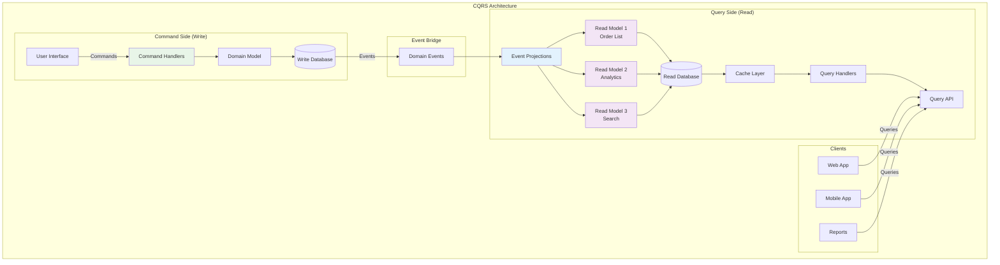

# 📊 CQRS Pattern - Command Query Responsibility Segregation - Bölüm 7

## 📋 Özet

Bu bölümde CQRS (Command Query Responsibility Segregation) Pattern ile command ve query operasyonlarını segregate edeceğiz. Read ve write model'leri ayırarak, complex business logic ile reporting requirements'ları optimize etme, event sourcing integration ve eventual consistency konularını derinlemesine öğreneceksiniz.

## 🎯 Öğrenme Hedefleri

Bu bölüm sonunda şunları yapabileceksiniz:

- ✅ **CQRS Fundamentals** - Command ve Query separation principles
- ✅ **Write Side Implementation** - Command handling ve business logic
- ✅ **Read Side Implementation** - Query models ve projections
- ✅ **Event-driven Projections** - Read model updates via events
- ✅ **CQRS with Event Sourcing** - Event store integration
- ✅ **Multiple Read Models** - Different view optimizations
- ✅ **Eventual Consistency** - Synchronization strategies
- ✅ **Performance Optimization** - Caching ve materialized views

## 📋 Ön Koşullar

- ✅ Outbox Pattern tamamlanmış (Bölüm 6)
- ✅ Event-driven architecture mastery
- ✅ Domain Driven Design principles
- ✅ Database design patterns
- ✅ Caching strategies knowledge

---

## 📊 CQRS Pattern Nedir?

CQRS (Command Query Responsibility Segregation), **command (write) operations ile query (read) operations'ı** separate ederek, her birini kendi requirements'ına göre optimize etmeyi sağlayan architectural pattern'dir.

### Problem: Single Model Limitations

```ascii
┌─────────────────────────────────────────────────────────────────────┐
│                      TRADITIONAL CRUD LIMITATIONS                  │
├─────────────────────────────────────────────────────────────────────┤
│                                                                     │
│  🏗️ SINGLE MODEL APPROACH                                         │
│  ┌─────────────────────────────────────────────────────────────┐   │
│  │                                                             │   │
│  │               Single Database Model                         │   │
│  │  ┌─────────────────────────────────────────────────────┐   │   │
│  │  │                                                     │   │   │
│  │  │  Order Entity (Complex)                             │   │   │
│  │  │  ├── Business Logic (Write Side)                    │   │   │
│  │  │  ├── Validation Rules                              │   │   │
│  │  │  ├── Status Management                             │   │   │
│  │  │  ├── Relationships (Customer, Items, Payment)     │   │   │
│  │  │  └── Audit Fields                                 │   │   │
│  │  │                                                     │   │   │
│  │  └─────────────────────────────────────────────────────┘   │   │
│  │                        │                                   │   │
│  │                        ▼                                   │   │
│  │              Used for BOTH:                                │   │
│  │                                                             │   │
│  │  ✍️ WRITE Operations          📖 READ Operations          │   │
│  │  ├── Create Order             ├── Order Search           │   │
│  │  ├── Update Status            ├── Order History          │   │
│  │  ├── Cancel Order             ├── Customer Dashboard     │   │
│  │  └── Process Payment          ├── Analytics Reports      │   │
│  │                               ├── Admin Lists            │   │
│  │                               └── Mobile Views           │   │
│  │                                                             │   │
│  └─────────────────────────────────────────────────────────────┘   │
│                                                                     │
│  💥 PROBLEMS:                                                      │
│  • Complex queries slow down simple reads                          │
│  • Write optimizations hurt read performance                       │
│  • Single schema can't optimize for all use cases                  │
│  • Complex joins for reporting                                     │
│  • Scaling challenges (reads vs writes different patterns)         │
│  • Mixed concerns in single model                                  │
│                                                                     │
│  💡 SOLUTION: CQRS Pattern                                         │
│  • Separate command and query responsibilities                     │
│  • Optimize each side independently                                │
│  • Different models for different purposes                         │
│                                                                     │
└─────────────────────────────────────────────────────────────────────┘
```

### CQRS Pattern Solution



---

## ✍️ Command Side Implementation

### Command Model Design

```java
// command/domain/model/Order.java
package com.example.cqrs.command.domain.model;

import com.example.cqrs.command.domain.valueobject.*;
import com.example.cqrs.command.domain.event.*;
import jakarta.persistence.*;
import java.time.LocalDateTime;
import java.util.List;
import java.util.ArrayList;

/**
 * Order Aggregate - Write Side Only
 *
 * Business logic'e odaklanmış, write operations için optimize edilmiş domain model.
 * Read concerns burada yok - sadece business behavior'lar.
 */
@Entity
@Table(name = "orders")
public class Order extends AggregateRoot<OrderId> {

    @EmbeddedId
    private OrderId id;

    @Embedded
    private CustomerId customerId;

    @Enumerated(EnumType.STRING)
    @Column(name = "status", nullable = false)
    private OrderStatus status;

    @ElementCollection(cascade = CascadeType.ALL, fetch = FetchType.EAGER)
    @CollectionTable(name = "order_items", joinColumns = @JoinColumn(name = "order_id"))
    private List<OrderItem> items = new ArrayList<>();

    @Embedded
    private Money totalAmount;

    @Embedded
    private ShippingAddress shippingAddress;

    @Embedded
    private PaymentMethod paymentMethod;

    @Column(name = "created_at", nullable = false)
    private LocalDateTime createdAt;

    @Column(name = "updated_at")
    private LocalDateTime updatedAt;

    @Version
    private Long version;

    protected Order() {} // JPA constructor

    private Order(
        OrderId id,
        CustomerId customerId,
        List<OrderItem> items,
        ShippingAddress shippingAddress,
        PaymentMethod paymentMethod
    ) {
        this.id = id;
        this.customerId = customerId;
        this.items = new ArrayList<>(items);
        this.shippingAddress = shippingAddress;
        this.paymentMethod = paymentMethod;
        this.status = OrderStatus.PENDING;
        this.totalAmount = calculateTotalAmount(items);
        this.createdAt = LocalDateTime.now();
        this.updatedAt = LocalDateTime.now();

        // Raise domain event
        this.addDomainEvent(new OrderPlacedEvent(
            this.id,
            this.customerId,
            this.items,
            this.totalAmount,
            this.shippingAddress,
            this.paymentMethod,
            LocalDateTime.now()
        ));
    }

    /**
     * Factory method for creating new order
     */
    public static Order create(
        CustomerId customerId,
        List<OrderItem> items,
        ShippingAddress shippingAddress,
        PaymentMethod paymentMethod
    ) {
        // Business rules validation
        validateOrderCreation(customerId, items, shippingAddress, paymentMethod);

        return new Order(
            OrderId.generate(),
            customerId,
            items,
            shippingAddress,
            paymentMethod
        );
    }

    /**
     * Confirm order after payment and inventory confirmation
     */
    public void confirm(PaymentConfirmation paymentConfirmation, InventoryConfirmation inventoryConfirmation) {
        // Business rules
        if (this.status != OrderStatus.PENDING) {
            throw new IllegalOrderStateException(
                "Order can only be confirmed from PENDING status. Current: " + this.status
            );
        }

        validatePaymentConfirmation(paymentConfirmation);
        validateInventoryConfirmation(inventoryConfirmation);

        // State change
        this.status = OrderStatus.CONFIRMED;
        this.updatedAt = LocalDateTime.now();

        // Raise domain event
        this.addDomainEvent(new OrderConfirmedEvent(
            this.id,
            this.customerId,
            paymentConfirmation,
            inventoryConfirmation,
            LocalDateTime.now()
        ));
    }

    /**
     * Ship order
     */
    public void ship(ShippingConfirmation shippingConfirmation) {
        // Business rules
        if (this.status != OrderStatus.CONFIRMED) {
            throw new IllegalOrderStateException(
                "Order can only be shipped from CONFIRMED status. Current: " + this.status
            );
        }

        validateShippingConfirmation(shippingConfirmation);

        // State change
        this.status = OrderStatus.SHIPPED;
        this.updatedAt = LocalDateTime.now();

        // Raise domain event
        this.addDomainEvent(new OrderShippedEvent(
            this.id,
            this.customerId,
            shippingConfirmation,
            LocalDateTime.now()
        ));
    }

    /**
     * Deliver order
     */
    public void deliver(DeliveryConfirmation deliveryConfirmation) {
        // Business rules
        if (this.status != OrderStatus.SHIPPED) {
            throw new IllegalOrderStateException(
                "Order can only be delivered from SHIPPED status. Current: " + this.status
            );
        }

        validateDeliveryConfirmation(deliveryConfirmation);

        // State change
        this.status = OrderStatus.DELIVERED;
        this.updatedAt = LocalDateTime.now();

        // Raise domain event
        this.addDomainEvent(new OrderDeliveredEvent(
            this.id,
            this.customerId,
            deliveryConfirmation,
            LocalDateTime.now()
        ));
    }

    /**
     * Cancel order
     */
    public void cancel(CancellationReason reason, String requestedBy) {
        // Business rules
        if (!canBeCancelled()) {
            throw new OrderCancellationNotAllowedException(
                "Order in status " + this.status + " cannot be cancelled"
            );
        }

        validateCancellationRequest(reason, requestedBy);

        OrderStatus previousStatus = this.status;
        this.status = OrderStatus.CANCELLED;
        this.updatedAt = LocalDateTime.now();

        // Raise domain event
        this.addDomainEvent(new OrderCancelledEvent(
            this.id,
            this.customerId,
            previousStatus,
            reason,
            requestedBy,
            LocalDateTime.now()
        ));
    }

    /**
     * Update order items (only for PENDING orders)
     */
    public void updateItems(List<OrderItem> newItems) {
        // Business rules
        if (this.status != OrderStatus.PENDING) {
            throw new IllegalOrderStateException(
                "Order items can only be updated for PENDING orders. Current: " + this.status
            );
        }

        validateOrderItems(newItems);

        List<OrderItem> previousItems = new ArrayList<>(this.items);
        Money previousTotal = this.totalAmount;

        this.items = new ArrayList<>(newItems);
        this.totalAmount = calculateTotalAmount(newItems);
        this.updatedAt = LocalDateTime.now();

        // Raise domain event
        this.addDomainEvent(new OrderItemsUpdatedEvent(
            this.id,
            this.customerId,
            previousItems,
            newItems,
            previousTotal,
            this.totalAmount,
            LocalDateTime.now()
        ));
    }

    // Business rule validation methods
    private static void validateOrderCreation(
        CustomerId customerId,
        List<OrderItem> items,
        ShippingAddress shippingAddress,
        PaymentMethod paymentMethod
    ) {
        if (customerId == null) {
            throw new IllegalArgumentException("Customer ID is required");
        }

        validateOrderItems(items);

        if (shippingAddress == null) {
            throw new IllegalArgumentException("Shipping address is required");
        }

        if (paymentMethod == null) {
            throw new IllegalArgumentException("Payment method is required");
        }
    }

    private static void validateOrderItems(List<OrderItem> items) {
        if (items == null || items.isEmpty()) {
            throw new IllegalArgumentException("Order must have at least one item");
        }

        if (items.size() > 50) { // Business rule
            throw new TooManyOrderItemsException("Order cannot have more than 50 items");
        }

        // Validate each item
        items.forEach(OrderItem::validate);

        // Check for duplicate products
        long uniqueProducts = items.stream()
            .map(OrderItem::getProductId)
            .distinct()
            .count();

        if (uniqueProducts != items.size()) {
            throw new DuplicateOrderItemsException("Order cannot have duplicate products");
        }
    }

    private void validatePaymentConfirmation(PaymentConfirmation paymentConfirmation) {
        if (paymentConfirmation == null) {
            throw new IllegalArgumentException("Payment confirmation is required");
        }

        if (!paymentConfirmation.getAmount().equals(this.totalAmount)) {
            throw new PaymentAmountMismatchException(
                "Payment amount does not match order total"
            );
        }
    }

    private void validateInventoryConfirmation(InventoryConfirmation inventoryConfirmation) {
        if (inventoryConfirmation == null) {
            throw new IllegalArgumentException("Inventory confirmation is required");
        }

        // Validate that all items are confirmed
        for (OrderItem item : this.items) {
            boolean itemConfirmed = inventoryConfirmation.getConfirmedItems().stream()
                .anyMatch(confirmed -> confirmed.getProductId().equals(item.getProductId()) &&
                         confirmed.getQuantity().equals(item.getQuantity()));

            if (!itemConfirmed) {
                throw new InventoryConfirmationMismatchException(
                    "Item not confirmed in inventory: " + item.getProductId()
                );
            }
        }
    }

    private void validateShippingConfirmation(ShippingConfirmation shippingConfirmation) {
        if (shippingConfirmation == null) {
            throw new IllegalArgumentException("Shipping confirmation is required");
        }

        if (shippingConfirmation.getTrackingNumber() == null ||
            shippingConfirmation.getTrackingNumber().isBlank()) {
            throw new IllegalArgumentException("Tracking number is required");
        }
    }

    private void validateDeliveryConfirmation(DeliveryConfirmation deliveryConfirmation) {
        if (deliveryConfirmation == null) {
            throw new IllegalArgumentException("Delivery confirmation is required");
        }

        if (deliveryConfirmation.getDeliveredAt() == null) {
            throw new IllegalArgumentException("Delivery timestamp is required");
        }

        if (deliveryConfirmation.getDeliveredAt().isAfter(LocalDateTime.now())) {
            throw new IllegalArgumentException("Delivery cannot be in the future");
        }
    }

    private void validateCancellationRequest(CancellationReason reason, String requestedBy) {
        if (reason == null) {
            throw new IllegalArgumentException("Cancellation reason is required");
        }

        if (requestedBy == null || requestedBy.isBlank()) {
            throw new IllegalArgumentException("Cancellation requester is required");
        }
    }

    private boolean canBeCancelled() {
        return this.status == OrderStatus.PENDING ||
               this.status == OrderStatus.CONFIRMED;
    }

    private Money calculateTotalAmount(List<OrderItem> items) {
        BigDecimal total = items.stream()
            .map(item -> item.getUnitPrice().getAmount()
                .multiply(BigDecimal.valueOf(item.getQuantity().getValue())))
            .reduce(BigDecimal.ZERO, BigDecimal::add);

        return Money.of(total, Currency.getInstance("USD"));
    }

    // Getters (minimal for command side)
    public OrderId getId() { return id; }
    public CustomerId getCustomerId() { return customerId; }
    public OrderStatus getStatus() { return status; }
    public List<OrderItem> getItems() { return List.copyOf(items); }
    public Money getTotalAmount() { return totalAmount; }
    public ShippingAddress getShippingAddress() { return shippingAddress; }
    public PaymentMethod getPaymentMethod() { return paymentMethod; }
    public LocalDateTime getCreatedAt() { return createdAt; }
    public LocalDateTime getUpdatedAt() { return updatedAt; }
    public Long getVersion() { return version; }
}
```

### Command Handlers

```java
// command/application/handler/OrderCommandHandler.java
package com.example.cqrs.command.application.handler;

import com.example.cqrs.command.application.command.*;
import com.example.cqrs.command.domain.model.Order;
import com.example.cqrs.command.domain.repository.OrderRepository;
import com.example.cqrs.command.application.service.DomainEventPublisher;
import org.springframework.stereotype.Component;
import org.springframework.transaction.annotation.Transactional;
import lombok.extern.slf4j.Slf4j;

/**
 * Order Command Handler
 *
 * Command'leri process eder, business logic'i execute eder ve domain events publish eder.
 * Sadece write operations'ı handle eder - read operations yok.
 */
@Component
@Slf4j
public class OrderCommandHandler {

    private final OrderRepository orderRepository;
    private final DomainEventPublisher domainEventPublisher;

    public OrderCommandHandler(
        OrderRepository orderRepository,
        DomainEventPublisher domainEventPublisher
    ) {
        this.orderRepository = orderRepository;
        this.domainEventPublisher = domainEventPublisher;
    }

    /**
     * Handle create order command
     */
    @Transactional
    public CreateOrderResult handle(CreateOrderCommand command) {
        try {
            log.info("Handling create order command for customer: {}",
                    command.getCustomerId());

            // Create domain aggregate
            Order order = Order.create(
                command.getCustomerId(),
                command.getItems(),
                command.getShippingAddress(),
                command.getPaymentMethod()
            );

            // Persist aggregate
            Order savedOrder = orderRepository.save(order);

            // Publish domain events
            domainEventPublisher.publishEvents(savedOrder);

            log.info("Order created successfully: {}", savedOrder.getId());

            return CreateOrderResult.success(savedOrder.getId());

        } catch (Exception e) {
            log.error("Failed to create order for customer: {}",
                     command.getCustomerId(), e);

            return CreateOrderResult.failure(e.getMessage());
        }
    }

    /**
     * Handle confirm order command
     */
    @Transactional
    public ConfirmOrderResult handle(ConfirmOrderCommand command) {
        try {
            log.info("Handling confirm order command: {}", command.getOrderId());

            // Load aggregate
            Order order = orderRepository.findById(command.getOrderId())
                .orElseThrow(() -> new OrderNotFoundException(command.getOrderId()));

            // Execute business logic
            order.confirm(
                command.getPaymentConfirmation(),
                command.getInventoryConfirmation()
            );

            // Persist changes
            Order savedOrder = orderRepository.save(order);

            // Publish domain events
            domainEventPublisher.publishEvents(savedOrder);

            log.info("Order confirmed successfully: {}", savedOrder.getId());

            return ConfirmOrderResult.success();

        } catch (Exception e) {
            log.error("Failed to confirm order: {}", command.getOrderId(), e);

            return ConfirmOrderResult.failure(e.getMessage());
        }
    }

    /**
     * Handle ship order command
     */
    @Transactional
    public ShipOrderResult handle(ShipOrderCommand command) {
        try {
            log.info("Handling ship order command: {}", command.getOrderId());

            Order order = orderRepository.findById(command.getOrderId())
                .orElseThrow(() -> new OrderNotFoundException(command.getOrderId()));

            order.ship(command.getShippingConfirmation());

            Order savedOrder = orderRepository.save(order);
            domainEventPublisher.publishEvents(savedOrder);

            log.info("Order shipped successfully: {}", savedOrder.getId());

            return ShipOrderResult.success();

        } catch (Exception e) {
            log.error("Failed to ship order: {}", command.getOrderId(), e);

            return ShipOrderResult.failure(e.getMessage());
        }
    }

    /**
     * Handle deliver order command
     */
    @Transactional
    public DeliverOrderResult handle(DeliverOrderCommand command) {
        try {
            log.info("Handling deliver order command: {}", command.getOrderId());

            Order order = orderRepository.findById(command.getOrderId())
                .orElseThrow(() -> new OrderNotFoundException(command.getOrderId()));

            order.deliver(command.getDeliveryConfirmation());

            Order savedOrder = orderRepository.save(order);
            domainEventPublisher.publishEvents(savedOrder);

            log.info("Order delivered successfully: {}", savedOrder.getId());

            return DeliverOrderResult.success();

        } catch (Exception e) {
            log.error("Failed to deliver order: {}", command.getOrderId(), e);

            return DeliverOrderResult.failure(e.getMessage());
        }
    }

    /**
     * Handle cancel order command
     */
    @Transactional
    public CancelOrderResult handle(CancelOrderCommand command) {
        try {
            log.info("Handling cancel order command: {}", command.getOrderId());

            Order order = orderRepository.findById(command.getOrderId())
                .orElseThrow(() -> new OrderNotFoundException(command.getOrderId()));

            order.cancel(command.getReason(), command.getRequestedBy());

            Order savedOrder = orderRepository.save(order);
            domainEventPublisher.publishEvents(savedOrder);

            log.info("Order cancelled successfully: {}", savedOrder.getId());

            return CancelOrderResult.success();

        } catch (Exception e) {
            log.error("Failed to cancel order: {}", command.getOrderId(), e);

            return CancelOrderResult.failure(e.getMessage());
        }
    }

    /**
     * Handle update order items command
     */
    @Transactional
    public UpdateOrderItemsResult handle(UpdateOrderItemsCommand command) {
        try {
            log.info("Handling update order items command: {}", command.getOrderId());

            Order order = orderRepository.findById(command.getOrderId())
                .orElseThrow(() -> new OrderNotFoundException(command.getOrderId()));

            order.updateItems(command.getNewItems());

            Order savedOrder = orderRepository.save(order);
            domainEventPublisher.publishEvents(savedOrder);

            log.info("Order items updated successfully: {}", savedOrder.getId());

            return UpdateOrderItemsResult.success();

        } catch (Exception e) {
            log.error("Failed to update order items: {}", command.getOrderId(), e);

            return UpdateOrderItemsResult.failure(e.getMessage());
        }
    }
}
```

### Command Bus Implementation

```java
// command/application/bus/CommandBus.java
package com.example.cqrs.command.application.bus;

/**
 * Command Bus Interface
 *
 * Command'leri appropriate handler'lara route eder.
 */
public interface CommandBus {
    <R> R send(Command<R> command);
}

// command/infrastructure/bus/SpringCommandBus.java
package com.example.cqrs.command.infrastructure.bus;

import com.example.cqrs.command.application.bus.CommandBus;
import com.example.cqrs.command.application.command.Command;
import org.springframework.context.ApplicationContext;
import org.springframework.stereotype.Component;
import lombok.extern.slf4j.Slf4j;

/**
 * Spring-based Command Bus Implementation
 *
 * Convention-based handler discovery kullanır.
 */
@Component
@Slf4j
public class SpringCommandBus implements CommandBus {

    private final ApplicationContext applicationContext;
    private final Map<Class<?>, Object> handlerCache = new ConcurrentHashMap<>();

    public SpringCommandBus(ApplicationContext applicationContext) {
        this.applicationContext = applicationContext;
    }

    @Override
    @SuppressWarnings("unchecked")
    public <R> R send(Command<R> command) {
        try {
            log.debug("Sending command: {}", command.getClass().getSimpleName());

            Object handler = findHandler(command.getClass());

            Method handleMethod = findHandleMethod(handler.getClass(), command.getClass());

            R result = (R) handleMethod.invoke(handler, command);

            log.debug("Command handled successfully: {}", command.getClass().getSimpleName());

            return result;

        } catch (Exception e) {
            log.error("Error handling command: {}", command.getClass().getSimpleName(), e);

            if (e instanceof InvocationTargetException) {
                Throwable cause = e.getCause();
                if (cause instanceof RuntimeException) {
                    throw (RuntimeException) cause;
                }
                throw new CommandHandlingException("Command handling failed", cause);
            }

            throw new CommandHandlingException("Command handling failed", e);
        }
    }

    private Object findHandler(Class<?> commandClass) {
        // Cache lookup
        Object handler = handlerCache.get(commandClass);
        if (handler != null) {
            return handler;
        }

        // Convention: CommandHandler suffix
        String handlerName = commandClass.getSimpleName().replace("Command", "CommandHandler");

        try {
            handler = applicationContext.getBean(handlerName);
            handlerCache.put(commandClass, handler);
            return handler;

        } catch (Exception e) {
            // Fallback: search by type
            String[] beanNames = applicationContext.getBeanNamesForType(Object.class);

            for (String beanName : beanNames) {
                Object bean = applicationContext.getBean(beanName);

                if (hasHandleMethodForCommand(bean.getClass(), commandClass)) {
                    handlerCache.put(commandClass, bean);
                    return bean;
                }
            }

            throw new CommandHandlerNotFoundException(
                "No handler found for command: " + commandClass.getSimpleName()
            );
        }
    }

    private Method findHandleMethod(Class<?> handlerClass, Class<?> commandClass) {
        try {
            return handlerClass.getMethod("handle", commandClass);
        } catch (NoSuchMethodException e) {
            throw new CommandHandlerMethodNotFoundException(
                "Handle method not found for command: " + commandClass.getSimpleName()
            );
        }
    }

    private boolean hasHandleMethodForCommand(Class<?> handlerClass, Class<?> commandClass) {
        try {
            handlerClass.getMethod("handle", commandClass);
            return true;
        } catch (NoSuchMethodException e) {
            return false;
        }
    }
}
```

---

## 📖 Query Side Implementation

### Read Models

```java
// query/domain/model/OrderListView.java
package com.example.cqrs.query.domain.model;

import jakarta.persistence.*;
import java.time.LocalDateTime;
import java.math.BigDecimal;

/**
 * Order List View - Read Model
 *
 * Order listing için optimize edilmiş denormalized model.
 * Fast queries, minimal joins, UI'a optimized.
 */
@Entity
@Table(name = "order_list_view", indexes = {
    @Index(name = "idx_order_list_customer", columnList = "customerId"),
    @Index(name = "idx_order_list_status", columnList = "status"),
    @Index(name = "idx_order_list_created", columnList = "createdAt"),
    @Index(name = "idx_order_list_customer_status", columnList = "customerId, status")
})
public class OrderListView {

    @Id
    @Column(name = "order_id")
    private String orderId;

    @Column(name = "customer_id", nullable = false)
    private String customerId;

    @Column(name = "customer_name")
    private String customerName;

    @Column(name = "customer_email")
    private String customerEmail;

    @Column(name = "status", nullable = false)
    private String status;

    @Column(name = "total_amount", nullable = false)
    private BigDecimal totalAmount;

    @Column(name = "currency", nullable = false)
    private String currency;

    @Column(name = "item_count", nullable = false)
    private Integer itemCount;

    @Column(name = "shipping_city")
    private String shippingCity;

    @Column(name = "shipping_country")
    private String shippingCountry;

    @Column(name = "created_at", nullable = false)
    private LocalDateTime createdAt;

    @Column(name = "updated_at")
    private LocalDateTime updatedAt;

    @Column(name = "estimated_delivery")
    private LocalDateTime estimatedDelivery;

    @Column(name = "tracking_number")
    private String trackingNumber;

    protected OrderListView() {} // JPA constructor

    public OrderListView(
        String orderId,
        String customerId,
        String customerName,
        String customerEmail,
        String status,
        BigDecimal totalAmount,
        String currency,
        Integer itemCount,
        String shippingCity,
        String shippingCountry,
        LocalDateTime createdAt
    ) {
        this.orderId = orderId;
        this.customerId = customerId;
        this.customerName = customerName;
        this.customerEmail = customerEmail;
        this.status = status;
        this.totalAmount = totalAmount;
        this.currency = currency;
        this.itemCount = itemCount;
        this.shippingCity = shippingCity;
        this.shippingCountry = shippingCountry;
        this.createdAt = createdAt;
        this.updatedAt = createdAt;
    }

    /**
     * Update status-related fields
     */
    public void updateStatus(String newStatus, LocalDateTime updatedAt) {
        this.status = newStatus;
        this.updatedAt = updatedAt;
    }

    /**
     * Update shipping information
     */
    public void updateShippingInfo(String trackingNumber, LocalDateTime estimatedDelivery) {
        this.trackingNumber = trackingNumber;
        this.estimatedDelivery = estimatedDelivery;
        this.updatedAt = LocalDateTime.now();
    }

    /**
     * Update customer information
     */
    public void updateCustomerInfo(String customerName, String customerEmail) {
        this.customerName = customerName;
        this.customerEmail = customerEmail;
        this.updatedAt = LocalDateTime.now();
    }

    // Getters
    public String getOrderId() { return orderId; }
    public String getCustomerId() { return customerId; }
    public String getCustomerName() { return customerName; }
    public String getCustomerEmail() { return customerEmail; }
    public String getStatus() { return status; }
    public BigDecimal getTotalAmount() { return totalAmount; }
    public String getCurrency() { return currency; }
    public Integer getItemCount() { return itemCount; }
    public String getShippingCity() { return shippingCity; }
    public String getShippingCountry() { return shippingCountry; }
    public LocalDateTime getCreatedAt() { return createdAt; }
    public LocalDateTime getUpdatedAt() { return updatedAt; }
    public LocalDateTime getEstimatedDelivery() { return estimatedDelivery; }
    public String getTrackingNumber() { return trackingNumber; }

    /**
     * Helper method for status checking
     */
    public boolean isActive() {
        return !"CANCELLED".equals(status) && !"DELIVERED".equals(status);
    }

    public boolean canBeTracked() {
        return trackingNumber != null &&
               ("SHIPPED".equals(status) || "DELIVERED".equals(status));
    }
}

// query/domain/model/OrderDetailView.java
package com.example.cqrs.query.domain.model;

/**
 * Order Detail View - Read Model
 *
 * Single order detail page için comprehensive data.
 */
@Entity
@Table(name = "order_detail_view")
public class OrderDetailView {

    @Id
    @Column(name = "order_id")
    private String orderId;

    // Basic order info
    @Column(name = "customer_id", nullable = false)
    private String customerId;

    @Column(name = "customer_name")
    private String customerName;

    @Column(name = "customer_email")
    private String customerEmail;

    @Column(name = "customer_phone")
    private String customerPhone;

    @Column(name = "status", nullable = false)
    private String status;

    @Column(name = "total_amount", nullable = false)
    private BigDecimal totalAmount;

    @Column(name = "currency", nullable = false)
    private String currency;

    // Shipping information
    @Column(name = "shipping_street")
    private String shippingStreet;

    @Column(name = "shipping_city")
    private String shippingCity;

    @Column(name = "shipping_zip_code")
    private String shippingZipCode;

    @Column(name = "shipping_country")
    private String shippingCountry;

    // Payment information
    @Column(name = "payment_method")
    private String paymentMethod;

    @Column(name = "payment_status")
    private String paymentStatus;

    @Column(name = "payment_reference")
    private String paymentReference;

    // Shipping tracking
    @Column(name = "tracking_number")
    private String trackingNumber;

    @Column(name = "carrier")
    private String carrier;

    @Column(name = "estimated_delivery")
    private LocalDateTime estimatedDelivery;

    // Timestamps
    @Column(name = "created_at", nullable = false)
    private LocalDateTime createdAt;

    @Column(name = "confirmed_at")
    private LocalDateTime confirmedAt;

    @Column(name = "shipped_at")
    private LocalDateTime shippedAt;

    @Column(name = "delivered_at")
    private LocalDateTime deliveredAt;

    @Column(name = "cancelled_at")
    private LocalDateTime cancelledAt;

    // Order items (JSON or separate table)
    @Column(name = "items_json", columnDefinition = "TEXT")
    private String itemsJson;

    // Order events history (for timeline)
    @Column(name = "events_json", columnDefinition = "TEXT")
    private String eventsJson;

    protected OrderDetailView() {} // JPA constructor

    // Constructors, getters, business methods...

    /**
     * Get parsed order items
     */
    public List<OrderItemView> getItems() {
        if (itemsJson == null) {
            return List.of();
        }

        try {
            ObjectMapper mapper = new ObjectMapper();
            return mapper.readValue(itemsJson,
                mapper.getTypeFactory().constructCollectionType(List.class, OrderItemView.class));
        } catch (Exception e) {
            return List.of();
        }
    }

    /**
     * Get parsed order events
     */
    public List<OrderEventView> getEvents() {
        if (eventsJson == null) {
            return List.of();
        }

        try {
            ObjectMapper mapper = new ObjectMapper();
            return mapper.readValue(eventsJson,
                mapper.getTypeFactory().constructCollectionType(List.class, OrderEventView.class));
        } catch (Exception e) {
            return List.of();
        }
    }
}

// Supporting view classes
public record OrderItemView(
    String productId,
    String productName,
    String productImageUrl,
    Integer quantity,
    BigDecimal unitPrice,
    BigDecimal totalPrice
) {}

public record OrderEventView(
    String eventType,
    String description,
    LocalDateTime timestamp,
    String details
) {}
```

### Query Handlers

```java
// query/application/handler/OrderQueryHandler.java
package com.example.cqrs.query.application.handler;

import com.example.cqrs.query.application.query.*;
import com.example.cqrs.query.domain.model.*;
import com.example.cqrs.query.domain.repository.*;
import org.springframework.data.domain.Page;
import org.springframework.data.domain.Pageable;
import org.springframework.stereotype.Component;
import lombok.extern.slf4j.Slf4j;

/**
 * Order Query Handler
 *
 * Query'leri process eder ve optimized read models'den data return eder.
 * Caching, performance optimizations burada yapılır.
 */
@Component
@Slf4j
public class OrderQueryHandler {

    private final OrderListViewRepository orderListViewRepository;
    private final OrderDetailViewRepository orderDetailViewRepository;
    private final OrderAnalyticsViewRepository orderAnalyticsViewRepository;
    private final QueryCache queryCache;

    public OrderQueryHandler(
        OrderListViewRepository orderListViewRepository,
        OrderDetailViewRepository orderDetailViewRepository,
        OrderAnalyticsViewRepository orderAnalyticsViewRepository,
        QueryCache queryCache
    ) {
        this.orderListViewRepository = orderListViewRepository;
        this.orderDetailViewRepository = orderDetailViewRepository;
        this.orderAnalyticsViewRepository = orderAnalyticsViewRepository;
        this.queryCache = queryCache;
    }

    /**
     * Handle get orders query
     */
    public GetOrdersResult handle(GetOrdersQuery query) {
        try {
            log.debug("Handling get orders query for customer: {}",
                     query.getCustomerId());

            // Cache key generation
            String cacheKey = generateCacheKey("orders", query);

            // Try cache first
            GetOrdersResult cachedResult = queryCache.get(cacheKey, GetOrdersResult.class);
            if (cachedResult != null) {
                log.debug("Returning cached result for orders query");
                return cachedResult;
            }

            // Execute query
            Page<OrderListView> orders;

            if (query.getCustomerId() != null) {
                // Customer-specific orders
                orders = orderListViewRepository.findByCustomerId(
                    query.getCustomerId(),
                    query.getStatus(),
                    query.getFromDate(),
                    query.getToDate(),
                    query.getPageable()
                );
            } else {
                // Admin/support view - all orders
                orders = orderListViewRepository.findAllWithFilters(
                    query.getStatus(),
                    query.getFromDate(),
                    query.getToDate(),
                    query.getSearchTerm(),
                    query.getPageable()
                );
            }

            GetOrdersResult result = GetOrdersResult.builder()
                .orders(orders.getContent())
                .totalElements(orders.getTotalElements())
                .totalPages(orders.getTotalPages())
                .currentPage(orders.getNumber())
                .pageSize(orders.getSize())
                .build();

            // Cache result
            queryCache.put(cacheKey, result, Duration.ofMinutes(5));

            log.debug("Retrieved {} orders", orders.getContent().size());

            return result;

        } catch (Exception e) {
            log.error("Error handling get orders query", e);
            throw new QueryHandlingException("Failed to retrieve orders", e);
        }
    }

    /**
     * Handle get order detail query
     */
    public GetOrderDetailResult handle(GetOrderDetailQuery query) {
        try {
            log.debug("Handling get order detail query: {}", query.getOrderId());

            // Cache key
            String cacheKey = generateCacheKey("order-detail", query.getOrderId());

            // Try cache
            GetOrderDetailResult cachedResult = queryCache.get(
                cacheKey, GetOrderDetailResult.class);
            if (cachedResult != null) {
                return cachedResult;
            }

            // Execute query
            OrderDetailView orderDetail = orderDetailViewRepository
                .findById(query.getOrderId())
                .orElse(null);

            if (orderDetail == null) {
                return GetOrderDetailResult.notFound();
            }

            // Security check - can user access this order?
            if (query.getRequesterId() != null &&
                !canUserAccessOrder(query.getRequesterId(), orderDetail)) {
                return GetOrderDetailResult.accessDenied();
            }

            GetOrderDetailResult result = GetOrderDetailResult.builder()
                .orderDetail(orderDetail)
                .build();

            // Cache result
            queryCache.put(cacheKey, result, Duration.ofMinutes(10));

            return result;

        } catch (Exception e) {
            log.error("Error handling get order detail query: {}",
                     query.getOrderId(), e);
            throw new QueryHandlingException("Failed to retrieve order detail", e);
        }
    }

    /**
     * Handle order search query
     */
    public OrderSearchResult handle(OrderSearchQuery query) {
        try {
            log.debug("Handling order search query: {}", query.getSearchTerm());

            // Cache key
            String cacheKey = generateCacheKey("order-search", query);

            OrderSearchResult cachedResult = queryCache.get(
                cacheKey, OrderSearchResult.class);
            if (cachedResult != null) {
                return cachedResult;
            }

            // Execute search
            List<OrderListView> searchResults;

            if (query.getSearchTerm() != null && !query.getSearchTerm().isBlank()) {
                searchResults = orderListViewRepository.searchOrders(
                    query.getSearchTerm(),
                    query.getCustomerId(),
                    query.getMaxResults()
                );
            } else {
                searchResults = List.of();
            }

            OrderSearchResult result = OrderSearchResult.builder()
                .results(searchResults)
                .totalResults(searchResults.size())
                .searchTerm(query.getSearchTerm())
                .build();

            // Cache for shorter duration (search results change frequently)
            queryCache.put(cacheKey, result, Duration.ofMinutes(2));

            return result;

        } catch (Exception e) {
            log.error("Error handling order search query", e);
            throw new QueryHandlingException("Failed to search orders", e);
        }
    }

    /**
     * Handle order analytics query
     */
    public OrderAnalyticsResult handle(OrderAnalyticsQuery query) {
        try {
            log.debug("Handling order analytics query");

            String cacheKey = generateCacheKey("order-analytics", query);

            OrderAnalyticsResult cachedResult = queryCache.get(
                cacheKey, OrderAnalyticsResult.class);
            if (cachedResult != null) {
                return cachedResult;
            }

            // Execute analytics queries
            OrderAnalyticsView analytics = orderAnalyticsViewRepository
                .getAnalytics(
                    query.getFromDate(),
                    query.getToDate(),
                    query.getCustomerId()
                );

            OrderAnalyticsResult result = OrderAnalyticsResult.builder()
                .analytics(analytics)
                .period(query.getFromDate().toString() + " to " + query.getToDate().toString())
                .build();

            // Cache analytics for longer (expensive to compute)
            queryCache.put(cacheKey, result, Duration.ofHours(1));

            return result;

        } catch (Exception e) {
            log.error("Error handling order analytics query", e);
            throw new QueryHandlingException("Failed to retrieve analytics", e);
        }
    }

    // Helper methods
    private String generateCacheKey(String prefix, Object... params) {
        return prefix + ":" +
               Arrays.stream(params)
                   .map(Object::toString)
                   .collect(Collectors.joining(":"));
    }

    private boolean canUserAccessOrder(String userId, OrderDetailView order) {
        // Business rule: users can only access their own orders
        // unless they are admin/support
        return order.getCustomerId().equals(userId) ||
               isAdminUser(userId);
    }

    private boolean isAdminUser(String userId) {
        // Implementation depends on your authorization system
        return false; // Placeholder
    }
}
```

---

## 🔄 Event-driven Read Model Updates

### Projection Service

```java
// query/application/projection/OrderProjectionService.java
package com.example.cqrs.query.application.projection;

import com.example.cqrs.command.domain.event.*;
import com.example.cqrs.query.domain.model.*;
import com.example.cqrs.query.domain.repository.*;
import org.springframework.context.event.EventListener;
import org.springframework.stereotype.Service;
import org.springframework.transaction.annotation.Transactional;
import lombok.extern.slf4j.Slf4j;

/**
 * Order Projection Service
 *
 * Domain events'i dinler ve read models'i günceller.
 * Eventual consistency sağlar.
 */
@Service
@Slf4j
public class OrderProjectionService {

    private final OrderListViewRepository orderListViewRepository;
    private final OrderDetailViewRepository orderDetailViewRepository;
    private final OrderAnalyticsViewRepository orderAnalyticsViewRepository;
    private final CustomerService customerService;
    private final ProductService productService;

    public OrderProjectionService(
        OrderListViewRepository orderListViewRepository,
        OrderDetailViewRepository orderDetailViewRepository,
        OrderAnalyticsViewRepository orderAnalyticsViewRepository,
        CustomerService customerService,
        ProductService productService
    ) {
        this.orderListViewRepository = orderListViewRepository;
        this.orderDetailViewRepository = orderDetailViewRepository;
        this.orderAnalyticsViewRepository = orderAnalyticsViewRepository;
        this.customerService = customerService;
        this.productService = productService;
    }

    /**
     * Handle order placed event - create read models
     */
    @EventListener
    @Transactional
    public void handle(OrderPlacedEvent event) {
        try {
            log.info("Projecting OrderPlacedEvent: {}", event.getOrderId());

            // Get customer information
            CustomerInfo customerInfo = customerService.getCustomerInfo(
                event.getCustomerId());

            // Create order list view
            OrderListView orderListView = new OrderListView(
                event.getOrderId().getValue(),
                event.getCustomerId().getValue(),
                customerInfo.getName(),
                customerInfo.getEmail(),
                "PENDING",
                event.getTotalAmount().getAmount(),
                event.getTotalAmount().getCurrency().getCurrencyCode(),
                event.getItems().size(),
                event.getShippingAddress().getCity(),
                event.getShippingAddress().getCountry(),
                event.getOccurredAt()
            );

            orderListViewRepository.save(orderListView);

            // Create order detail view
            OrderDetailView orderDetailView = createOrderDetailView(event, customerInfo);
            orderDetailViewRepository.save(orderDetailView);

            // Update analytics
            updateOrderAnalytics(event);

            log.debug("Order projections created successfully: {}",
                     event.getOrderId());

        } catch (Exception e) {
            log.error("Error projecting OrderPlacedEvent: {}",
                     event.getOrderId(), e);
            // Don't propagate exception - eventual consistency
        }
    }

    /**
     * Handle order confirmed event - update read models
     */
    @EventListener
    @Transactional
    public void handle(OrderConfirmedEvent event) {
        try {
            log.info("Projecting OrderConfirmedEvent: {}", event.getOrderId());

            // Update order list view
            orderListViewRepository.findById(event.getOrderId().getValue())
                .ifPresent(orderView -> {
                    orderView.updateStatus("CONFIRMED", event.getOccurredAt());
                    orderListViewRepository.save(orderView);
                });

            // Update order detail view
            orderDetailViewRepository.findById(event.getOrderId().getValue())
                .ifPresent(orderDetail -> {
                    updateOrderDetailForConfirmation(orderDetail, event);
                    orderDetailViewRepository.save(orderDetail);
                });

            // Update analytics
            updateAnalyticsForConfirmation(event);

        } catch (Exception e) {
            log.error("Error projecting OrderConfirmedEvent: {}",
                     event.getOrderId(), e);
        }
    }

    /**
     * Handle order shipped event
     */
    @EventListener
    @Transactional
    public void handle(OrderShippedEvent event) {
        try {
            log.info("Projecting OrderShippedEvent: {}", event.getOrderId());

            // Update order list view
            orderListViewRepository.findById(event.getOrderId().getValue())
                .ifPresent(orderView -> {
                    orderView.updateStatus("SHIPPED", event.getOccurredAt());
                    orderView.updateShippingInfo(
                        event.getShippingConfirmation().getTrackingNumber(),
                        event.getShippingConfirmation().getEstimatedDelivery()
                    );
                    orderListViewRepository.save(orderView);
                });

            // Update order detail view
            orderDetailViewRepository.findById(event.getOrderId().getValue())
                .ifPresent(orderDetail -> {
                    updateOrderDetailForShipping(orderDetail, event);
                    orderDetailViewRepository.save(orderDetail);
                });

        } catch (Exception e) {
            log.error("Error projecting OrderShippedEvent: {}",
                     event.getOrderId(), e);
        }
    }

    /**
     * Handle order delivered event
     */
    @EventListener
    @Transactional
    public void handle(OrderDeliveredEvent event) {
        try {
            log.info("Projecting OrderDeliveredEvent: {}", event.getOrderId());

            // Update order list view
            orderListViewRepository.findById(event.getOrderId().getValue())
                .ifPresent(orderView -> {
                    orderView.updateStatus("DELIVERED", event.getOccurredAt());
                    orderListViewRepository.save(orderView);
                });

            // Update order detail view
            orderDetailViewRepository.findById(event.getOrderId().getValue())
                .ifPresent(orderDetail -> {
                    updateOrderDetailForDelivery(orderDetail, event);
                    orderDetailViewRepository.save(orderDetail);
                });

            // Update analytics
            updateAnalyticsForDelivery(event);

        } catch (Exception e) {
            log.error("Error projecting OrderDeliveredEvent: {}",
                     event.getOrderId(), e);
        }
    }

    /**
     * Handle order cancelled event
     */
    @EventListener
    @Transactional
    public void handle(OrderCancelledEvent event) {
        try {
            log.info("Projecting OrderCancelledEvent: {}", event.getOrderId());

            // Update order list view
            orderListViewRepository.findById(event.getOrderId().getValue())
                .ifPresent(orderView -> {
                    orderView.updateStatus("CANCELLED", event.getOccurredAt());
                    orderListViewRepository.save(orderView);
                });

            // Update order detail view
            orderDetailViewRepository.findById(event.getOrderId().getValue())
                .ifPresent(orderDetail -> {
                    updateOrderDetailForCancellation(orderDetail, event);
                    orderDetailViewRepository.save(orderDetail);
                });

            // Update analytics
            updateAnalyticsForCancellation(event);

        } catch (Exception e) {
            log.error("Error projecting OrderCancelledEvent: {}",
                     event.getOrderId(), e);
        }
    }

    // Helper methods for creating/updating read models
    private OrderDetailView createOrderDetailView(
        OrderPlacedEvent event,
        CustomerInfo customerInfo
    ) {
        // Implementation details...
        return new OrderDetailView(/* parameters */);
    }

    private void updateOrderDetailForConfirmation(
        OrderDetailView orderDetail,
        OrderConfirmedEvent event
    ) {
        // Update payment information, confirmation timestamp, etc.
    }

    private void updateOrderDetailForShipping(
        OrderDetailView orderDetail,
        OrderShippedEvent event
    ) {
        // Update shipping information, tracking details, etc.
    }

    private void updateOrderDetailForDelivery(
        OrderDetailView orderDetail,
        OrderDeliveredEvent event
    ) {
        // Update delivery information, completion timestamp, etc.
    }

    private void updateOrderDetailForCancellation(
        OrderDetailView orderDetail,
        OrderCancelledEvent event
    ) {
        // Update cancellation information, reason, etc.
    }

    private void updateOrderAnalytics(OrderPlacedEvent event) {
        // Update aggregated analytics data
    }

    private void updateAnalyticsForConfirmation(OrderConfirmedEvent event) {
        // Update confirmation metrics
    }

    private void updateAnalyticsForDelivery(OrderDeliveredEvent event) {
        // Update delivery metrics
    }

    private void updateAnalyticsForCancellation(OrderCancelledEvent event) {
        // Update cancellation metrics
    }
}
```

---

## 🔄 Yapılan İşlemler & Mimari Açıklamalar

### 1. **CQRS Separation Benefits**

```ascii
┌─────────────────────────────────────────────────────────────────────┐
│                         CQRS BENEFITS                              │
├─────────────────────────────────────────────────────────────────────┤
│                                                                     │
│  📝 WRITE SIDE (Command)              📖 READ SIDE (Query)         │
│  ┌─────────────────────────────┐     ┌─────────────────────────────┐ │
│  │                             │     │                             │ │
│  │ ✅ Business Logic Focus     │     │ ✅ UI/Reporting Focus      │ │
│  │ ✅ Domain Model Purity      │     │ ✅ Denormalized Views      │ │
│  │ ✅ Transactional Integrity  │     │ ✅ Query Performance       │ │
│  │ ✅ Complex Validation       │     │ ✅ Multiple Representations│ │
│  │ ✅ Event Sourcing Ready     │     │ ✅ Caching Friendly        │ │
│  │                             │     │                             │ │
│  │ 🎯 Optimized for:           │     │ 🎯 Optimized for:          │ │
│  │ • Data Consistency          │     │ • Read Performance          │ │
│  │ • Business Rules            │     │ • UI Requirements           │ │
│  │ • Data Integrity            │     │ • Reporting Needs           │ │
│  │ • Domain Behavior           │     │ • Search Capabilities       │ │
│  │                             │     │                             │ │
│  │ 🗄️ Storage:                 │     │ 🗄️ Storage:                │ │
│  │ • Normalized Tables         │     │ • Denormalized Views        │ │
│  │ • Strong Consistency        │     │ • Eventually Consistent     │ │
│  │ • Write Optimized           │     │ • Read Optimized            │ │
│  │                             │     │                             │ │
│  └─────────────────────────────┘     └─────────────────────────────┘ │
│                │                                       ▲             │
│                │ Domain Events                         │             │
│                └───────────────────────────────────────┘             │
│                                                                     │
│  🔄 EVENT-DRIVEN SYNCHRONIZATION                                   │
│  • Commands generate domain events                                 │
│  • Events update read models asynchronously                        │
│  • Eventual consistency between write and read sides               │
│                                                                     │
└─────────────────────────────────────────────────────────────────────┘
```

### 2. **Read Model Optimization Strategies**

- **Denormalization**: Complex joins'i eliminate etmek için data duplicate etme
- **Multiple Views**: Different UI scenarios için specialized read models
- **Caching**: Frequently accessed data için memory caching
- **Indexing**: Query performance için strategic indexing
- **Materialized Views**: Database-level pre-computed views

### 3. **Eventual Consistency Management**

- **Event Ordering**: Events'i correct order'da process etme
- **Idempotency**: Duplicate events'i safely handle etme
- **Error Handling**: Failed projections için retry mechanisms
- **Monitoring**: Read model sync status tracking

---

## ✅ CQRS Implementation Benefits

### 1. **Performance Optimization**

- Write operations business logic'e focus eder
- Read operations query performance'a optimize eder
- Independent scaling strategies
- Specialized storage solutions

### 2. **Development Productivity**

- Clear separation of concerns
- Independent team development
- Technology flexibility per side
- Simplified testing strategies

### 3. **Business Alignment**

- Write side domain expert collaboration
- Read side UI/UX team optimization
- Different stakeholder requirements
- Flexible reporting capabilities

Bu CQRS Pattern implementation'ı ile command ve query responsibilities'ını clearly separate edebilir, each side'ı kendi requirements'ına göre optimize edebilir ve scalable, maintainable architecture oluşturabiliriz! 🎯

**Sonraki Adım:** Event Sourcing integration ve Kubernetes deployment! 🚀
