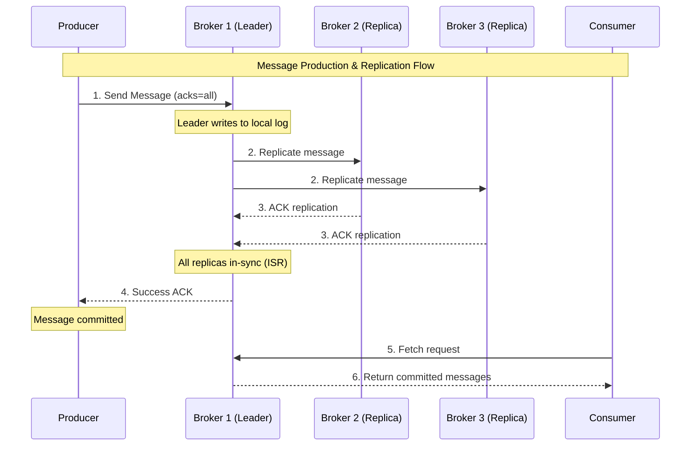

# ⚡ Kafka Architecture & Advanced Programming - Bölüm 8

## 📋 Özet

Bu bölümde Apache Kafka'nın deep architectural concepts'ini öğrenecek ve advanced programming patterns implement edeceğiz. Partitioning strategies, transaction management, exactly-once semantics, performance tuning ve production-ready Kafka applications geliştirme konularını derinlemesine öğreneceksiniz.

## 🎯 Öğrenme Hedefleri

Bu bölüm sonunda şunları yapabileceksiniz:

- ✅ **Kafka Architecture Deep Dive** - Broker, partition, replication internals
- ✅ **Advanced Producer Patterns** - Idempotent, transactional, batch processing
- ✅ **Advanced Consumer Patterns** - Exactly-once, rebalancing, offset management
- ✅ **Partitioning Strategies** - Custom partitioners, hot partitions
- ✅ **Transaction Management** - Multi-topic atomicity, exactly-once semantics
- ✅ **Performance Optimization** - Throughput, latency, resource utilization
- ✅ **Error Handling & Resilience** - Dead letter queues, retry patterns
- ✅ **Monitoring & Observability** - JMX metrics, custom metrics, alerts

## 📋 Ön Koşullar

- ✅ CQRS Pattern tamamlanmış (Bölüm 7)
- ✅ Basic Kafka knowledge (producer/consumer)
- ✅ Event-driven architecture understanding
- ✅ Distributed systems concepts
- ✅ Java concurrent programming knowledge

---

## 🏗️ Kafka Architecture Deep Dive

### Kafka Cluster Architecture

```ascii
┌─────────────────────────────────────────────────────────────────────┐
│                       KAFKA CLUSTER ARCHITECTURE                   │
├─────────────────────────────────────────────────────────────────────┤
│                                                                     │
│  📊 TOPIC: order.events (Partitions: 3, Replication: 3)           │
│  ┌─────────────────────────────────────────────────────────────┐   │
│  │                                                             │   │
│  │  Partition 0        Partition 1        Partition 2         │   │
│  │  ┌─────────────┐    ┌─────────────┐    ┌─────────────┐     │   │
│  │  │Leader: B1   │    │Leader: B2   │    │Leader: B3   │     │   │
│  │  │Replica: B2  │    │Replica: B3  │    │Replica: B1  │     │   │
│  │  │Replica: B3  │    │Replica: B1  │    │Replica: B2  │     │   │
│  │  └─────────────┘    └─────────────┘    └─────────────┘     │   │
│  │       │                   │                   │            │   │
│  │       ▼                   ▼                   ▼            │   │
│  │  [Msg0,Msg3,...]    [Msg1,Msg4,...]    [Msg2,Msg5,...]   │   │
│  │                                                             │   │
│  └─────────────────────────────────────────────────────────────┘   │
│                                                                     │
│  🏢 BROKERS                                                        │
│  ┌─────────────────────────────────────────────────────────────┐   │
│  │                                                             │   │
│  │  Broker 1 (ID: 1)    Broker 2 (ID: 2)    Broker 3 (ID: 3)  │   │
│  │  ┌─────────────┐     ┌─────────────┐     ┌─────────────┐    │   │
│  │  │- Log files  │     │- Log files  │     │- Log files  │    │   │
│  │  │- Indexes    │     │- Indexes    │     │- Indexes    │    │   │
│  │  │- Offsets    │     │- Offsets    │     │- Offsets    │    │   │
│  │  │- Metadata   │     │- Metadata   │     │- Metadata   │    │   │
│  │  └─────────────┘     └─────────────┘     └─────────────┘    │   │
│  │                                                             │   │
│  └─────────────────────────────────────────────────────────────┘   │
│                                                                     │
│  🗳️ ZOOKEEPER ENSEMBLE                                             │
│  ┌─────────────────────────────────────────────────────────────┐   │
│  │                                                             │   │
│  │  ZK-1 (Leader)       ZK-2 (Follower)     ZK-3 (Follower)   │   │
│  │  ┌─────────────┐     ┌─────────────┐     ┌─────────────┐    │   │
│  │  │- Broker     │     │- Broker     │     │- Broker     │    │   │
│  │  │  metadata   │     │  metadata   │     │  metadata   │    │   │
│  │  │- Topic      │     │- Topic      │     │- Topic      │    │   │
│  │  │  config     │     │  config     │     │  config     │    │   │
│  │  │- Consumer   │     │- Consumer   │     │- Consumer   │    │   │
│  │  │  groups     │     │  groups     │     │  groups     │    │   │
│  │  │- ACLs       │     │- ACLs       │     │- ACLs       │    │   │
│  │  └─────────────┘     └─────────────┘     └─────────────┘    │   │
│  │                                                             │   │
│  └─────────────────────────────────────────────────────────────┘   │
│                                                                     │
└─────────────────────────────────────────────────────────────────────┘
```

### Message Flow & Replication



---

## ⚡ Advanced Producer Implementation

### Transactional Producer

```java
// infrastructure/kafka/producer/TransactionalOrderEventProducer.java
package com.example.order.infrastructure.kafka.producer;

import org.apache.kafka.clients.producer.KafkaProducer;
import org.apache.kafka.clients.producer.ProducerRecord;
import org.apache.kafka.clients.producer.RecordMetadata;
import org.springframework.stereotype.Component;
import lombok.extern.slf4j.Slf4j;

import java.util.Properties;
import java.util.concurrent.Future;
import java.time.Duration;
import java.util.List;
import java.util.UUID;

/**
 * Transactional Kafka Producer
 *
 * Provides exactly-once semantics across multiple topics.
 * Useful for atomic operations like order processing saga.
 */
@Component
@Slf4j
public class TransactionalOrderEventProducer {

    private final KafkaProducer<String, String> producer;
    private final EventSerializer eventSerializer;
    private final ProducerMetrics producerMetrics;

    private static final String TRANSACTION_ID_PREFIX = "order-producer-";
    private static final Duration TRANSACTION_TIMEOUT = Duration.ofMinutes(1);

    public TransactionalOrderEventProducer(
        KafkaProducerConfig config,
        EventSerializer eventSerializer,
        ProducerMetrics producerMetrics
    ) {
        this.producer = createTransactionalProducer(config);
        this.eventSerializer = eventSerializer;
        this.producerMetrics = producerMetrics;

        // Initialize transactions
        initializeTransactions();
    }

    private KafkaProducer<String, String> createTransactionalProducer(KafkaProducerConfig config) {
        Properties props = new Properties();

        // Basic configuration
        props.put("bootstrap.servers", config.getBootstrapServers());
        props.put("key.serializer", "org.apache.kafka.common.serialization.StringSerializer");
        props.put("value.serializer", "org.apache.kafka.common.serialization.StringSerializer");

        // Idempotence and transactions
        props.put("enable.idempotence", true);
        props.put("transactional.id", TRANSACTION_ID_PREFIX + UUID.randomUUID());

        // Reliability settings
        props.put("acks", "all");
        props.put("retries", Integer.MAX_VALUE);
        props.put("max.in.flight.requests.per.connection", 1);

        // Performance optimization
        props.put("batch.size", 32768); // 32KB
        props.put("linger.ms", 5); // 5ms batching delay
        props.put("compression.type", "lz4");
        props.put("buffer.memory", 67108864); // 64MB

        // Timeout settings
        props.put("delivery.timeout.ms", 30000); // 30 seconds
        props.put("request.timeout.ms", 15000); // 15 seconds
        props.put("transaction.timeout.ms", TRANSACTION_TIMEOUT.toMillis());

        return new KafkaProducer<>(props);
    }

    private void initializeTransactions() {
        try {
            producer.initTransactions();
            log.info("Transactional producer initialized successfully");
        } catch (Exception e) {
            log.error("Failed to initialize transactional producer", e);
            throw new KafkaProducerInitializationException("Transaction initialization failed", e);
        }
    }

    /**
     * Send multiple events atomically across topics
     */
    public TransactionResult sendEventsAtomically(List<EventMessage> events) {
        if (events == null || events.isEmpty()) {
            return TransactionResult.success("No events to send");
        }

        long startTime = System.currentTimeMillis();
        String transactionId = UUID.randomUUID().toString();

        try {
            log.debug("Starting transaction: {} with {} events", transactionId, events.size());

            // Begin transaction
            producer.beginTransaction();

            List<Future<RecordMetadata>> futures = new ArrayList<>();

            // Send all events within transaction
            for (EventMessage event : events) {
                try {
                    ProducerRecord<String, String> record = createProducerRecord(event);
                    Future<RecordMetadata> future = producer.send(record);
                    futures.add(future);

                    log.debug("Queued event: {} for topic: {}",
                             event.getEventType(), event.getTopic());

                } catch (Exception e) {
                    log.error("Failed to send event: {}", event.getEventId(), e);
                    producer.abortTransaction();

                    producerMetrics.recordTransactionAborted(transactionId);
                    return TransactionResult.failure("Failed to send event: " + e.getMessage());
                }
            }

            // Wait for all sends to complete
            List<RecordMetadata> results = new ArrayList<>();
            for (Future<RecordMetadata> future : futures) {
                try {
                    RecordMetadata metadata = future.get(Duration.ofSeconds(10).toMillis(),
                                                        java.util.concurrent.TimeUnit.MILLISECONDS);
                    results.add(metadata);
                } catch (Exception e) {
                    log.error("Failed to complete send operation", e);
                    producer.abortTransaction();

                    producerMetrics.recordTransactionAborted(transactionId);
                    return TransactionResult.failure("Send operation failed: " + e.getMessage());
                }
            }

            // Commit transaction
            producer.commitTransaction();

            long duration = System.currentTimeMillis() - startTime;
            log.info("Transaction {} committed successfully. Sent {} events in {}ms",
                    transactionId, events.size(), duration);

            // Record metrics
            producerMetrics.recordTransactionCommitted(transactionId, events.size(), duration);

            return TransactionResult.success(transactionId, results);

        } catch (Exception e) {
            log.error("Transaction {} failed", transactionId, e);

            try {
                producer.abortTransaction();
                producerMetrics.recordTransactionAborted(transactionId);
            } catch (Exception abortException) {
                log.error("Failed to abort transaction: {}", transactionId, abortException);
            }

            return TransactionResult.failure("Transaction failed: " + e.getMessage());
        }
    }

    /**
     * Send single event with exactly-once semantics
     */
    public SendResult sendEventExactlyOnce(EventMessage event) {
        return sendEventsAtomically(List.of(event)).toSendResult();
    }

    private ProducerRecord<String, String> createProducerRecord(EventMessage event) {
        try {
            String serializedEvent = eventSerializer.serialize(event);

            ProducerRecord<String, String> record = new ProducerRecord<>(
                event.getTopic(),
                event.getPartitionKey(),
                serializedEvent
            );

            // Add headers for tracing and metadata
            record.headers().add("eventId", event.getEventId().getBytes());
            record.headers().add("eventType", event.getEventType().getBytes());
            record.headers().add("correlationId", event.getCorrelationId().getBytes());
            record.headers().add("timestamp", String.valueOf(event.getTimestamp()).getBytes());
            record.headers().add("source", event.getSource().getBytes());

            return record;

        } catch (Exception e) {
            throw new EventSerializationException("Failed to create producer record", e);
        }
    }

    /**
     * Graceful shutdown
     */
    public void shutdown() {
        try {
            log.info("Shutting down transactional producer");
            producer.close(Duration.ofSeconds(10));
            log.info("Transactional producer shut down successfully");
        } catch (Exception e) {
            log.error("Error during producer shutdown", e);
        }
    }

    /**
     * Health check
     */
    public boolean isHealthy() {
        try {
            // Try to get metadata - this will fail if producer is not healthy
            producer.partitionsFor("__health_check__", Duration.ofSeconds(5));
            return true;
        } catch (Exception e) {
            log.warn("Producer health check failed", e);
            return false;
        }
    }
}

/**
 * Event Message wrapper
 */
public record EventMessage(
    String eventId,
    String eventType,
    String topic,
    String partitionKey,
    Object payload,
    String correlationId,
    long timestamp,
    String source,
    Map<String, String> metadata
) {
    public static EventMessage create(String eventType, String topic, String key, Object payload) {
        return new EventMessage(
            UUID.randomUUID().toString(),
            eventType,
            topic,
            key,
            payload,
            UUID.randomUUID().toString(),
            System.currentTimeMillis(),
            "order-service",
            new HashMap<>()
        );
    }
}

/**
 * Transaction Result
 */
public static class TransactionResult {
    private final boolean success;
    private final String transactionId;
    private final String errorMessage;
    private final List<RecordMetadata> recordMetadata;

    private TransactionResult(boolean success, String transactionId, String errorMessage,
                             List<RecordMetadata> recordMetadata) {
        this.success = success;
        this.transactionId = transactionId;
        this.errorMessage = errorMessage;
        this.recordMetadata = recordMetadata != null ? recordMetadata : List.of();
    }

    public static TransactionResult success(String transactionId, List<RecordMetadata> metadata) {
        return new TransactionResult(true, transactionId, null, metadata);
    }

    public static TransactionResult success(String message) {
        return new TransactionResult(true, null, message, null);
    }

    public static TransactionResult failure(String errorMessage) {
        return new TransactionResult(false, null, errorMessage, null);
    }

    public SendResult toSendResult() {
        if (success && !recordMetadata.isEmpty()) {
            RecordMetadata metadata = recordMetadata.get(0);
            return SendResult.success(metadata.topic(), metadata.partition(), metadata.offset());
        } else {
            return SendResult.failure(errorMessage);
        }
    }

    // Getters
    public boolean isSuccess() { return success; }
    public String getTransactionId() { return transactionId; }
    public String getErrorMessage() { return errorMessage; }
    public List<RecordMetadata> getRecordMetadata() { return recordMetadata; }
}
```

### Custom Partitioner

```java
// infrastructure/kafka/partitioner/OrderPartitioner.java
package com.example.order.infrastructure.kafka.partitioner;

import org.apache.kafka.clients.producer.Partitioner;
import org.apache.kafka.common.Cluster;
import org.apache.kafka.common.PartitionInfo;
import java.util.Map;
import java.util.concurrent.atomic.AtomicInteger;

/**
 * Custom Order Partitioner
 *
 * Ensures related order events go to same partition for ordering guarantees.
 * Implements load balancing and hot partition avoidance.
 */
public class OrderPartitioner implements Partitioner {

    private final AtomicInteger counter = new AtomicInteger(0);

    @Override
    public int partition(String topic, Object key, byte[] keyBytes,
                        Object value, byte[] valueBytes, Cluster cluster) {

        List<PartitionInfo> partitions = cluster.partitionsForTopic(topic);
        int numPartitions = partitions.size();

        if (keyBytes == null) {
            // Round-robin for null keys
            return counter.getAndIncrement() % numPartitions;
        }

        String keyString = new String(keyBytes);

        // Custom partitioning logic for orders
        if (keyString.startsWith("order-")) {
            return partitionByOrderId(keyString, numPartitions);
        } else if (keyString.startsWith("customer-")) {
            return partitionByCustomerId(keyString, numPartitions);
        } else {
            // Default hash-based partitioning
            return Math.abs(keyString.hashCode()) % numPartitions;
        }
    }

    private int partitionByOrderId(String orderKey, int numPartitions) {
        // Extract order ID and use consistent hashing
        String orderId = orderKey.substring("order-".length());

        // Use hash of order ID for consistent partitioning
        int hash = orderId.hashCode();

        // Ensure positive hash
        hash = hash == Integer.MIN_VALUE ? 0 : Math.abs(hash);

        return hash % numPartitions;
    }

    private int partitionByCustomerId(String customerKey, int numPartitions) {
        // Extract customer ID
        String customerId = customerKey.substring("customer-".length());

        // Use hash of customer ID
        int hash = customerId.hashCode();

        // Ensure positive hash
        hash = hash == Integer.MIN_VALUE ? 0 : Math.abs(hash);

        return hash % numPartitions;
    }

    @Override
    public void close() {
        // No resources to clean up
    }

    @Override
    public void configure(Map<String, ?> configs) {
        // No configuration needed
    }
}
```

---

## 📥 Advanced Consumer Implementation

### Exactly-Once Consumer

```java
// infrastructure/kafka/consumer/ExactlyOnceOrderEventConsumer.java
package com.example.order.infrastructure.kafka.consumer;

import org.apache.kafka.clients.consumer.KafkaConsumer;
import org.apache.kafka.clients.consumer.ConsumerRecords;
import org.apache.kafka.clients.consumer.ConsumerRecord;
import org.apache.kafka.clients.consumer.OffsetAndMetadata;
import org.apache.kafka.common.TopicPartition;
import org.springframework.stereotype.Component;
import lombok.extern.slf4j.Slf4j;

import java.util.Properties;
import java.util.List;
import java.util.Map;
import java.util.HashMap;
import java.time.Duration;
import java.util.concurrent.atomic.AtomicBoolean;

/**
 * Exactly-Once Kafka Consumer
 *
 * Implements exactly-once processing semantics using manual offset management
 * and idempotency checks.
 */
@Component
@Slf4j
public class ExactlyOnceOrderEventConsumer {

    private final KafkaConsumer<String, String> consumer;
    private final EventProcessor eventProcessor;
    private final IdempotencyService idempotencyService;
    private final ConsumerMetrics consumerMetrics;
    private final AtomicBoolean running = new AtomicBoolean(false);

    private static final Duration POLL_TIMEOUT = Duration.ofMillis(1000);
    private static final int MAX_POLL_RECORDS = 100;

    public ExactlyOnceOrderEventConsumer(
        KafkaConsumerConfig config,
        EventProcessor eventProcessor,
        IdempotencyService idempotencyService,
        ConsumerMetrics consumerMetrics
    ) {
        this.consumer = createConsumer(config);
        this.eventProcessor = eventProcessor;
        this.idempotencyService = idempotencyService;
        this.consumerMetrics = consumerMetrics;
    }

    private KafkaConsumer<String, String> createConsumer(KafkaConsumerConfig config) {
        Properties props = new Properties();

        // Basic configuration
        props.put("bootstrap.servers", config.getBootstrapServers());
        props.put("group.id", config.getGroupId());
        props.put("key.deserializer", "org.apache.kafka.common.serialization.StringDeserializer");
        props.put("value.deserializer", "org.apache.kafka.common.serialization.StringDeserializer");

        // Exactly-once configuration
        props.put("enable.auto.commit", false); // Manual offset management
        props.put("isolation.level", "read_committed"); // Only read committed transactions

        // Performance optimization
        props.put("max.poll.records", MAX_POLL_RECORDS);
        props.put("fetch.min.bytes", 1024); // 1KB minimum fetch
        props.put("fetch.max.wait.ms", 500); // 500ms max wait
        props.put("max.partition.fetch.bytes", 1048576); // 1MB max per partition

        // Reliability settings
        props.put("session.timeout.ms", 30000); // 30 seconds
        props.put("heartbeat.interval.ms", 3000); // 3 seconds
        props.put("max.poll.interval.ms", 300000); // 5 minutes

        return new KafkaConsumer<>(props);
    }

    /**
     * Start consuming messages
     */
    public void start(List<String> topics) {
        if (running.get()) {
            log.warn("Consumer already running");
            return;
        }

        running.set(true);

        try {
            consumer.subscribe(topics);
            log.info("Started exactly-once consumer for topics: {}", topics);

            while (running.get()) {
                try {
                    ConsumerRecords<String, String> records = consumer.poll(POLL_TIMEOUT);

                    if (!records.isEmpty()) {
                        processRecordsExactlyOnce(records);
                    }

                } catch (Exception e) {
                    log.error("Error processing records", e);
                    consumerMetrics.recordProcessingError();

                    // Continue processing - don't stop on individual errors
                    Thread.sleep(1000); // Brief pause before retrying
                }
            }

        } catch (Exception e) {
            log.error("Fatal error in consumer loop", e);
            throw new KafkaConsumerException("Consumer failed", e);
        } finally {
            shutdown();
        }
    }

    /**
     * Process records with exactly-once semantics
     */
    private void processRecordsExactlyOnce(ConsumerRecords<String, String> records) {
        long startTime = System.currentTimeMillis();

        Map<TopicPartition, OffsetAndMetadata> offsetsToCommit = new HashMap<>();
        int processedCount = 0;
        int skippedCount = 0;

        try {
            for (ConsumerRecord<String, String> record : records) {
                try {
                    String eventId = extractEventId(record);

                    // Check if already processed (idempotency)
                    if (idempotencyService.isAlreadyProcessed(eventId)) {
                        log.debug("Skipping already processed event: {}", eventId);
                        skippedCount++;

                        // Still need to track offset for commit
                        TopicPartition partition = new TopicPartition(record.topic(), record.partition());
                        offsetsToCommit.put(partition, new OffsetAndMetadata(record.offset() + 1));
                        continue;
                    }

                    // Process event
                    ProcessingResult result = eventProcessor.process(record);

                    if (result.isSuccess()) {
                        // Mark as processed
                        idempotencyService.markAsProcessed(eventId);

                        // Track offset for commit
                        TopicPartition partition = new TopicPartition(record.topic(), record.partition());
                        offsetsToCommit.put(partition, new OffsetAndMetadata(record.offset() + 1));

                        processedCount++;

                        log.debug("Successfully processed event: {} from partition: {}, offset: {}",
                                 eventId, record.partition(), record.offset());

                    } else {
                        log.error("Failed to process event: {}, error: {}",
                                 eventId, result.getErrorMessage());

                        // Don't commit offset for failed processing
                        // This will cause reprocessing on next poll
                        consumerMetrics.recordProcessingFailure(record.topic());

                        // For exactly-once, we might want to send to DLQ instead
                        handleProcessingFailure(record, result.getErrorMessage());
                    }

                } catch (Exception e) {
                    log.error("Unexpected error processing record from partition: {}, offset: {}",
                             record.partition(), record.offset(), e);

                    consumerMetrics.recordProcessingError();

                    // Handle individual record failure
                    handleRecordProcessingError(record, e);
                }
            }

            // Commit offsets for successfully processed records
            if (!offsetsToCommit.isEmpty()) {
                consumer.commitSync(offsetsToCommit);

                log.debug("Committed offsets for {} partitions", offsetsToCommit.size());
            }

            long duration = System.currentTimeMillis() - startTime;

            log.info("Processed batch: {} records processed, {} skipped in {}ms",
                    processedCount, skippedCount, duration);

            // Record metrics
            consumerMetrics.recordBatchProcessed(processedCount, skippedCount, duration);

        } catch (Exception e) {
            log.error("Error processing record batch", e);
            consumerMetrics.recordBatchError();
            throw new RecordProcessingException("Batch processing failed", e);
        }
    }

    private String extractEventId(ConsumerRecord<String, String> record) {
        // Try to get event ID from headers first
        if (record.headers().lastHeader("eventId") != null) {
            return new String(record.headers().lastHeader("eventId").value());
        }

        // Fallback: generate deterministic ID from record metadata
        return record.topic() + "-" + record.partition() + "-" + record.offset();
    }

    private void handleProcessingFailure(ConsumerRecord<String, String> record, String errorMessage) {
        try {
            // Send to dead letter queue for manual investigation
            DeadLetterRecord dlq = DeadLetterRecord.builder()
                .originalTopic(record.topic())
                .originalPartition(record.partition())
                .originalOffset(record.offset())
                .originalKey(record.key())
                .originalValue(record.value())
                .errorMessage(errorMessage)
                .failureTimestamp(System.currentTimeMillis())
                .build();

            deadLetterQueueService.send(dlq);

            log.warn("Sent failed record to DLQ: topic={}, partition={}, offset={}",
                    record.topic(), record.partition(), record.offset());

        } catch (Exception dlqException) {
            log.error("Failed to send record to DLQ", dlqException);

            // Last resort: commit offset to avoid infinite reprocessing
            // This is data loss, but prevents consumer from getting stuck
            log.error("DATA LOSS: Committing offset for failed record to prevent infinite reprocessing");
        }
    }

    private void handleRecordProcessingError(ConsumerRecord<String, String> record, Exception error) {
        // Similar to handleProcessingFailure but for unexpected exceptions
        handleProcessingFailure(record, "Unexpected error: " + error.getMessage());
    }

    /**
     * Graceful shutdown
     */
    public void shutdown() {
        log.info("Shutting down exactly-once consumer");
        running.set(false);

        try {
            consumer.close(Duration.ofSeconds(10));
            log.info("Consumer shutdown completed");
        } catch (Exception e) {
            log.error("Error during consumer shutdown", e);
        }
    }

    /**
     * Health check
     */
    public boolean isHealthy() {
        return running.get() && consumer != null;
    }

    /**
     * Get current lag information
     */
    public Map<TopicPartition, Long> getCurrentLag() {
        try {
            Map<TopicPartition, Long> endOffsets = consumer.endOffsets(consumer.assignment());
            Map<TopicPartition, OffsetAndMetadata> committedOffsets =
                consumer.committed(consumer.assignment());

            Map<TopicPartition, Long> lag = new HashMap<>();

            for (TopicPartition partition : consumer.assignment()) {
                long endOffset = endOffsets.getOrDefault(partition, 0L);
                long committedOffset = committedOffsets.containsKey(partition) ?
                    committedOffsets.get(partition).offset() : 0L;

                lag.put(partition, Math.max(0, endOffset - committedOffset));
            }

            return lag;

        } catch (Exception e) {
            log.warn("Failed to calculate consumer lag", e);
            return Map.of();
        }
    }
}
```

---

## 🔄 Yapılan İşlemler & Mimari Açıklamalar

### 1. **Kafka Architecture Benefits**

```ascii
┌─────────────────────────────────────────────────────────────────────┐
│                      KAFKA ADVANCED FEATURES                       │
├─────────────────────────────────────────────────────────────────────┤
│                                                                     │
│  🔄 EXACTLY-ONCE SEMANTICS                                         │
│  ┌─────────────────────────────────────────────────────────────┐   │
│  │                                                             │   │
│  │  Producer Side                 Consumer Side                │   │
│  │  ┌─────────────────┐          ┌─────────────────┐           │   │
│  │  │ • Idempotence   │          │ • Isolation     │           │   │
│  │  │ • Transactions  │   ────►  │   Level         │           │   │
│  │  │ • Sequence IDs  │          │ • Manual Offset │           │   │
│  │  │ • Retries       │          │ • Idempotency   │           │   │
│  │  └─────────────────┘          └─────────────────┘           │   │
│  │                                                             │   │
│  └─────────────────────────────────────────────────────────────┘   │
│                                                                     │
│  ⚡ PERFORMANCE OPTIMIZATION                                        │
│  ┌─────────────────────────────────────────────────────────────┐   │
│  │                                                             │   │
│  │  • Batching & Compression    • Custom Partitioning         │   │
│  │  • Zero-copy transfers       • Partition-level parallelism │   │
│  │  • Memory-mapped files       • Consumer lag monitoring     │   │
│  │  • Sequential disk I/O       • Connection pooling          │   │
│  │                                                             │   │
│  └─────────────────────────────────────────────────────────────┘   │
│                                                                     │
│  🔒 RELIABILITY & RESILIENCE                                       │
│  ┌─────────────────────────────────────────────────────────────┐   │
│  │                                                             │   │
│  │  • Replication & ISR          • Dead Letter Queues         │   │
│  │  • Leader Election            • Circuit Breakers           │   │
│  │  • Partition Recovery         • Retry Policies             │   │
│  │  • Data Retention             • Error Handling             │   │
│  │                                                             │   │
│  └─────────────────────────────────────────────────────────────┘   │
│                                                                     │
└─────────────────────────────────────────────────────────────────────┘
```

### 2. **Transaction Flow**

- **Begin Transaction**: Producer starts atomic operation
- **Send Messages**: Multiple topics/partitions in single transaction
- **Commit/Abort**: All-or-nothing semantics
- **Consumer Isolation**: Only committed messages visible

### 3. **Partitioning Strategies**

- **Order-based**: Related events same partition for ordering
- **Customer-based**: Per-customer event streams
- **Load balancing**: Avoid hot partitions
- **Consistent hashing**: Deterministic partition assignment

Bu Kafka Advanced implementation'ı ile high-throughput, exactly-once semantics ve resilient event streaming sağlayabilir ve production-ready Kafka applications geliştirebiliriz! 🎯

**Sonraki Adım:** Kafka as Event Store implementation! 🚀

```

```
