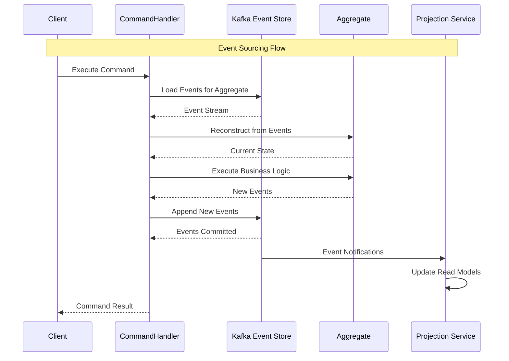

# 🎪 Kafka as Event Store - Event Sourcing Implementation - Bölüm 9

## 📋 Özet

Bu bölümde Apache Kafka'yı Event Store olarak kullanarak Event Sourcing pattern'ini implement edeceğiz. Event-driven state management, aggregate reconstruction, snapshots, event replay ve temporal queries konularını derinlemesine öğreneceksiniz.

## 🎯 Öğrenme Hedefleri

Bu bölüm sonunda şunları yapabileceksiniz:

- ✅ **Event Sourcing Fundamentals** - Event-based state management principles
- ✅ **Kafka Event Store Implementation** - Log compaction, retention strategies
- ✅ **Aggregate Reconstruction** - Event replay, state rebuilding
- ✅ **Snapshot Management** - Performance optimization, storage efficiency
- ✅ **Event Versioning** - Schema evolution, backward compatibility
- ✅ **Temporal Queries** - Point-in-time state reconstruction
- ✅ **Projection Updates** - Read model synchronization
- ✅ **Event Store Monitoring** - Performance metrics, health checks

## 📋 Ön Koşullar

- ✅ Kafka Advanced Programming tamamlanmış (Bölüm 8)
- ✅ CQRS Pattern understanding
- ✅ Domain-Driven Design mastery
- ✅ Event-driven architecture expertise
- ✅ Distributed systems concepts

---

## 🎪 Event Sourcing Pattern Overview

### Traditional vs Event Sourcing

```ascii
┌─────────────────────────────────────────────────────────────────────┐
│                    TRADITIONAL vs EVENT SOURCING                   │
├─────────────────────────────────────────────────────────────────────┤
│                                                                     │
│  🗃️ TRADITIONAL APPROACH                                           │
│  ┌─────────────────────────────────────────────────────────────┐   │
│  │                                                             │   │
│  │  Current State Storage                                      │   │
│  │  ┌─────────────────────────────────────────────────────┐   │   │
│  │  │                                                     │   │   │
│  │  │  Order Table                                        │   │   │
│  │  │  ├── id: ORD-123                                   │   │   │
│  │  │  ├── customer_id: CUST-456                         │   │   │
│  │  │  ├── status: DELIVERED                             │   │   │
│  │  │  ├── total: 199.99                                 │   │   │
│  │  │  └── updated_at: 2024-01-15                        │   │   │
│  │  │                                                     │   │   │
│  │  │  ❌ Lost History: How did we get here?             │   │   │
│  │  │  ❌ No Audit Trail: What changed when?             │   │   │
│  │  │  ❌ No Time Travel: What was state at time X?      │   │   │
│  │  │                                                     │   │   │
│  │  └─────────────────────────────────────────────────────┘   │   │
│  │                                                             │   │
│  └─────────────────────────────────────────────────────────────┘   │
│                                                                     │
│  🎪 EVENT SOURCING APPROACH                                        │
│  ┌─────────────────────────────────────────────────────────────┐   │
│  │                                                             │   │
│  │  Event Stream Storage                                       │   │
│  │  ┌─────────────────────────────────────────────────────┐   │   │
│  │  │                                                     │   │   │
│  │  │  Order Events (Immutable Log)                      │   │   │
│  │  │  ├── OrderPlaced(id=ORD-123, customer=CUST-456,   │   │   │
│  │  │  │              items=[...], total=199.99)        │   │   │
│  │  │  ├── PaymentProcessed(orderId=ORD-123,             │   │   │
│  │  │  │                    paymentId=PAY-789)           │   │   │
│  │  │  ├── OrderShipped(orderId=ORD-123,                 │   │   │
│  │  │  │                tracking=TRK-999)                │   │   │
│  │  │  └── OrderDelivered(orderId=ORD-123,               │   │   │
│  │  │                     deliveredAt=2024-01-15)        │   │   │
│  │  │                                                     │   │   │
│  │  │  ✅ Complete History: Every state change recorded  │   │   │
│  │  │  ✅ Full Audit Trail: Who, what, when, why        │   │   │
│  │  │  ✅ Time Travel: Reconstruct any point in time     │   │   │
│  │  │  ✅ Immutable: Events never change                 │   │   │
│  │  │                                                     │   │   │
│  │  └─────────────────────────────────────────────────────┘   │   │
│  │                                                             │   │
│  │  ▼ Derived State (Projections)                             │   │
│  │  ┌─────────────────────────────────────────────────────┐   │   │
│  │  │                                                     │   │   │
│  │  │  Current State = Replay(Events)                    │   │   │
│  │  │  • Order List View                                 │   │   │
│  │  │  • Order Detail View                               │   │   │
│  │  │  • Analytics View                                  │   │   │
│  │  │  • Customer Dashboard                              │   │   │
│  │  │                                                     │   │   │
│  │  └─────────────────────────────────────────────────────┘   │   │
│  │                                                             │   │
│  └─────────────────────────────────────────────────────────────┘   │
│                                                                     │
└─────────────────────────────────────────────────────────────────────┘
```

### Event Sourcing Flow



---

## 🏗️ Kafka Event Store Implementation

### Event Store Configuration

```java
// infrastructure/eventstore/KafkaEventStore.java
package com.example.order.infrastructure.eventstore;

import org.apache.kafka.clients.producer.KafkaProducer;
import org.apache.kafka.clients.consumer.KafkaConsumer;
import org.apache.kafka.clients.producer.ProducerRecord;
import org.apache.kafka.clients.consumer.ConsumerRecord;
import org.apache.kafka.clients.consumer.ConsumerRecords;
import org.apache.kafka.common.TopicPartition;
import org.springframework.stereotype.Component;
import lombok.extern.slf4j.Slf4j;

import java.util.Properties;
import java.util.List;
import java.util.Map;
import java.util.stream.Collectors;
import java.time.Duration;
import java.util.Collections;

/**
 * Kafka-based Event Store Implementation
 *
 * Provides event sourcing capabilities using Kafka as the underlying storage.
 * Supports event append, stream reading, and snapshot management.
 */
@Component
@Slf4j
public class KafkaEventStore implements EventStore {

    private final KafkaProducer<String, String> producer;
    private final KafkaConsumer<String, String> consumer;
    private final EventSerializer eventSerializer;
    private final EventStoreMetrics metrics;
    private final SnapshotStore snapshotStore;

    private static final String EVENT_STORE_TOPIC_PREFIX = "eventstore-";
    private static final Duration POLL_TIMEOUT = Duration.ofSeconds(10);

    public KafkaEventStore(
        KafkaEventStoreConfig config,
        EventSerializer eventSerializer,
        EventStoreMetrics metrics,
        SnapshotStore snapshotStore
    ) {
        this.producer = createProducer(config);
        this.consumer = createConsumer(config);
        this.eventSerializer = eventSerializer;
        this.metrics = metrics;
        this.snapshotStore = snapshotStore;
    }

    private KafkaProducer<String, String> createProducer(KafkaEventStoreConfig config) {
        Properties props = new Properties();

        // Basic configuration
        props.put("bootstrap.servers", config.getBootstrapServers());
        props.put("key.serializer", "org.apache.kafka.common.serialization.StringSerializer");
        props.put("value.serializer", "org.apache.kafka.common.serialization.StringSerializer");

        // Event store specific settings for durability
        props.put("acks", "all"); // Wait for all replicas
        props.put("retries", Integer.MAX_VALUE);
        props.put("enable.idempotence", true);
        props.put("max.in.flight.requests.per.connection", 1);

        // Compression for space efficiency
        props.put("compression.type", "lz4");

        // Larger batch size for better throughput
        props.put("batch.size", 65536); // 64KB
        props.put("linger.ms", 10);

        return new KafkaProducer<>(props);
    }

    private KafkaConsumer<String, String> createConsumer(KafkaEventStoreConfig config) {
        Properties props = new Properties();

        // Basic configuration
        props.put("bootstrap.servers", config.getBootstrapServers());
        props.put("group.id", "eventstore-reader-" + System.currentTimeMillis());
        props.put("key.deserializer", "org.apache.kafka.common.serialization.StringDeserializer");
        props.put("value.deserializer", "org.apache.kafka.common.serialization.StringDeserializer");

        // Event store reader settings
        props.put("enable.auto.commit", false);
        props.put("auto.offset.reset", "earliest");
        props.put("max.poll.records", 1000);

        return new KafkaConsumer<>(props);
    }

    /**
     * Append events to event stream
     */
    @Override
    public AppendResult appendEvents(String aggregateId, String aggregateType,
                                   List<DomainEvent> events, long expectedVersion) {

        if (events == null || events.isEmpty()) {
            return AppendResult.success(expectedVersion);
        }

        long startTime = System.currentTimeMillis();
        String streamId = createStreamId(aggregateType, aggregateId);
        String topic = getTopicForAggregateType(aggregateType);

        try {
            log.debug("Appending {} events to stream: {}", events.size(), streamId);

            // Check optimistic concurrency (optional, requires version tracking)
            if (expectedVersion != ExpectedVersion.ANY) {
                long currentVersion = getCurrentVersion(streamId);
                if (currentVersion != expectedVersion) {
                    return AppendResult.concurrencyConflict(currentVersion, expectedVersion);
                }
            }

            // Prepare event records
            List<ProducerRecord<String, String>> records = events.stream()
                .map(event -> createEventRecord(topic, streamId, event))
                .collect(Collectors.toList());

            // Send events atomically (within single producer session)
            List<EventMetadata> appendedEvents = new ArrayList<>();

            for (ProducerRecord<String, String> record : records) {
                try {
                    var future = producer.send(record);
                    var metadata = future.get(Duration.ofSeconds(10).toMillis(),
                                            java.util.concurrent.TimeUnit.MILLISECONDS);

                    appendedEvents.add(EventMetadata.builder()
                        .topic(metadata.topic())
                        .partition(metadata.partition())
                        .offset(metadata.offset())
                        .timestamp(metadata.timestamp())
                        .build());

                } catch (Exception e) {
                    log.error("Failed to append event to stream: {}", streamId, e);
                    metrics.recordAppendFailure(aggregateType);
                    return AppendResult.failure("Failed to append event: " + e.getMessage());
                }
            }

            long duration = System.currentTimeMillis() - startTime;
            log.debug("Successfully appended {} events to stream: {} in {}ms",
                     events.size(), streamId, duration);

            metrics.recordAppendSuccess(aggregateType, events.size(), duration);

            return AppendResult.success(expectedVersion + events.size(), appendedEvents);

        } catch (Exception e) {
            log.error("Error appending events to stream: {}", streamId, e);
            metrics.recordAppendFailure(aggregateType);
            return AppendResult.failure("Append operation failed: " + e.getMessage());
        }
    }

    /**
     * Read event stream for aggregate
     */
    @Override
    public EventStream readEventStream(String aggregateId, String aggregateType,
                                     long fromVersion, int maxCount) {

        long startTime = System.currentTimeMillis();
        String streamId = createStreamId(aggregateType, aggregateId);
        String topic = getTopicForAggregateType(aggregateType);

        try {
            log.debug("Reading event stream: {} from version: {}", streamId, fromVersion);

            // Check for available snapshot
            Optional<Snapshot> snapshot = snapshotStore.loadSnapshot(aggregateId, aggregateType);
            long startVersion = fromVersion;
            List<DomainEvent> events = new ArrayList<>();

            if (snapshot.isPresent() && snapshot.get().getVersion() >= fromVersion) {
                // Start from snapshot if available and recent enough
                startVersion = snapshot.get().getVersion() + 1;
                events.add(createSnapshotEvent(snapshot.get()));

                log.debug("Using snapshot at version: {} for stream: {}",
                         snapshot.get().getVersion(), streamId);
            }

            // Read events from Kafka
            List<DomainEvent> kafkaEvents = readEventsFromKafka(topic, streamId, startVersion, maxCount);
            events.addAll(kafkaEvents);

            long currentVersion = startVersion + kafkaEvents.size() - 1;
            long duration = System.currentTimeMillis() - startTime;

            log.debug("Read {} events from stream: {} (version {}) in {}ms",
                     events.size(), streamId, currentVersion, duration);

            metrics.recordStreamRead(aggregateType, events.size(), duration);

            return EventStream.builder()
                .streamId(streamId)
                .aggregateId(aggregateId)
                .aggregateType(aggregateType)
                .events(events)
                .currentVersion(currentVersion)
                .fromVersion(fromVersion)
                .build();

        } catch (Exception e) {
            log.error("Error reading event stream: {}", streamId, e);
            metrics.recordStreamReadFailure(aggregateType);
            return EventStream.empty(streamId, aggregateId, aggregateType);
        }
    }

    /**
     * Read events from Kafka topic
     */
    private List<DomainEvent> readEventsFromKafka(String topic, String streamId,
                                                 long fromVersion, int maxCount) {

        List<DomainEvent> events = new ArrayList<>();

        try {
            // Get topic partitions
            List<TopicPartition> partitions = consumer.partitionsFor(topic).stream()
                .map(info -> new TopicPartition(topic, info.partition()))
                .collect(Collectors.toList());

            consumer.assign(partitions);

            // Find offset corresponding to version (simplified - in practice you'd need version->offset mapping)
            Map<TopicPartition, Long> beginningOffsets = consumer.beginningOffsets(partitions);
            consumer.seekToBeginning(partitions);

            int eventsRead = 0;
            boolean foundStream = false;

            while (eventsRead < maxCount) {
                ConsumerRecords<String, String> records = consumer.poll(POLL_TIMEOUT);

                if (records.isEmpty()) {
                    break;
                }

                for (ConsumerRecord<String, String> record : records) {
                    if (streamId.equals(record.key())) {
                        foundStream = true;

                        try {
                            DomainEvent event = eventSerializer.deserialize(record.value());
                            events.add(event);
                            eventsRead++;

                            if (eventsRead >= maxCount) {
                                break;
                            }

                        } catch (Exception e) {
                            log.warn("Failed to deserialize event from offset: {}", record.offset(), e);
                        }
                    }
                }
            }

            if (!foundStream) {
                log.debug("No events found for stream: {}", streamId);
            }

        } catch (Exception e) {
            log.error("Error reading events from Kafka topic: {}", topic, e);
            throw new EventStoreException("Failed to read events from Kafka", e);
        }

        return events;
    }

    /**
     * Create snapshot for aggregate
     */
    @Override
    public SnapshotResult createSnapshot(String aggregateId, String aggregateType,
                                       Object aggregateState, long version) {
        try {
            log.debug("Creating snapshot for aggregate: {} at version: {}", aggregateId, version);

            Snapshot snapshot = Snapshot.builder()
                .aggregateId(aggregateId)
                .aggregateType(aggregateType)
                .aggregateState(aggregateState)
                .version(version)
                .createdAt(System.currentTimeMillis())
                .build();

            snapshotStore.saveSnapshot(snapshot);

            log.info("Created snapshot for aggregate: {} at version: {}", aggregateId, version);
            metrics.recordSnapshotCreated(aggregateType);

            return SnapshotResult.success(snapshot);

        } catch (Exception e) {
            log.error("Failed to create snapshot for aggregate: {}", aggregateId, e);
            metrics.recordSnapshotFailure(aggregateType);
            return SnapshotResult.failure("Snapshot creation failed: " + e.getMessage());
        }
    }

    /**
     * Replay events for aggregate reconstruction
     */
    @Override
    public <T> T replayEvents(String aggregateId, String aggregateType,
                            AggregateFactory<T> factory, long toVersion) {

        EventStream stream = readEventStream(aggregateId, aggregateType, 0, Integer.MAX_VALUE);

        T aggregate = factory.createEmpty(aggregateId);

        for (DomainEvent event : stream.getEvents()) {
            if (event.getVersion() <= toVersion) {
                aggregate = factory.applyEvent(aggregate, event);
            } else {
                break;
            }
        }

        return aggregate;
    }

    // Helper methods
    private String createStreamId(String aggregateType, String aggregateId) {
        return aggregateType + "-" + aggregateId;
    }

    private String getTopicForAggregateType(String aggregateType) {
        return EVENT_STORE_TOPIC_PREFIX + aggregateType.toLowerCase();
    }

    private ProducerRecord<String, String> createEventRecord(String topic, String streamId,
                                                           DomainEvent event) {
        try {
            String serializedEvent = eventSerializer.serialize(event);

            ProducerRecord<String, String> record = new ProducerRecord<>(topic, streamId, serializedEvent);

            // Add headers for metadata
            record.headers().add("eventId", event.getEventId().getBytes());
            record.headers().add("eventType", event.getEventType().getBytes());
            record.headers().add("aggregateId", event.getAggregateId().getBytes());
            record.headers().add("aggregateType", event.getAggregateType().getBytes());
            record.headers().add("version", String.valueOf(event.getVersion()).getBytes());
            record.headers().add("timestamp", String.valueOf(event.getTimestamp()).getBytes());

            return record;

        } catch (Exception e) {
            throw new EventSerializationException("Failed to create event record", e);
        }
    }

    private long getCurrentVersion(String streamId) {
        // In practice, you'd maintain version metadata separately
        // For now, return ANY to skip version checks
        return ExpectedVersion.ANY;
    }

    private DomainEvent createSnapshotEvent(Snapshot snapshot) {
        // Create a special event from snapshot data
        return SnapshotRestoreEvent.builder()
            .aggregateId(snapshot.getAggregateId())
            .aggregateType(snapshot.getAggregateType())
            .aggregateState(snapshot.getAggregateState())
            .version(snapshot.getVersion())
            .timestamp(snapshot.getCreatedAt())
            .build();
    }
}
```

### Event Store Interface

```java
// domain/eventstore/EventStore.java
package com.example.order.domain.eventstore;

import java.util.List;
import java.util.Optional;

/**
 * Event Store Interface
 *
 * Defines the contract for event storage and retrieval in event sourcing.
 */
public interface EventStore {

    /**
     * Append events to an aggregate stream
     */
    AppendResult appendEvents(String aggregateId, String aggregateType,
                            List<DomainEvent> events, long expectedVersion);

    /**
     * Read event stream for an aggregate
     */
    EventStream readEventStream(String aggregateId, String aggregateType,
                              long fromVersion, int maxCount);

    /**
     * Create snapshot for performance optimization
     */
    SnapshotResult createSnapshot(String aggregateId, String aggregateType,
                                Object aggregateState, long version);

    /**
     * Load snapshot if available
     */
    Optional<Snapshot> loadSnapshot(String aggregateId, String aggregateType);

    /**
     * Replay events to reconstruct aggregate state
     */
    <T> T replayEvents(String aggregateId, String aggregateType,
                      AggregateFactory<T> factory, long toVersion);

    /**
     * Get all events for a stream (for debugging/admin)
     */
    List<DomainEvent> getAllEvents(String aggregateId, String aggregateType);

    /**
     * Health check
     */
    boolean isHealthy();
}

/**
 * Expected Version constants
 */
public class ExpectedVersion {
    public static final long ANY = -2;
    public static final long NO_STREAM = -1;
    public static final long EMPTY_STREAM = 0;
}

/**
 * Append Result
 */
public static class AppendResult {
    private final boolean success;
    private final long newVersion;
    private final String errorMessage;
    private final List<EventMetadata> eventMetadata;
    private final boolean concurrencyConflict;
    private final long currentVersion;

    private AppendResult(boolean success, long newVersion, String errorMessage,
                        List<EventMetadata> eventMetadata, boolean concurrencyConflict,
                        long currentVersion) {
        this.success = success;
        this.newVersion = newVersion;
        this.errorMessage = errorMessage;
        this.eventMetadata = eventMetadata != null ? eventMetadata : List.of();
        this.concurrencyConflict = concurrencyConflict;
        this.currentVersion = currentVersion;
    }

    public static AppendResult success(long newVersion) {
        return new AppendResult(true, newVersion, null, null, false, 0);
    }

    public static AppendResult success(long newVersion, List<EventMetadata> metadata) {
        return new AppendResult(true, newVersion, null, metadata, false, 0);
    }

    public static AppendResult failure(String errorMessage) {
        return new AppendResult(false, 0, errorMessage, null, false, 0);
    }

    public static AppendResult concurrencyConflict(long currentVersion, long expectedVersion) {
        return new AppendResult(false, 0,
            "Concurrency conflict: expected=" + expectedVersion + ", current=" + currentVersion,
            null, true, currentVersion);
    }

    // Getters
    public boolean isSuccess() { return success; }
    public long getNewVersion() { return newVersion; }
    public String getErrorMessage() { return errorMessage; }
    public List<EventMetadata> getEventMetadata() { return eventMetadata; }
    public boolean isConcurrencyConflict() { return concurrencyConflict; }
    public long getCurrentVersion() { return currentVersion; }
}
```

---

## 🎯 Event-Sourced Aggregate Implementation

### Event-Sourced Order Aggregate

```java
// domain/aggregate/EventSourcedOrder.java
package com.example.order.domain.aggregate;

import com.example.order.domain.event.*;
import com.example.order.domain.valueobject.*;
import java.time.LocalDateTime;
import java.util.List;
import java.util.ArrayList;

/**
 * Event-Sourced Order Aggregate
 *
 * Aggregate that derives its state from a sequence of events.
 * State changes are captured as events, not direct mutations.
 */
public class EventSourcedOrder {

    // Current state
    private OrderId id;
    private CustomerId customerId;
    private OrderStatus status;
    private List<OrderItem> items = new ArrayList<>();
    private Money totalAmount;
    private ShippingAddress shippingAddress;
    private PaymentMethod paymentMethod;
    private LocalDateTime createdAt;
    private LocalDateTime updatedAt;

    // Event sourcing metadata
    private long version = 0;
    private List<DomainEvent> uncommittedEvents = new ArrayList<>();

    /**
     * Create new order (generates OrderPlacedEvent)
     */
    public static EventSourcedOrder placeOrder(OrderId orderId, CustomerId customerId,
                                             List<OrderItem> items, ShippingAddress shippingAddress,
                                             PaymentMethod paymentMethod) {

        // Validate business rules
        validateOrderCreation(customerId, items, shippingAddress, paymentMethod);

        EventSourcedOrder order = new EventSourcedOrder();

        // Generate domain event
        OrderPlacedEvent event = OrderPlacedEvent.builder()
            .eventId(UUID.randomUUID().toString())
            .aggregateId(orderId.getValue())
            .aggregateType("Order")
            .eventType("OrderPlaced")
            .version(order.version + 1)
            .timestamp(System.currentTimeMillis())
            .orderId(orderId)
            .customerId(customerId)
            .items(items)
            .shippingAddress(shippingAddress)
            .paymentMethod(paymentMethod)
            .totalAmount(calculateTotalAmount(items))
            .placedAt(LocalDateTime.now())
            .build();

        // Apply event to update state
        order.applyEvent(event);
        order.markEventAsUncommitted(event);

        return order;
    }

    /**
     * Reconstruct aggregate from event stream
     */
    public static EventSourcedOrder fromEvents(List<DomainEvent> events) {
        EventSourcedOrder order = new EventSourcedOrder();

        for (DomainEvent event : events) {
            order.applyEvent(event);
        }

        // All events are committed when reconstructing
        order.uncommittedEvents.clear();

        return order;
    }

    /**
     * Confirm order (generates OrderConfirmedEvent)
     */
    public void confirm(PaymentConfirmation paymentConfirmation,
                       InventoryConfirmation inventoryConfirmation) {

        // Business rule validation
        if (this.status != OrderStatus.PENDING) {
            throw new IllegalOrderStateException(
                "Order can only be confirmed from PENDING status. Current: " + this.status
            );
        }

        validatePaymentConfirmation(paymentConfirmation);
        validateInventoryConfirmation(inventoryConfirmation);

        // Generate domain event
        OrderConfirmedEvent event = OrderConfirmedEvent.builder()
            .eventId(UUID.randomUUID().toString())
            .aggregateId(this.id.getValue())
            .aggregateType("Order")
            .eventType("OrderConfirmed")
            .version(this.version + 1)
            .timestamp(System.currentTimeMillis())
            .orderId(this.id)
            .customerId(this.customerId)
            .paymentConfirmation(paymentConfirmation)
            .inventoryConfirmation(inventoryConfirmation)
            .confirmedAt(LocalDateTime.now())
            .build();

        applyEvent(event);
        markEventAsUncommitted(event);
    }

    /**
     * Ship order (generates OrderShippedEvent)
     */
    public void ship(ShippingConfirmation shippingConfirmation) {
        // Business rule validation
        if (this.status != OrderStatus.CONFIRMED) {
            throw new IllegalOrderStateException(
                "Order can only be shipped from CONFIRMED status. Current: " + this.status
            );
        }

        validateShippingConfirmation(shippingConfirmation);

        // Generate domain event
        OrderShippedEvent event = OrderShippedEvent.builder()
            .eventId(UUID.randomUUID().toString())
            .aggregateId(this.id.getValue())
            .aggregateType("Order")
            .eventType("OrderShipped")
            .version(this.version + 1)
            .timestamp(System.currentTimeMillis())
            .orderId(this.id)
            .customerId(this.customerId)
            .shippingConfirmation(shippingConfirmation)
            .shippedAt(LocalDateTime.now())
            .build();

        applyEvent(event);
        markEventAsUncommitted(event);
    }

    /**
     * Cancel order (generates OrderCancelledEvent)
     */
    public void cancel(CancellationReason reason, String requestedBy) {
        // Business rule validation
        if (!canBeCancelled()) {
            throw new OrderCancellationNotAllowedException(
                "Order in status " + this.status + " cannot be cancelled"
            );
        }

        OrderStatus previousStatus = this.status;

        // Generate domain event
        OrderCancelledEvent event = OrderCancelledEvent.builder()
            .eventId(UUID.randomUUID().toString())
            .aggregateId(this.id.getValue())
            .aggregateType("Order")
            .eventType("OrderCancelled")
            .version(this.version + 1)
            .timestamp(System.currentTimeMillis())
            .orderId(this.id)
            .customerId(this.customerId)
            .previousStatus(previousStatus)
            .cancellationReason(reason)
            .requestedBy(requestedBy)
            .cancelledAt(LocalDateTime.now())
            .build();

        applyEvent(event);
        markEventAsUncommitted(event);
    }

    /**
     * Apply event to update aggregate state
     */
    private void applyEvent(DomainEvent event) {
        switch (event) {
            case OrderPlacedEvent e -> applyOrderPlacedEvent(e);
            case OrderConfirmedEvent e -> applyOrderConfirmedEvent(e);
            case OrderShippedEvent e -> applyOrderShippedEvent(e);
            case OrderDeliveredEvent e -> applyOrderDeliveredEvent(e);
            case OrderCancelledEvent e -> applyOrderCancelledEvent(e);
            case SnapshotRestoreEvent e -> applySnapshotRestoreEvent(e);
            default -> throw new UnsupportedEventTypeException("Unknown event type: " +
                                                              event.getClass().getSimpleName());
        }

        // Update version
        this.version = event.getVersion();
        this.updatedAt = LocalDateTime.ofEpochSecond(event.getTimestamp() / 1000,
                                                   (int) (event.getTimestamp() % 1000) * 1000000);
    }

    private void applyOrderPlacedEvent(OrderPlacedEvent event) {
        this.id = event.getOrderId();
        this.customerId = event.getCustomerId();
        this.status = OrderStatus.PENDING;
        this.items = new ArrayList<>(event.getItems());
        this.shippingAddress = event.getShippingAddress();
        this.paymentMethod = event.getPaymentMethod();
        this.totalAmount = event.getTotalAmount();
        this.createdAt = event.getPlacedAt();
        this.updatedAt = event.getPlacedAt();
    }

    private void applyOrderConfirmedEvent(OrderConfirmedEvent event) {
        this.status = OrderStatus.CONFIRMED;
        // Additional confirmation-specific state updates can be added here
    }

    private void applyOrderShippedEvent(OrderShippedEvent event) {
        this.status = OrderStatus.SHIPPED;
        // Additional shipping-specific state updates can be added here
    }

    private void applyOrderDeliveredEvent(OrderDeliveredEvent event) {
        this.status = OrderStatus.DELIVERED;
        // Additional delivery-specific state updates can be added here
    }

    private void applyOrderCancelledEvent(OrderCancelledEvent event) {
        this.status = OrderStatus.CANCELLED;
        // Additional cancellation-specific state updates can be added here
    }

    private void applySnapshotRestoreEvent(SnapshotRestoreEvent event) {
        // Restore state from snapshot
        EventSourcedOrder snapshotOrder = (EventSourcedOrder) event.getAggregateState();

        this.id = snapshotOrder.id;
        this.customerId = snapshotOrder.customerId;
        this.status = snapshotOrder.status;
        this.items = new ArrayList<>(snapshotOrder.items);
        this.shippingAddress = snapshotOrder.shippingAddress;
        this.paymentMethod = snapshotOrder.paymentMethod;
        this.totalAmount = snapshotOrder.totalAmount;
        this.createdAt = snapshotOrder.createdAt;
        this.updatedAt = snapshotOrder.updatedAt;
    }

    /**
     * Mark events as committed (called after successful persistence)
     */
    public void markEventsAsCommitted() {
        uncommittedEvents.clear();
    }

    /**
     * Get uncommitted events for persistence
     */
    public List<DomainEvent> getUncommittedEvents() {
        return new ArrayList<>(uncommittedEvents);
    }

    private void markEventAsUncommitted(DomainEvent event) {
        uncommittedEvents.add(event);
    }

    /**
     * Create snapshot of current state
     */
    public OrderSnapshot createSnapshot() {
        return OrderSnapshot.builder()
            .aggregateId(this.id.getValue())
            .version(this.version)
            .id(this.id)
            .customerId(this.customerId)
            .status(this.status)
            .items(new ArrayList<>(this.items))
            .shippingAddress(this.shippingAddress)
            .paymentMethod(this.paymentMethod)
            .totalAmount(this.totalAmount)
            .createdAt(this.createdAt)
            .updatedAt(this.updatedAt)
            .snapshotCreatedAt(LocalDateTime.now())
            .build();
    }

    // Business rule validation methods (same as before)
    private static void validateOrderCreation(CustomerId customerId, List<OrderItem> items,
                                            ShippingAddress shippingAddress, PaymentMethod paymentMethod) {
        if (customerId == null) {
            throw new IllegalArgumentException("Customer ID is required");
        }
        // ... other validations
    }

    private void validatePaymentConfirmation(PaymentConfirmation paymentConfirmation) {
        if (paymentConfirmation == null) {
            throw new IllegalArgumentException("Payment confirmation is required");
        }
        // ... other validations
    }

    private void validateInventoryConfirmation(InventoryConfirmation inventoryConfirmation) {
        if (inventoryConfirmation == null) {
            throw new IllegalArgumentException("Inventory confirmation is required");
        }
        // ... other validations
    }

    private void validateShippingConfirmation(ShippingConfirmation shippingConfirmation) {
        if (shippingConfirmation == null) {
            throw new IllegalArgumentException("Shipping confirmation is required");
        }
        // ... other validations
    }

    private boolean canBeCancelled() {
        return this.status == OrderStatus.PENDING || this.status == OrderStatus.CONFIRMED;
    }

    private static Money calculateTotalAmount(List<OrderItem> items) {
        BigDecimal total = items.stream()
            .map(item -> item.getUnitPrice().getAmount()
                .multiply(BigDecimal.valueOf(item.getQuantity().getValue())))
            .reduce(BigDecimal.ZERO, BigDecimal::add);

        return Money.of(total, Currency.getInstance("USD"));
    }

    // Getters
    public OrderId getId() { return id; }
    public CustomerId getCustomerId() { return customerId; }
    public OrderStatus getStatus() { return status; }
    public List<OrderItem> getItems() { return List.copyOf(items); }
    public Money getTotalAmount() { return totalAmount; }
    public ShippingAddress getShippingAddress() { return shippingAddress; }
    public PaymentMethod getPaymentMethod() { return paymentMethod; }
    public LocalDateTime getCreatedAt() { return createdAt; }
    public LocalDateTime getUpdatedAt() { return updatedAt; }
    public long getVersion() { return version; }
}
```

---

## 📸 Snapshot Management

### Snapshot Store Implementation

```java
// infrastructure/snapshot/PostgreSnapshotStore.java
package com.example.order.infrastructure.snapshot;

import org.springframework.jdbc.core.JdbcTemplate;
import org.springframework.stereotype.Component;
import com.fasterxml.jackson.databind.ObjectMapper;
import lombok.extern.slf4j.Slf4j;

import java.util.Optional;
import java.sql.ResultSet;
import java.sql.SQLException;

/**
 * PostgreSQL-based Snapshot Store
 *
 * Stores and retrieves aggregate snapshots for performance optimization.
 */
@Component
@Slf4j
public class PostgreSnapshotStore implements SnapshotStore {

    private final JdbcTemplate jdbcTemplate;
    private final ObjectMapper objectMapper;
    private final SnapshotMetrics metrics;

    private static final String INSERT_SNAPSHOT_SQL = """
        INSERT INTO snapshots (aggregate_id, aggregate_type, version, snapshot_data, created_at)
        VALUES (?, ?, ?, ?::jsonb, ?)
        ON CONFLICT (aggregate_id, aggregate_type)
        DO UPDATE SET
            version = EXCLUDED.version,
            snapshot_data = EXCLUDED.snapshot_data,
            created_at = EXCLUDED.created_at
        WHERE snapshots.version < EXCLUDED.version
        """;

    private static final String SELECT_SNAPSHOT_SQL = """
        SELECT aggregate_id, aggregate_type, version, snapshot_data, created_at
        FROM snapshots
        WHERE aggregate_id = ? AND aggregate_type = ?
        ORDER BY version DESC
        LIMIT 1
        """;

    private static final String DELETE_OLD_SNAPSHOTS_SQL = """
        DELETE FROM snapshots
        WHERE aggregate_id = ? AND aggregate_type = ? AND version < ?
        """;

    public PostgreSnapshotStore(JdbcTemplate jdbcTemplate, ObjectMapper objectMapper,
                               SnapshotMetrics metrics) {
        this.jdbcTemplate = jdbcTemplate;
        this.objectMapper = objectMapper;
        this.metrics = metrics;
    }

    @Override
    public void saveSnapshot(Snapshot snapshot) {
        long startTime = System.currentTimeMillis();

        try {
            log.debug("Saving snapshot for aggregate: {} at version: {}",
                     snapshot.getAggregateId(), snapshot.getVersion());

            String snapshotJson = objectMapper.writeValueAsString(snapshot.getAggregateState());

            int rowsAffected = jdbcTemplate.update(INSERT_SNAPSHOT_SQL,
                snapshot.getAggregateId(),
                snapshot.getAggregateType(),
                snapshot.getVersion(),
                snapshotJson,
                snapshot.getCreatedAt()
            );

            if (rowsAffected > 0) {
                // Clean up old snapshots (keep only the latest)
                cleanupOldSnapshots(snapshot.getAggregateId(), snapshot.getAggregateType(),
                                  snapshot.getVersion());

                long duration = System.currentTimeMillis() - startTime;
                log.debug("Snapshot saved successfully in {}ms", duration);

                metrics.recordSnapshotSaved(snapshot.getAggregateType(), duration);
            } else {
                log.debug("Snapshot not saved - older version exists");
            }

        } catch (Exception e) {
            log.error("Failed to save snapshot for aggregate: {}", snapshot.getAggregateId(), e);
            metrics.recordSnapshotSaveFailure(snapshot.getAggregateType());
            throw new SnapshotStoreException("Failed to save snapshot", e);
        }
    }

    @Override
    public Optional<Snapshot> loadSnapshot(String aggregateId, String aggregateType) {
        long startTime = System.currentTimeMillis();

        try {
            log.debug("Loading snapshot for aggregate: {}", aggregateId);

            Snapshot snapshot = jdbcTemplate.queryForObject(SELECT_SNAPSHOT_SQL,
                this::mapRowToSnapshot,
                aggregateId,
                aggregateType
            );

            long duration = System.currentTimeMillis() - startTime;
            log.debug("Snapshot loaded successfully in {}ms", duration);

            metrics.recordSnapshotLoaded(aggregateType, duration);

            return Optional.of(snapshot);

        } catch (EmptyResultDataAccessException e) {
            log.debug("No snapshot found for aggregate: {}", aggregateId);
            return Optional.empty();

        } catch (Exception e) {
            log.error("Failed to load snapshot for aggregate: {}", aggregateId, e);
            metrics.recordSnapshotLoadFailure(aggregateType);
            return Optional.empty();
        }
    }

    private Snapshot mapRowToSnapshot(ResultSet rs, int rowNum) throws SQLException {
        try {
            String aggregateId = rs.getString("aggregate_id");
            String aggregateType = rs.getString("aggregate_type");
            long version = rs.getLong("version");
            String snapshotJson = rs.getString("snapshot_data");
            long createdAt = rs.getLong("created_at");

            // Deserialize aggregate state based on type
            Object aggregateState = deserializeAggregateState(aggregateType, snapshotJson);

            return Snapshot.builder()
                .aggregateId(aggregateId)
                .aggregateType(aggregateType)
                .version(version)
                .aggregateState(aggregateState)
                .createdAt(createdAt)
                .build();

        } catch (Exception e) {
            throw new SQLException("Failed to map snapshot from result set", e);
        }
    }

    private Object deserializeAggregateState(String aggregateType, String snapshotJson)
            throws Exception {

        Class<?> stateClass = getAggregateStateClass(aggregateType);
        return objectMapper.readValue(snapshotJson, stateClass);
    }

    private Class<?> getAggregateStateClass(String aggregateType) {
        // Map aggregate type to snapshot class
        return switch (aggregateType) {
            case "Order" -> OrderSnapshot.class;
            case "Inventory" -> InventorySnapshot.class;
            case "Payment" -> PaymentSnapshot.class;
            default -> throw new IllegalArgumentException("Unknown aggregate type: " + aggregateType);
        };
    }

    private void cleanupOldSnapshots(String aggregateId, String aggregateType, long currentVersion) {
        try {
            int deletedRows = jdbcTemplate.update(DELETE_OLD_SNAPSHOTS_SQL,
                aggregateId, aggregateType, currentVersion);

            if (deletedRows > 0) {
                log.debug("Cleaned up {} old snapshots for aggregate: {}", deletedRows, aggregateId);
            }

        } catch (Exception e) {
            log.warn("Failed to cleanup old snapshots for aggregate: {}", aggregateId, e);
            // Don't fail the main operation for cleanup errors
        }
    }

    @Override
    public boolean deleteSnapshot(String aggregateId, String aggregateType) {
        try {
            String deleteSql = "DELETE FROM snapshots WHERE aggregate_id = ? AND aggregate_type = ?";
            int deletedRows = jdbcTemplate.update(deleteSql, aggregateId, aggregateType);

            log.debug("Deleted {} snapshots for aggregate: {}", deletedRows, aggregateId);
            return deletedRows > 0;

        } catch (Exception e) {
            log.error("Failed to delete snapshots for aggregate: {}", aggregateId, e);
            return false;
        }
    }

    @Override
    public List<SnapshotMetadata> listSnapshots(String aggregateType, int limit, int offset) {
        try {
            String listSql = """
                SELECT aggregate_id, aggregate_type, version, created_at
                FROM snapshots
                WHERE aggregate_type = ?
                ORDER BY created_at DESC
                LIMIT ? OFFSET ?
                """;

            return jdbcTemplate.query(listSql,
                (rs, rowNum) -> SnapshotMetadata.builder()
                    .aggregateId(rs.getString("aggregate_id"))
                    .aggregateType(rs.getString("aggregate_type"))
                    .version(rs.getLong("version"))
                    .createdAt(rs.getLong("created_at"))
                    .build(),
                aggregateType, limit, offset
            );

        } catch (Exception e) {
            log.error("Failed to list snapshots for aggregate type: {}", aggregateType, e);
            return List.of();
        }
    }
}

/**
 * Snapshot metadata for listing
 */
@Builder
public record SnapshotMetadata(
    String aggregateId,
    String aggregateType,
    long version,
    long createdAt
) {}

/**
 * Database schema for snapshots
 */
/*
CREATE TABLE snapshots (
    aggregate_id VARCHAR(100) NOT NULL,
    aggregate_type VARCHAR(50) NOT NULL,
    version BIGINT NOT NULL,
    snapshot_data JSONB NOT NULL,
    created_at BIGINT NOT NULL,
    PRIMARY KEY (aggregate_id, aggregate_type)
);

CREATE INDEX idx_snapshots_type_created ON snapshots(aggregate_type, created_at DESC);
CREATE INDEX idx_snapshots_created ON snapshots(created_at DESC);
*/
```

---

## 🔄 Yapılan İşlemler & Mimari Açıklamalar

### 1. **Event Sourcing Benefits**

```ascii
┌─────────────────────────────────────────────────────────────────────┐
│                       EVENT SOURCING BENEFITS                      │
├─────────────────────────────────────────────────────────────────────┤
│                                                                     │
│  📚 COMPLETE AUDIT TRAIL                                           │
│  • Every state change recorded as immutable event                  │
│  • Full history preservation with business context                 │
│  • Regulatory compliance and forensic analysis                     │
│  • Natural auditing without additional infrastructure              │
│                                                                     │
│  🕰️ TEMPORAL QUERIES                                               │
│  • Reconstruct state at any point in time                         │
│  • Historical reporting and analytics                              │
│  • Debugging production issues by replaying events                 │
│  • Business intelligence across time dimensions                    │
│                                                                     │
│  🔄 REPLAY & RECOVERY                                              │
│  • Rebuild read models from scratch                                │
│  • Fix bugs by correcting event handlers                          │
│  • Migrate to new business rules                                   │
│  • Disaster recovery from immutable event log                      │
│                                                                     │
│  📊 MULTIPLE PROJECTIONS                                           │
│  • Same events feed different read models                          │
│  • Optimized views for different use cases                        │
│  • New projections without touching source data                    │
│  • A/B testing with alternative projections                       │
│                                                                     │
│  🎯 BUSINESS INSIGHTS                                              │
│  • Rich business events capture intent                             │
│  • Process mining and business analytics                           │
│  • Customer behavior analysis                                      │
│  • Performance optimization insights                               │
│                                                                     │
└─────────────────────────────────────────────────────────────────────┘
```

### 2. **Kafka as Event Store Architecture**

- **Log Compaction**: Keep latest event per key, remove old events
- **Retention Policies**: Time-based and size-based retention
- **Partitioning**: Aggregate-based partitioning for ordering
- **Replication**: Multi-replica setup for durability

### 3. **Snapshot Strategy**

- **Performance**: Avoid replaying thousands of events
- **Storage**: Compressed snapshots for large aggregates
- **Frequency**: Snapshot every N events or time period
- **Cleanup**: Remove old snapshots to save space

Bu Kafka Event Store implementation'ı ile event sourcing pattern'ini fully implement edebilir, temporal queries yapabilir, complete audit trails maintain edebilir ve high-performance event-driven systems oluşturabiliriz! 🎯

**Sonraki Adım:** Kubernetes Fundamentals ve container orchestration! 🚀

```

```
