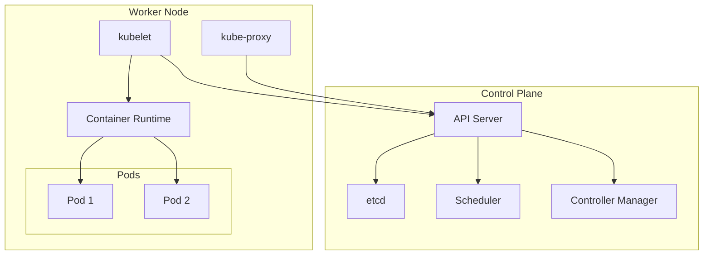

# ⚙️ Kubernetes Fundamentals & Local Cluster - Bölüm 10

## 📋 Özet

Bu bölümde Kubernetes'in fundamentals'ını öğrenecek ve local development cluster kurarak mikroservislerimizi container orchestration ile yöneteceğiz. Pods, Services, Deployments, ConfigMaps, Secrets ve networking concepts'ini hands-on öğreneceksiniz.

## 🎯 Öğrenme Hedefleri

Bu bölüm sonunda şunları yapabileceksiniz:

- ✅ **Kubernetes Architecture** - Control plane, worker nodes, components
- ✅ **Local Cluster Setup** - Docker Desktop, kind, minikube
- ✅ **Core Resources** - Pods, Services, Deployments, ConfigMaps
- ✅ **Networking** - Service discovery, ingress, load balancing
- ✅ **Storage** - Persistent volumes, storage classes
- ✅ **Configuration Management** - Secrets, environment variables
- ✅ **Health Checks** - Liveness, readiness, startup probes
- ✅ **Monitoring & Debugging** - kubectl, logs, troubleshooting

## 📋 Ön Koşullar

- ✅ Kafka Event Store tamamlanmış (Bölüm 9)
- ✅ Docker containerization knowledge
- ✅ Basic networking concepts
- ✅ YAML configuration familiarity
- ✅ Command-line tool usage

---

## 🏗️ Kubernetes Architecture Overview

### Cluster Architecture

```ascii
┌─────────────────────────────────────────────────────────────────────┐
│                        KUBERNETES CLUSTER                          │
├─────────────────────────────────────────────────────────────────────┤
│                                                                     │
│  🎛️ CONTROL PLANE (Master Nodes)                                  │
│  ┌─────────────────────────────────────────────────────────────┐   │
│  │                                                             │   │
│  │  ┌─────────────┐  ┌─────────────┐  ┌─────────────┐       │   │
│  │  │   API       │  │   etcd      │  │ Scheduler   │       │   │
│  │  │  Server     │  │ (Storage)   │  │             │       │   │
│  │  └─────────────┘  └─────────────┘  └─────────────┘       │   │
│  │                                                             │   │
│  │  ┌─────────────┐  ┌─────────────┐                        │   │
│  │  │ Controller  │  │   Cloud     │                        │   │
│  │  │  Manager    │  │ Controller  │                        │   │
│  │  └─────────────┘  └─────────────┘                        │   │
│  │                                                             │   │
│  └─────────────────────────────────────────────────────────────┘   │
│                                                                     │
│  🔧 WORKER NODES                                                   │
│  ┌─────────────────────────────────────────────────────────────┐   │
│  │                                                             │   │
│  │  Node 1                Node 2                Node 3        │   │
│  │  ┌─────────────┐       ┌─────────────┐      ┌─────────────┐ │   │
│  │  │   kubelet   │       │   kubelet   │      │   kubelet   │ │   │
│  │  │ kube-proxy  │       │ kube-proxy  │      │ kube-proxy  │ │   │
│  │  │ Container   │       │ Container   │      │ Container   │ │   │
│  │  │ Runtime     │       │ Runtime     │      │ Runtime     │ │   │
│  │  └─────────────┘       └─────────────┘      └─────────────┘ │   │
│  │                                                             │   │
│  │  ┌─────────────┐       ┌─────────────┐      ┌─────────────┐ │   │
│  │  │   Pod 1     │       │   Pod 3     │      │   Pod 5     │ │   │
│  │  │ (App A)     │       │ (App C)     │      │ (Database)  │ │   │
│  │  └─────────────┘       └─────────────┘      └─────────────┘ │   │
│  │                                                             │   │
│  │  ┌─────────────┐       ┌─────────────┐      ┌─────────────┐ │   │
│  │  │   Pod 2     │       │   Pod 4     │      │   Pod 6     │ │   │
│  │  │ (App B)     │       │ (App D)     │      │ (Kafka)     │ │   │
│  │  └─────────────┘       └─────────────┘      └─────────────┘ │   │
│  │                                                             │   │
│  └─────────────────────────────────────────────────────────────┘   │
│                                                                     │
│  🌐 NETWORKING                                                     │
│  ┌─────────────────────────────────────────────────────────────┐   │
│  │                                                             │   │
│  │  Pod Network (CNI)    Service Network    Ingress           │   │
│  │  10.244.0.0/16       10.96.0.0/12       LoadBalancer      │   │
│  │                                                             │   │
│  └─────────────────────────────────────────────────────────────┘   │
│                                                                     │
└─────────────────────────────────────────────────────────────────────┘
```

### Component Responsibilities



---

## 🚀 Local Kubernetes Setup

### Option 1: Docker Desktop (Recommended for Beginners)

```bash
# Enable Kubernetes in Docker Desktop
# Settings > Kubernetes > Enable Kubernetes

# Verify installation
kubectl version --short
kubectl cluster-info
kubectl get nodes
```

### Option 2: kind (Kubernetes in Docker)

```bash
# Install kind
# On Windows (using chocolatey)
choco install kind

# On macOS (using brew)
brew install kind

# Create cluster configuration
cat > kind-cluster.yaml <<EOF
kind: Cluster
apiVersion: kind.x-k8s.io/v1alpha4
name: microservices-cluster
nodes:
- role: control-plane
  kubeadmConfigPatches:
  - |
    kind: InitConfiguration
    nodeRegistration:
      kubeletExtraArgs:
        node-labels: "ingress-ready=true"
  extraPortMappings:
  - containerPort: 80
    hostPort: 80
    protocol: TCP
  - containerPort: 443
    hostPort: 443
    protocol: TCP
- role: worker
- role: worker
EOF

# Create cluster
kind create cluster --config=kind-cluster.yaml

# Verify cluster
kubectl get nodes
```

### Option 3: minikube

```bash
# Install minikube
# On Windows
choco install minikube

# On macOS
brew install minikube

# Start cluster
minikube start --cpus=4 --memory=8192 --kubernetes-version=v1.28.0

# Enable addons
minikube addons enable ingress
minikube addons enable metrics-server
minikube addons enable dashboard

# Access dashboard
minikube dashboard
```

---

## 📦 Core Kubernetes Resources

### Namespace Setup

```yaml
# namespace.yaml
apiVersion: v1
kind: Namespace
metadata:
  name: microservices
  labels:
    environment: development
    project: order-system
---
apiVersion: v1
kind: Namespace
metadata:
  name: microservices-monitoring
  labels:
    environment: development
    project: monitoring
---
apiVersion: v1
kind: Namespace
metadata:
  name: microservices-kafka
  labels:
    environment: development
    project: kafka
```

### ConfigMap for Application Configuration

```yaml
# configmap.yaml
apiVersion: v1
kind: ConfigMap
metadata:
  name: order-service-config
  namespace: microservices
data:
  application.yml: |
    server:
      port: 8080
    spring:
      application:
        name: order-service
      datasource:
        url: jdbc:postgresql://postgres-service:5432/order_db
        username: order_user
        password: order_pass
      jpa:
        hibernate:
          ddl-auto: validate
        show-sql: false
      kafka:
        bootstrap-servers: kafka-service:9092
        producer:
          acks: all
          retries: 3
        consumer:
          group-id: order-service-group
          auto-offset-reset: earliest

    # Application specific config
    order:
      processing:
        timeout: 30s
      retry:
        max-attempts: 3
        delay: 1s

    # Logging
    logging:
      level:
        com.example.order: DEBUG
        org.springframework.kafka: INFO
        org.hibernate.SQL: WARN
      pattern:
        console: "%d{HH:mm:ss.SSS} [%thread] %-5level %logger{36} - %msg%n"

    # Management endpoints
    management:
      endpoints:
        web:
          exposure:
            include: health,metrics,prometheus,info
      endpoint:
        health:
          show-details: always
      health:
        livenessstate:
          enabled: true
        readinessstate:
          enabled: true

---
apiVersion: v1
kind: ConfigMap
metadata:
  name: inventory-service-config
  namespace: microservices
data:
  application.yml: |
    server:
      port: 8081
    spring:
      application:
        name: inventory-service
      datasource:
        url: jdbc:postgresql://postgres-service:5432/inventory_db
        username: inventory_user
        password: inventory_pass
      kafka:
        bootstrap-servers: kafka-service:9092

    # Similar configuration structure as order service

---
apiVersion: v1
kind: ConfigMap
metadata:
  name: payment-service-config
  namespace: microservices
data:
  application.yml: |
    server:
      port: 8082
    spring:
      application:
        name: payment-service
      datasource:
        url: jdbc:postgresql://postgres-service:5432/payment_db
        username: payment_user
        password: payment_pass
      kafka:
        bootstrap-servers: kafka-service:9092

    # Similar configuration structure
```

### Secrets for Sensitive Data

```yaml
# secrets.yaml
apiVersion: v1
kind: Secret
metadata:
  name: postgres-secret
  namespace: microservices
type: Opaque
data:
  # Base64 encoded values
  postgres-password: cG9zdGdyZXNfcGFzcw== # postgres_pass
  order-db-password: b3JkZXJfcGFzcw== # order_pass
  inventory-db-password: aW52ZW50b3J5X3Bhc3M= # inventory_pass
  payment-db-password: cGF5bWVudF9wYXNz # payment_pass

---
apiVersion: v1
kind: Secret
metadata:
  name: kafka-secret
  namespace: microservices
type: Opaque
data:
  # Kafka credentials if needed
  sasl-username: a2Fma2FfdXNlcg== # kafka_user
  sasl-password: a2Fma2FfcGFzcw== # kafka_pass
```

### PostgreSQL Deployment

```yaml
# postgres-deployment.yaml
apiVersion: apps/v1
kind: Deployment
metadata:
  name: postgres
  namespace: microservices
  labels:
    app: postgres
spec:
  replicas: 1
  selector:
    matchLabels:
      app: postgres
  template:
    metadata:
      labels:
        app: postgres
    spec:
      containers:
        - name: postgres
          image: postgres:15-alpine
          ports:
            - containerPort: 5432
              name: postgres
          env:
            - name: POSTGRES_DB
              value: "postgres"
            - name: POSTGRES_USER
              value: "postgres"
            - name: POSTGRES_PASSWORD
              valueFrom:
                secretKeyRef:
                  name: postgres-secret
                  key: postgres-password
            - name: PGDATA
              value: /var/lib/postgresql/data/pgdata
          volumeMounts:
            - name: postgres-storage
              mountPath: /var/lib/postgresql/data
            - name: postgres-init
              mountPath: /docker-entrypoint-initdb.d
          resources:
            requests:
              memory: "256Mi"
              cpu: "250m"
            limits:
              memory: "512Mi"
              cpu: "500m"
          livenessProbe:
            exec:
              command:
                - /bin/sh
                - -c
                - pg_isready -U postgres
            initialDelaySeconds: 30
            periodSeconds: 10
          readinessProbe:
            exec:
              command:
                - /bin/sh
                - -c
                - pg_isready -U postgres
            initialDelaySeconds: 5
            periodSeconds: 5
      volumes:
        - name: postgres-storage
          persistentVolumeClaim:
            claimName: postgres-pvc
        - name: postgres-init
          configMap:
            name: postgres-init-config

---
apiVersion: v1
kind: Service
metadata:
  name: postgres-service
  namespace: microservices
  labels:
    app: postgres
spec:
  selector:
    app: postgres
  ports:
    - port: 5432
      targetPort: 5432
      name: postgres
  type: ClusterIP

---
apiVersion: v1
kind: PersistentVolumeClaim
metadata:
  name: postgres-pvc
  namespace: microservices
spec:
  accessModes:
    - ReadWriteOnce
  resources:
    requests:
      storage: 1Gi
  storageClassName: standard # Use appropriate storage class

---
apiVersion: v1
kind: ConfigMap
metadata:
  name: postgres-init-config
  namespace: microservices
data:
  init.sql: |
    -- Create databases
    CREATE DATABASE order_db;
    CREATE DATABASE inventory_db;
    CREATE DATABASE payment_db;

    -- Create users
    CREATE USER order_user WITH PASSWORD 'order_pass';
    CREATE USER inventory_user WITH PASSWORD 'inventory_pass';
    CREATE USER payment_user WITH PASSWORD 'payment_pass';

    -- Grant permissions
    GRANT ALL PRIVILEGES ON DATABASE order_db TO order_user;
    GRANT ALL PRIVILEGES ON DATABASE inventory_db TO inventory_user;
    GRANT ALL PRIVILEGES ON DATABASE payment_db TO payment_user;
```

### Order Service Deployment

```yaml
# order-service-deployment.yaml
apiVersion: apps/v1
kind: Deployment
metadata:
  name: order-service
  namespace: microservices
  labels:
    app: order-service
    version: v1
spec:
  replicas: 2
  strategy:
    type: RollingUpdate
    rollingUpdate:
      maxUnavailable: 1
      maxSurge: 1
  selector:
    matchLabels:
      app: order-service
      version: v1
  template:
    metadata:
      labels:
        app: order-service
        version: v1
    spec:
      initContainers:
        - name: wait-for-postgres
          image: postgres:15-alpine
          command:
            - /bin/sh
            - -c
            - |
              until pg_isready -h postgres-service -p 5432; do
                echo "Waiting for PostgreSQL..."
                sleep 2
              done
              echo "PostgreSQL is ready!"
        - name: wait-for-kafka
          image: confluentinc/cp-kafka:7.4.0
          command:
            - /bin/sh
            - -c
            - |
              until kafka-broker-api-versions --bootstrap-server kafka-service:9092; do
                echo "Waiting for Kafka..."
                sleep 2
              done
              echo "Kafka is ready!"
      containers:
        - name: order-service
          image: order-service:latest
          imagePullPolicy: IfNotPresent
          ports:
            - containerPort: 8080
              name: http
          env:
            - name: SPRING_PROFILES_ACTIVE
              value: "kubernetes"
            - name: SPRING_CONFIG_LOCATION
              value: "classpath:/application.yml,/config/application.yml"
            - name: JAVA_OPTS
              value: "-Xmx512m -Xms256m"
          volumeMounts:
            - name: config-volume
              mountPath: /config
          resources:
            requests:
              memory: "512Mi"
              cpu: "250m"
            limits:
              memory: "1Gi"
              cpu: "500m"
          livenessProbe:
            httpGet:
              path: /actuator/health/liveness
              port: 8080
            initialDelaySeconds: 60
            periodSeconds: 30
            timeoutSeconds: 5
            failureThreshold: 3
          readinessProbe:
            httpGet:
              path: /actuator/health/readiness
              port: 8080
            initialDelaySeconds: 30
            periodSeconds: 10
            timeoutSeconds: 5
            failureThreshold: 3
          startupProbe:
            httpGet:
              path: /actuator/health
              port: 8080
            initialDelaySeconds: 30
            periodSeconds: 10
            timeoutSeconds: 5
            failureThreshold: 30
      volumes:
        - name: config-volume
          configMap:
            name: order-service-config
      restartPolicy: Always

---
apiVersion: v1
kind: Service
metadata:
  name: order-service
  namespace: microservices
  labels:
    app: order-service
spec:
  selector:
    app: order-service
  ports:
    - port: 80
      targetPort: 8080
      name: http
  type: ClusterIP

---
apiVersion: v1
kind: Service
metadata:
  name: order-service-nodeport
  namespace: microservices
  labels:
    app: order-service
spec:
  selector:
    app: order-service
  ports:
    - port: 80
      targetPort: 8080
      nodePort: 30080
      name: http
  type: NodePort
```

### Kafka Deployment

```yaml
# kafka-deployment.yaml
apiVersion: apps/v1
kind: Deployment
metadata:
  name: zookeeper
  namespace: microservices
  labels:
    app: zookeeper
spec:
  replicas: 1
  selector:
    matchLabels:
      app: zookeeper
  template:
    metadata:
      labels:
        app: zookeeper
    spec:
      containers:
        - name: zookeeper
          image: confluentinc/cp-zookeeper:7.4.0
          ports:
            - containerPort: 2181
          env:
            - name: ZOOKEEPER_CLIENT_PORT
              value: "2181"
            - name: ZOOKEEPER_TICK_TIME
              value: "2000"
          volumeMounts:
            - name: zookeeper-data
              mountPath: /var/lib/zookeeper/data
            - name: zookeeper-logs
              mountPath: /var/lib/zookeeper/log
          resources:
            requests:
              memory: "256Mi"
              cpu: "250m"
            limits:
              memory: "512Mi"
              cpu: "500m"
      volumes:
        - name: zookeeper-data
          emptyDir: {}
        - name: zookeeper-logs
          emptyDir: {}

---
apiVersion: v1
kind: Service
metadata:
  name: zookeeper-service
  namespace: microservices
spec:
  selector:
    app: zookeeper
  ports:
    - port: 2181
      targetPort: 2181

---
apiVersion: apps/v1
kind: Deployment
metadata:
  name: kafka
  namespace: microservices
  labels:
    app: kafka
spec:
  replicas: 1
  selector:
    matchLabels:
      app: kafka
  template:
    metadata:
      labels:
        app: kafka
    spec:
      containers:
        - name: kafka
          image: confluentinc/cp-kafka:7.4.0
          ports:
            - containerPort: 9092
            - containerPort: 9101
          env:
            - name: KAFKA_BROKER_ID
              value: "1"
            - name: KAFKA_ZOOKEEPER_CONNECT
              value: "zookeeper-service:2181"
            - name: KAFKA_LISTENER_SECURITY_PROTOCOL_MAP
              value: "PLAINTEXT:PLAINTEXT,PLAINTEXT_HOST:PLAINTEXT"
            - name: KAFKA_ADVERTISED_LISTENERS
              value: "PLAINTEXT://kafka-service:9092,PLAINTEXT_HOST://localhost:29092"
            - name: KAFKA_OFFSETS_TOPIC_REPLICATION_FACTOR
              value: "1"
            - name: KAFKA_TRANSACTION_STATE_LOG_MIN_ISR
              value: "1"
            - name: KAFKA_TRANSACTION_STATE_LOG_REPLICATION_FACTOR
              value: "1"
            - name: KAFKA_GROUP_INITIAL_REBALANCE_DELAY_MS
              value: "0"
            - name: KAFKA_JMX_PORT
              value: "9101"
            - name: KAFKA_JMX_HOSTNAME
              value: "localhost"
          volumeMounts:
            - name: kafka-data
              mountPath: /var/lib/kafka/data
          resources:
            requests:
              memory: "512Mi"
              cpu: "250m"
            limits:
              memory: "1Gi"
              cpu: "500m"
          livenessProbe:
            exec:
              command:
                - /bin/sh
                - -c
                - "kafka-broker-api-versions --bootstrap-server localhost:9092"
            initialDelaySeconds: 30
            periodSeconds: 10
          readinessProbe:
            exec:
              command:
                - /bin/sh
                - -c
                - "kafka-broker-api-versions --bootstrap-server localhost:9092"
            initialDelaySeconds: 30
            periodSeconds: 5
      volumes:
        - name: kafka-data
          emptyDir: {}

---
apiVersion: v1
kind: Service
metadata:
  name: kafka-service
  namespace: microservices
spec:
  selector:
    app: kafka
  ports:
    - port: 9092
      targetPort: 9092
      name: kafka
    - port: 9101
      targetPort: 9101
      name: jmx
```

---

## 🌐 Networking & Service Discovery

### Ingress Configuration

```yaml
# ingress.yaml
apiVersion: networking.k8s.io/v1
kind: Ingress
metadata:
  name: microservices-ingress
  namespace: microservices
  annotations:
    nginx.ingress.kubernetes.io/rewrite-target: /
    nginx.ingress.kubernetes.io/ssl-redirect: "false"
    nginx.ingress.kubernetes.io/use-regex: "true"
spec:
  ingressClassName: nginx
  rules:
    - host: microservices.local
      http:
        paths:
          - path: /orders(/|$)(.*)
            pathType: Prefix
            backend:
              service:
                name: order-service
                port:
                  number: 80
          - path: /inventory(/|$)(.*)
            pathType: Prefix
            backend:
              service:
                name: inventory-service
                port:
                  number: 80
          - path: /payments(/|$)(.*)
            pathType: Prefix
            backend:
              service:
                name: payment-service
                port:
                  number: 80

---
# For monitoring endpoints
apiVersion: networking.k8s.io/v1
kind: Ingress
metadata:
  name: monitoring-ingress
  namespace: microservices
  annotations:
    nginx.ingress.kubernetes.io/rewrite-target: /$2
spec:
  ingressClassName: nginx
  rules:
    - host: microservices.local
      http:
        paths:
          - path: /monitoring/orders(/|$)(.*)
            pathType: Prefix
            backend:
              service:
                name: order-service
                port:
                  number: 80
```

### Network Policies (Optional Security)

```yaml
# network-policy.yaml
apiVersion: networking.k8s.io/v1
kind: NetworkPolicy
metadata:
  name: microservices-network-policy
  namespace: microservices
spec:
  podSelector: {}
  policyTypes:
    - Ingress
    - Egress
  ingress:
    - from:
        - namespaceSelector:
            matchLabels:
              name: microservices
        - namespaceSelector:
            matchLabels:
              name: ingress-nginx
  egress:
    - to:
        - namespaceSelector:
            matchLabels:
              name: microservices
    - to: []
      ports:
        - protocol: TCP
          port: 53
        - protocol: UDP
          port: 53
    - to: []
      ports:
        - protocol: TCP
          port: 443
        - protocol: TCP
          port: 80
```

---

## 🔍 Monitoring & Health Checks

### Health Check Configuration

```yaml
# health-check-service.yaml
apiVersion: v1
kind: Service
metadata:
  name: health-check-service
  namespace: microservices
  labels:
    app: health-check
spec:
  selector:
    app: health-check
  ports:
    - port: 80
      targetPort: 8080

---
apiVersion: apps/v1
kind: Deployment
metadata:
  name: health-check
  namespace: microservices
spec:
  replicas: 1
  selector:
    matchLabels:
      app: health-check
  template:
    metadata:
      labels:
        app: health-check
    spec:
      containers:
        - name: health-check
          image: nginx:alpine
          ports:
            - containerPort: 80
          volumeMounts:
            - name: health-check-config
              mountPath: /etc/nginx/conf.d
            - name: health-check-html
              mountPath: /usr/share/nginx/html
      volumes:
        - name: health-check-config
          configMap:
            name: health-check-nginx-config
        - name: health-check-html
          configMap:
            name: health-check-html

---
apiVersion: v1
kind: ConfigMap
metadata:
  name: health-check-nginx-config
  namespace: microservices
data:
  default.conf: |
    server {
        listen 80;
        server_name localhost;
        
        location / {
            root /usr/share/nginx/html;
            index index.html;
        }
        
        location /health {
            access_log off;
            return 200 "healthy\n";
            add_header Content-Type text/plain;
        }
    }

---
apiVersion: v1
kind: ConfigMap
metadata:
  name: health-check-html
  namespace: microservices
data:
  index.html: |
    <!DOCTYPE html>
    <html>
    <head>
        <title>Microservices Health Dashboard</title>
        <style>
            body { font-family: Arial, sans-serif; margin: 40px; }
            .service { margin: 20px 0; padding: 20px; border-radius: 5px; }
            .healthy { background-color: #d4edda; border: 1px solid #c3e6cb; }
            .unhealthy { background-color: #f8d7da; border: 1px solid #f5c6cb; }
        </style>
    </head>
    <body>
        <h1>Microservices Health Dashboard</h1>
        <div id="services"></div>
        
        <script>
            const services = [
                { name: 'Order Service', url: '/orders/actuator/health' },
                { name: 'Inventory Service', url: '/inventory/actuator/health' },
                { name: 'Payment Service', url: '/payments/actuator/health' },
            ];
            
            async function checkHealth() {
                const container = document.getElementById('services');
                container.innerHTML = '';
                
                for (const service of services) {
                    const div = document.createElement('div');
                    div.className = 'service';
                    div.innerHTML = `<h3>${service.name}</h3><p>Checking...</p>`;
                    container.appendChild(div);
                    
                    try {
                        const response = await fetch(service.url);
                        const data = await response.json();
                        
                        if (data.status === 'UP') {
                            div.className = 'service healthy';
                            div.innerHTML = `<h3>${service.name}</h3><p>✅ Healthy</p>`;
                        } else {
                            div.className = 'service unhealthy';
                            div.innerHTML = `<h3>${service.name}</h3><p>❌ Unhealthy</p>`;
                        }
                    } catch (error) {
                        div.className = 'service unhealthy';
                        div.innerHTML = `<h3>${service.name}</h3><p>❌ Connection Failed</p>`;
                    }
                }
            }
            
            checkHealth();
            setInterval(checkHealth, 30000); // Check every 30 seconds
        </script>
    </body>
    </html>
```

---

## 🚀 Deployment Commands

### Deploy Everything

```bash
# Create namespace
kubectl apply -f namespace.yaml

# Deploy configurations
kubectl apply -f configmap.yaml
kubectl apply -f secrets.yaml

# Deploy PostgreSQL
kubectl apply -f postgres-deployment.yaml

# Deploy Kafka
kubectl apply -f kafka-deployment.yaml

# Wait for infrastructure
kubectl wait --for=condition=ready pod -l app=postgres -n microservices --timeout=300s
kubectl wait --for=condition=ready pod -l app=kafka -n microservices --timeout=300s

# Deploy microservices
kubectl apply -f order-service-deployment.yaml
kubectl apply -f inventory-service-deployment.yaml
kubectl apply -f payment-service-deployment.yaml

# Deploy networking
kubectl apply -f ingress.yaml

# Deploy monitoring
kubectl apply -f health-check-service.yaml

# Verify deployment
kubectl get all -n microservices
```

### Useful kubectl Commands

```bash
# Get all resources
kubectl get all -n microservices

# Describe deployment
kubectl describe deployment order-service -n microservices

# View logs
kubectl logs -f deployment/order-service -n microservices

# Execute into pod
kubectl exec -it deployment/order-service -n microservices -- /bin/bash

# Port forward for local access
kubectl port-forward service/order-service 8080:80 -n microservices

# Scale deployment
kubectl scale deployment order-service --replicas=3 -n microservices

# Rolling update
kubectl set image deployment/order-service order-service=order-service:v2 -n microservices

# Check rollout status
kubectl rollout status deployment/order-service -n microservices

# Rollback deployment
kubectl rollout undo deployment/order-service -n microservices

# Get events
kubectl get events -n microservices --sort-by=.metadata.creationTimestamp

# Debug pod
kubectl describe pod <pod-name> -n microservices
```

---

## 🔧 Troubleshooting Guide

### Common Issues & Solutions

```bash
# 1. Pod stuck in Pending state
kubectl describe pod <pod-name> -n microservices
# Check: Resources, PVC, Node selector, Taints

# 2. ImagePullBackOff error
kubectl describe pod <pod-name> -n microservices
# Check: Image name, registry access, image pull secrets

# 3. CrashLoopBackOff
kubectl logs <pod-name> -n microservices --previous
# Check: Application errors, health checks, resource limits

# 4. Service not accessible
kubectl get endpoints <service-name> -n microservices
# Check: Service selector, pod labels, port configuration

# 5. ConfigMap/Secret not mounted
kubectl describe pod <pod-name> -n microservices
# Check: Volume mounts, ConfigMap/Secret exists

# 6. Database connection issues
kubectl exec -it deployment/postgres -n microservices -- psql -U postgres
# Check: Database creation, user permissions, network policies

# 7. Kafka connection issues
kubectl exec -it deployment/kafka -n microservices -- kafka-topics --list --bootstrap-server localhost:9092
# Check: Kafka bootstrap servers, topic creation, network connectivity
```

### Health Check Verification

```bash
# Check all pod health
kubectl get pods -n microservices

# Test service endpoints
kubectl run test-pod --image=curlimages/curl -i --tty --rm -- sh
# Inside pod:
curl http://order-service.microservices.svc.cluster.local/actuator/health
curl http://inventory-service.microservices.svc.cluster.local/actuator/health
curl http://payment-service.microservices.svc.cluster.local/actuator/health

# Check ingress
curl -H "Host: microservices.local" http://localhost/orders/actuator/health
```

Bu Kubernetes Fundamentals implementation'ı ile local development cluster kurabiliş, microservices'leri container orchestration ile manage edebilir ve production-ready deployment patterns öğrenebiliriz! 🎯

**Sonraki Adım:** Production Kubernetes deployment ve GKE integration! 🚀

```

```
